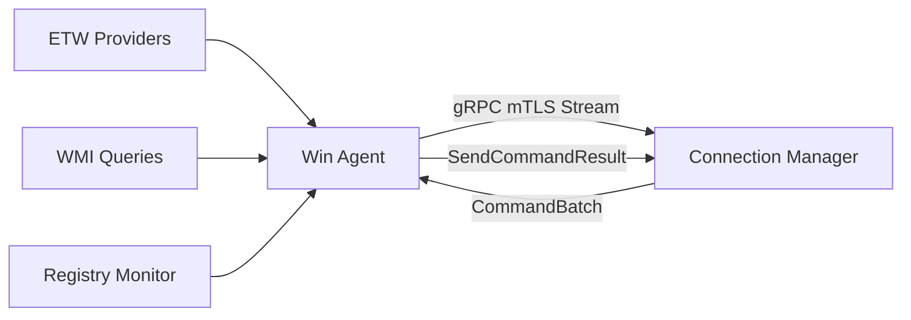
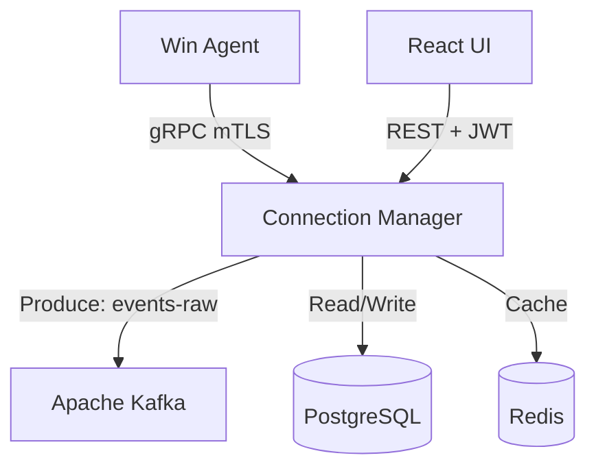
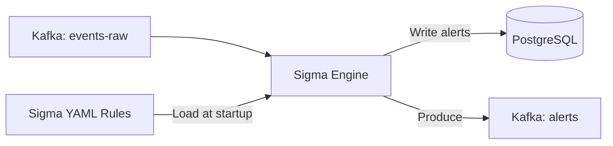
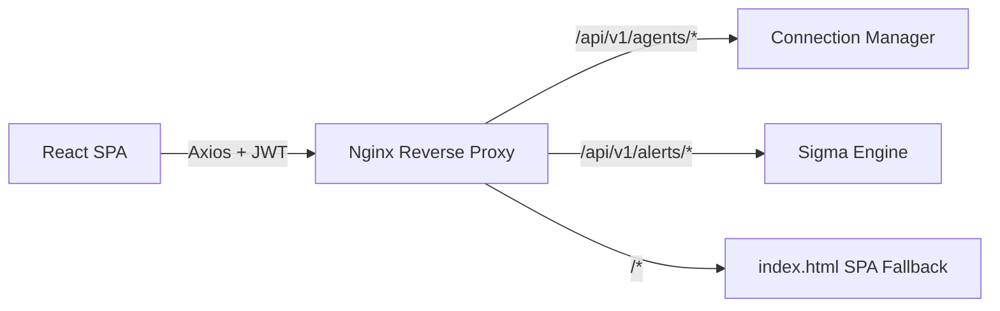
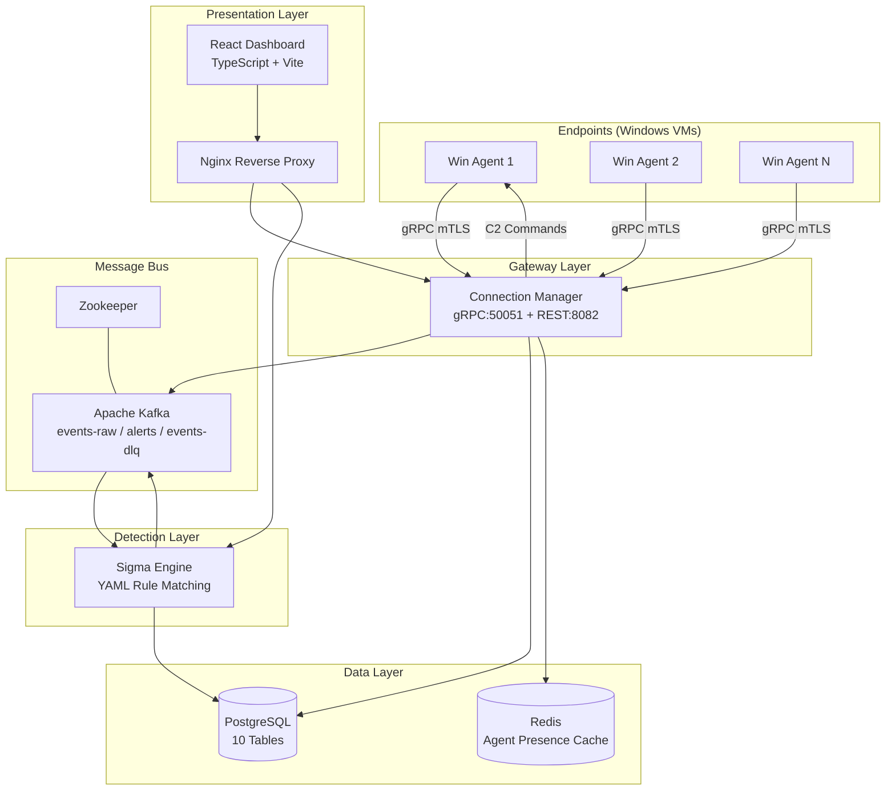

# Component-by-Component Architecture Breakdown
## EDR Platform — Graduation Project Documentation

---

## 1. THE WINDOWS ENDPOINT AGENT (`win_edrAgent`)

### A) Primary Role

The Windows Endpoint Agent is a **lightweight, persistent sensor** deployed on every monitored Windows machine. Its core responsibility is to **collect real-time security telemetry** (process creation, network connections, registry mutations, file operations), **compress and batch** that telemetry, and **stream it to the central server** over a secure gRPC channel. It also acts as a **remote command executor**, receiving C2 (Command & Control) instructions from the server (e.g., restart, shutdown, isolate network) and executing them locally on the endpoint.

### B) Internal Mechanics

**Telemetry Collection — ETW (Event Tracing for Windows):**

The agent uses the native **Windows ETW kernel-mode tracing infrastructure** via the `golang.org/x/sys/windows` syscall package. Four distinct kernel providers are subscribed to, each identified by a unique GUID:

| ETW Provider | GUID | Events Captured |
|---|---|---|
| `Microsoft-Windows-Kernel-Process` | `{22fb2cd6-0fe7-4212-...}` | Process creation, termination, image loads |
| `Microsoft-Windows-Kernel-Network` | `{7dd42a49-5329-4832-...}` | TCP/UDP connections, DNS lookups |
| `Microsoft-Windows-Kernel-Registry` | `{70eb4f03-c1de-4f73-...}` | Registry key creation, modification, deletion |
| `Microsoft-Windows-Kernel-File` | `{edd08927-9cc4-4e65-...}` | File creation, deletion, rename operations |

The collection loop uses **Windows Toolhelp32 API** (`CreateToolhelp32Snapshot` + `Process32First/Next`) for process enumeration. Each process is **enriched** with its full executable path via `QueryFullProcessImageName` (using `PROCESS_QUERY_LIMITED_INFORMATION = 0x1000`, which works even for elevated/system processes). The WMI collector gathers system-level inventory (CPU, memory, disk, installed software) on a configurable interval (default: 1 hour).

**Event Batching & Compression:**

Raw events flow through the `Batcher` which uses a **dual-trigger flush mechanism**:

```
Events → Batcher → Batch (50 events OR 1-second timer, whichever fires first)
```

- **Threshold trigger**: When buffer reaches **50 events** (configurable, range 1–10,000), a batch is created immediately
- **Time trigger**: When **1 second** elapses since last flush (configurable, 100ms–60s), pending events are flushed regardless of count
- **Compression**: Events are serialized to **JSON** then compressed with **Snappy** (Google's fast compression — ~80% reduction observed in logs: `20KB → 4KB`)
- **Integrity**: Each compressed payload gets a **SHA-256 checksum** for server-side verification
- **Batch ID**: Each batch gets a **UUIDv4** for deduplication and tracking

**gRPC Bidirectional Stream:**

The agent maintains a **persistent, long-lived bidirectional gRPC stream** (`StreamEvents` RPC). This stream serves dual purposes:

1. **Upstream (Agent → Server)**: Event batches flow continuously on `stream.Send(EventBatch)`
2. **Downstream (Server → Agent)**: C2 commands arrive as `CommandBatch` messages via `stream.Recv()`

A dedicated `recvLoop` goroutine continuously receives commands and pushes them to a buffered `commandChan` (capacity: 100). A separate `runCommandLoop` goroutine drains this channel and dispatches each command to the appropriate handler.

**C2 Command Execution Handler:**

Commands are mapped from proto enum strings to handler functions:

| Proto Enum | Handler | OS Command |
|---|---|---|
| `COMMAND_TYPE_RESTART (10)` | `restartMachine()` | `shutdown /r /t 3 /d p:4:1` |
| `COMMAND_TYPE_SHUTDOWN (11)` | `shutdownMachine()` | `shutdown /s /t 3 /d p:4:1` |
| `COMMAND_TYPE_TERMINATE_PROCESS (7)` | `terminateProcess()` | `taskkill /PID <pid> /F` |
| `COMMAND_TYPE_ISOLATE (3)` | `isolateNetwork()` | Windows Firewall rules |

After execution, the agent sends a `CommandResult` back to the server via the `SendCommandResult` unary RPC, closing the **C2 feedback loop**.

**Self-Healing Re-Enrollment:**

When the server returns `codes.Unauthenticated` (e.g., after a database wipe), the agent automatically:
1. Stops the connection loop
2. Wipes stale certificates from disk
3. Clears the saved `agent_id`
4. Re-triggers full enrollment (mTLS CSR + registration)
5. Reconnects with a fresh identity

### C) Integration



- **Outbound**: gRPC bidirectional stream to Connection Manager (port 50051)
- **Authentication**: mTLS certificates (client cert + CA chain)
- **Protocol**: HTTP/2 (gRPC) with TLS 1.3
- **Reconnection**: Exponential backoff with server auto-discovery (gateway IP fallback)

### D) Technology Stack & Justification

| Technology | Justification |
|---|---|
| **Go** | Compiles to a single static binary (~15MB) — no runtime dependencies. Cross-compiles with `CGO_ENABLED=0`. Goroutines provide efficient concurrency for collectors. Low memory footprint (~13MB observed). |
| **ETW via `x/sys/windows`** | Kernel-level tracing without third-party drivers. Microsoft's recommended API for security telemetry. Zero-copy event delivery. |
| **Snappy compression** | Optimized for speed over ratio (18–21% of original size observed). Google's choice for internal RPC compression. CPU overhead < 1%. |
| **gRPC + Protobuf** | Binary serialization (10x smaller than JSON). HTTP/2 multiplexing. Bidirectional streaming eliminates polling. Code generation ensures type safety. |
| **UUIDv4** | Globally unique batch IDs without central coordination. |

---

## 2. THE CONNECTION MANAGER / GATEWAY (`connection-manager`)

### A) Primary Role

The Connection Manager is the **central gateway** of the EDR platform. It serves as the **single point of entry** for both agent gRPC traffic and dashboard REST requests. It authenticates agents via mTLS, authenticates dashboard users via JWT, manages agent lifecycle in PostgreSQL, and acts as a **Kafka producer** to forward telemetry events to the detection pipeline. It is the **brain of the control plane**.

### B) Internal Mechanics

**Dual Protocol Server:**

The Connection Manager runs **two protocol servers concurrently**:

1. **gRPC Server** (port 50051): Handles agent communication
   - `StreamEvents`: Bidirectional streaming for event ingestion + C2 command delivery
   - `RegisterAgent`: Agent enrollment with CSR signing
   - `Heartbeat`: Periodic health check from agents
   - `SendCommandResult`: C2 feedback loop closure
   - `RequestCertificateRenewal`: mTLS cert rotation

2. **REST Server** (port 8082, Echo framework): Handles dashboard API
   - `GET /api/v1/agents`: List all agents with stats
   - `POST /api/v1/agents/:id/commands`: Push C2 command to live agent
   - `POST /api/v1/auth/login`: JWT authentication
   - Full CRUD for agents, alerts, rules, audit logs

**Agent Authentication — Zero Trust Architecture:**

```
Agent ─── mTLS ──→ gRPC Server (validates client cert CN = "agent-{uuid}")
Dashboard ─── JWT ──→ REST Server (validates Bearer token + role)
```

- **mTLS (Mutual TLS)**: Every agent presents a client certificate during the TLS handshake. The server validates the certificate chain against the embedded CA and extracts the agent UUID from the certificate's Common Name (`CN = agent-{uuid}`). This is a **Zero Trust** approach — the network path alone is never trusted.
- **JWT (JSON Web Tokens)**: Dashboard users authenticate via username/password, receive a signed JWT with role claims (`admin`, `analyst`, `viewer`), and include it in every REST request's `Authorization: Bearer` header.

**Unified Stream Send Architecture (thread-safety fix):**

gRPC's `stream.Send()` is **NOT thread-safe** for concurrent callers. The server uses a **single-sender architecture**:

```
sendChan (buffered, cap 100)
    ├── Event batch responses (from processBatch)
    └── C2 commands (from AgentRegistry.Send)
         │
    Single Sender Goroutine → stream.Send()
```

All writes to the agent's stream go through a single buffered channel, drained by one goroutine. This eliminates the race condition that previously caused commands to be silently lost.

**Auto-Migration System (`go:embed` + `golang-migrate`):**

On startup, before any repository is initialized, the service runs embedded SQL migrations:

```go
//go:embed migrations/*.up.sql
var migrationsFS embed.FS
```

- **10 migration files** are embedded directly into the binary via Go's `go:embed` directive
- `golang-migrate/v4` with `iofs` source driver and `postgres` database driver applies pending migrations
- **Dirty state recovery**: If a previous migration crashed, the system detects the dirty `schema_migrations` row and forces the version clean before retrying
- **Result**: The service starts successfully even against a completely fresh database — zero manual SQL scripts required

**Kafka Producer:**

Each decompressed event batch is forwarded to Kafka's `events-raw` topic. The producer uses:
- **`segmentio/kafka-go`** writer with Snappy compression
- **DLQ (Dead Letter Queue)**: Failed events are sent to `events-dlq` topic for later replay
- **PostgreSQL fallback**: If Kafka is entirely unreachable, batches are written to `event_batches_fallback` table — **zero data loss guarantee**

### C) Integration



### D) Technology Stack & Justification

| Technology | Justification |
|---|---|
| **Go** | Handles 1000s of concurrent gRPC streams via goroutines. Static binary simplifies Docker deployment. Same language as agent — shared protobuf code. |
| **gRPC + Protobuf** | Binary wire format, HTTP/2 multiplexing, bidirectional streaming for C2. Code-generated server interfaces prevent RPC signature drift. |
| **Echo (REST)** | High-performance Go HTTP framework with middleware support (JWT auth, CORS, rate limiting). Cleaner routing than `net/http`. |
| **mTLS** | Hardware-bound identity — each agent's identity is cryptographically tied to its X.509 certificate. No passwords to steal. |
| **JWT (RS256)** | Stateless authentication for the dashboard. Role-based claims enable RBAC without database queries on every request. |
| **`golang-migrate`** | Industry-standard database migration tool. Version-tracked schema changes. Embedded via `go:embed` for Docker-friendly deployment. |
| **`segmentio/kafka-go`** | Pure-Go Kafka client — no CGO/librdkafka dependency. Supports compression, batching, and DLQ patterns. |

---

## 3. THE MESSAGE BROKER (Apache Kafka & Zookeeper)

### A) Primary Role

Apache Kafka serves as the **asynchronous, high-throughput message bus** that **decouples the ingestion layer (Connection Manager) from the detection layer (Sigma Engine)**. It buffers telemetry events so that even if the detection engine is down or slow, no events are lost. Zookeeper manages Kafka's broker coordination and partition leadership.

### B) Internal Mechanics

**Topic Architecture:**

| Topic | Producer | Consumer | Purpose |
|---|---|---|---|
| `events-raw` | Connection Manager | Sigma Engine (`sigma-engine-group`) | Raw telemetry from all agents |
| `events-dlq` | Connection Manager | Manual/Admin replay | Failed events that couldn't be processed |
| `alerts` | Sigma Engine | Dashboard (optional) | Generated security alerts |

**Event Flow:**

```
Agent → Connection Manager → Kafka [events-raw] → Sigma Engine → Kafka [alerts] → PostgreSQL
```

**Consumer Group**: The Sigma Engine consumes from `events-raw` using consumer group `sigma-engine-group`. This enables:
- **Horizontal scaling**: Multiple sigma-engine instances split partitions
- **At-least-once delivery**: Consumer commits offsets after processing
- **StartOffset: -1 (latest)**: New consumers start from the latest message, not replaying history

**Buffering & Throughput:**

Kafka acts as a **shock absorber** between the fast ingestion tier (Connection Manager can ingest ~50 batches/second per agent) and the CPU-intensive detection tier. Without Kafka, a spike in telemetry would overwhelm the Sigma Engine. With Kafka, events queue up and are processed at the detection engine's pace.

### C) Integration

- **Producer** (Connection Manager): Writes to `events-raw` with agent_id as the partition key (ensures ordering per agent)
- **Consumer** (Sigma Engine): Reads from `events-raw`, deserializes, applies Sigma rules, produces alerts to `alerts` topic
- **Configuration**: Brokers at `kafka:9092` (Docker internal network), Zookeeper at `zookeeper:2181`

### D) Technology Stack & Justification

| Technology | Justification |
|---|---|
| **Apache Kafka** | Industry standard for event streaming. Persistent log guarantees durability. Partitioning enables horizontal scale. Proven at >1M messages/sec in production. |
| **Zookeeper** | Required for Kafka <3.x broker coordination. Manages leader election and partition metadata. |
| **Snappy compression** | Reduces network I/O between producers/consumers. Same codec used by the agent, creating an end-to-end compressed pipeline. |
| **Consumer Groups** | Enable load balancing across multiple Sigma Engine instances. Automatic partition rebalancing on scale-out/failure. |

---

## 4. THE DETECTION ENGINE (`sigma_engine_go`)

### A) Primary Role

The Sigma Engine is the **brain of the detection pipeline**. It consumes raw telemetry events from Kafka, loads **Sigma YAML detection rules** (an open-source, vendor-neutral standard), compiles them into in-memory matchers, and evaluates every incoming event against all active rules. When a match is found, it generates an **alert** and persists it to PostgreSQL.

### B) Internal Mechanics

**Kafka Consumer:**

- Consumes from `events-raw` topic as part of `sigma-engine-group`
- **Event Loop**: 4 worker goroutines process events concurrently
- **Buffer sizes**: Event buffer = 1,000, Alert buffer = 500
- **Metrics**: Tracks events received, processed, alerts generated, and average latency

**Sigma Rule Parsing:**

Sigma rules are loaded from YAML files and compiled into Go structs at startup:

```yaml
title: Suspicious PowerShell Download
logsource:
    category: process_creation
    product: windows
detection:
    selection:
        CommandLine|contains:
            - 'Invoke-WebRequest'
            - 'wget'
            - 'curl'
    condition: selection
level: high
```

The engine parses the `detection` block into field matchers. Each matcher has:
- **Field name** (e.g., `CommandLine`)
- **Modifier** (e.g., `|contains`, `|endswith`, `|startswith`, `|re`)
- **Value list** (e.g., `['Invoke-WebRequest', 'wget', 'curl']`)

**Matching Algorithm:**

```
For each incoming event:
    For each active Sigma rule:
        Apply field mapping (agent field → Sigma field)
        Evaluate detection conditions:
            - selection: ALL listed fields must match
            - filter: exclusion patterns
            - condition: Boolean logic (selection AND NOT filter)
        If match → Create Alert (severity from rule, metadata from event)
```

**Defensive Programming:**

- **NULL handling**: All database scans use `sql.NullString`, `sql.NullInt64`, `sql.NullFloat64` to prevent `cannot scan NULL into *int` panics
- **Nil pointer guards**: Every proto message field access uses `GetXxx()` methods which return zero values for nil pointers
- **Field mapping**: A configurable field mapper translates agent event keys (e.g., `command_line`) to Sigma-expected keys (e.g., `CommandLine`) — preventing silent mismatches

### C) Integration



### D) Technology Stack & Justification

| Technology | Justification |
|---|---|
| **Go** | Same language as Connection Manager — shared proto definitions and deployment patterns. Goroutine-based worker pool for parallel rule evaluation. |
| **Sigma YAML** | Open-source, vendor-neutral detection format. 3,000+ community rules available. YAML is human-readable for SOC analysts. |
| **`segmentio/kafka-go`** | Pure-Go Kafka consumer. Consumer group support with automatic partition rebalancing. |
| **PostgreSQL** | Alerts require relational integrity (foreign keys to agents, users). Full-text search via GIN indexes. |

---

## 5. THE DATA & STATE LAYER (PostgreSQL & Redis)

### A) Primary Role

**PostgreSQL** is the **permanent source of truth** for all relational data — agent registrations, security alerts, user accounts, audit logs, certificates, and policies. **Redis** provides **ephemeral, high-speed caching** for transient state like agent online/offline presence and rate limiting.

### B) Internal Mechanics

**PostgreSQL Relational Schema (10 Tables):**

| Migration | Table | Purpose |
|---|---|---|
| 001 | `agents` | Registered endpoints (UUID PK, hostname, status, OS info, health_score, metrics, JSONB metadata) |
| 002 | `certificates` | mTLS certificates (X.509 PEM, serial number, expiry, revocation status) |
| 003 | `users` | Dashboard accounts (bcrypt password hash, role, locked_until, last_login) |
| 004 | `audit_logs` | Immutable audit trail (who did what, when, from where) |
| 005 | `tokens` | JWT refresh tokens (token hash, expiry, revocation) |
| 006 | `csrs` | Certificate Signing Requests (PEM, status: pending/approved/rejected) |
| 007 | `alerts` | Security alerts (severity CHECK constraint, FK to agents, FK to users for assignment, GIN full-text search index) |
| 008 | `policies` | Security policies (JSONB configuration, version tracking) |
| 009 | `commands` | C2 command history (type, parameters, status, result, execution time) |
| 010 | `enrollment_tokens` | One-time agent enrollment tokens (token hash, max_uses, expiry) |

**Key Schema Design Decisions:**

- **UUIDs as Primary Keys**: Globally unique, no central sequence coordination, safe for distributed systems
- **JSONB columns** (`tags`, `metadata`): Flexible, schema-less extension points without ALTER TABLE migrations
- **CHECK constraints**: `severity IN ('critical','high','medium','low','informational')` — database-level validation, can't be bypassed by application bugs
- **Foreign Keys with CASCADE**: `alerts.agent_id REFERENCES agents(id) ON DELETE CASCADE` — deleting an agent automatically cleans up its alerts
- **GIN full-text search indexes**: `to_tsvector('english', title || description)` — enables fast `LIKE`-free text search on alert titles
- **`updated_at` triggers**: An automatic `BEFORE UPDATE` trigger sets `updated_at = NOW()` on every row modification — consistent staleness tracking without application logic
- **Partial indexes**: `idx_alerts_open_by_severity ON alerts(severity) WHERE status = 'open'` — only indexes open alerts, dramatically faster dashboard queries

**Redis Caching Strategy:**

| Key Pattern | Value | TTL | Purpose |
|---|---|---|---|
| `agent:{uuid}:status` | `"online"` / `"offline"` | 10 min | Real-time presence (refreshed every 2 min by keepalive) |
| `rate:{identifier}` | Counter | 1 min | API rate limiting |

- **Presence tracking**: When an agent's gRPC stream opens, Redis is set to `"online"` with a 10-minute TTL. A **keepalive ticker** (every 2 minutes) refreshes the TTL. If the agent disconnects, the TTL expires naturally — eventual consistency without explicit cleanup.
- **Graceful degradation**: All Redis operations are wrapped in nil checks — if Redis is unavailable, the service falls back to PostgreSQL-only operation without crashing.

### C) Integration

- **PostgreSQL**: Connected via `pgx/v5` (high-performance pure-Go PostgreSQL driver) with connection pooling (`pgxpool`)
- **Redis**: Connected via `go-redis/v9` with automatic reconnection
- **Auto-Migration**: `golang-migrate/v4` with embedded SQL files ensures schema is always up-to-date on boot

### D) Technology Stack & Justification

| Technology | Justification |
|---|---|
| **PostgreSQL 15** | ACID transactions for alert integrity. Full-text search (GIN). JSONB for flexible metadata. Mature, enterprise-proven RDBMS. |
| **Redis 7** | Sub-millisecond reads for presence checks. TTL-based automatic expiry. Minimal operational overhead. |
| **`pgx/v5`** | Fastest Go PostgreSQL driver. Native support for pgx COPY protocol, arrays, composite types. |
| **`go-redis/v9`** | Feature-complete Go Redis client with connection pooling and automatic pipelining. |

---

## 6. THE FRONTEND DASHBOARD (React / TypeScript)

### A) Primary Role

The dashboard is the **SOC analyst's primary interface** — a single-page application (SPA) for monitoring endpoints, triaging security alerts, sending C2 commands, and viewing system health metrics. It consumes REST APIs from the Connection Manager and Sigma Engine and renders them in a responsive, real-time UI.

### B) Internal Mechanics

**API Client Architecture:**

Two Axios instances connect to different backends:

```typescript
const config = {
    sigmaEngineUrl:        envOrDefault(VITE_API_URL, 'http://localhost:8080'),
    connectionManagerUrl:  envOrDefault(VITE_CONNECTION_MANAGER_URL, 'http://localhost:8082'),
};
```

In Docker, both are set to `""` (empty string), so Axios sends **relative requests**. Nginx then proxies:
- `/api/v1/agents/*`, `/api/v1/auth/*` → Connection Manager (:8082)
- `/api/v1/alerts/*`, `/api/v1/rules/*`, `/api/v1/sigma/*` → Sigma Engine (:8080)

**C2 Quick Actions — Payload Mapping:**

The Endpoints page renders an **Actions dropdown** for each agent. When the operator clicks "Restart Machine":

```typescript
// 1. UI: User clicks "Restart Machine" in dropdown
// 2. Modal opens, user clicks "Execute"
// 3. Dashboard sends:
POST /api/v1/agents/{agent_id}/commands
Body: {
    "command_type": "restart_machine",
    "parameters": {},
    "timeout": 300
}

// 4. Connection Manager maps "restart_machine" → enum 10 (COMMAND_TYPE_RESTART)
// 5. Builds proto Command, pushes to AgentRegistry channel
// 6. commandPushLoop goroutine wraps it in CommandBatch → stream.Send()
// 7. Agent recvLoop receives CommandBatch → dispatches to restartMachine()
// 8. Agent sends SendCommandResult back to server
// 9. Dashboard shows success toast: "Command queued successfully (ID: ...)"
```

**Available C2 Commands in Dashboard:**

| Command | Label | Icon | Description |
|---|---|---|---|
| `isolate_network` | Isolate Network | WifiOff | Block all network traffic |
| `restore_network` | Restore Network | Wifi | Restore network connectivity |
| `kill_process` | Kill Process | X | Terminate a running process |
| `quarantine_file` | Quarantine File | FileX | Move file to quarantine |
| `collect_logs` | Collect Logs | Folder | Gather forensic logs |
| `scan_memory` | Scan Memory | Monitor | Perform memory analysis |
| `restart_agent` | Restart Agent | RefreshCw | Restart EDR agent service |
| `restart_machine` | Restart Machine | RefreshCw | OS-level reboot |
| `shutdown_machine` | Shutdown Machine | Power | OS-level power off |

**State Management**: React Query (`@tanstack/react-query`) for server state — automatic refetching, caching, and optimistic updates. `useMutation` handles command execution with success/error toasts.

### C) Integration



### D) Technology Stack & Justification

| Technology | Justification |
|---|---|
| **React 18** | Component-based architecture with hooks. Massive ecosystem. Virtual DOM for efficient re-renders of agent tables and alert lists. |
| **TypeScript** | Compile-time type safety. `CommandType` union type prevents invalid command strings. API response interfaces catch schema drift. |
| **Vite** | Sub-second HMR (Hot Module Replacement) during development. Optimized production bundling with tree-shaking. |
| **React Query** | Server-state caching with automatic refetch. Mutation hooks for command execution with rollback. |
| **Axios** | Request/response interceptors for JWT injection. Configurable base URLs for multi-backend proxying. |
| **Nginx** | Reverse proxy + static file serving in a single Docker container. Gzip compression. SPA fallback (`try_files $uri /index.html`). |
| **Lucide React** | Consistent, modern icon library — `Power`, `RefreshCw`, `WifiOff`, etc. Tree-shakeable (only imported icons are bundled). |

---

## System-Wide Architecture Diagram



---

> **Key Architectural Principles:**
> - **Zero Trust Security**: mTLS for agents, JWT for users — every request is authenticated
> - **Event-Driven Architecture**: Kafka decouples ingestion from detection
> - **Zero Data Loss**: Triple-tier delivery (Kafka → DLQ → PostgreSQL fallback)
> - **Self-Healing**: Agent auto-re-enrolls, dirty migration recovery, stale agent sweeper
> - **Defense in Depth**: Database CHECK constraints, application validation, API middleware
