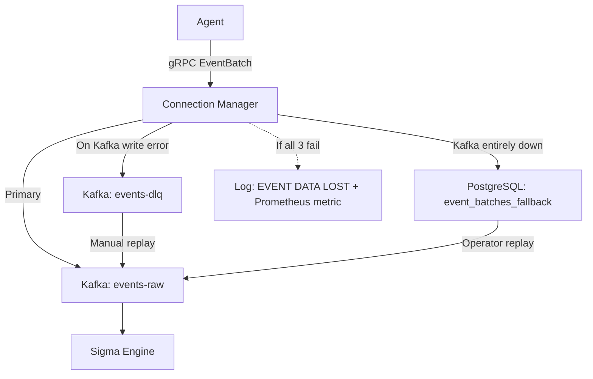

# The Connection Manager (`connection-manager`)
## A Microscopic Deep-Dive — Graduation Defense Documentation

---

## 1. DUAL-PROTOCOL ARCHITECTURE (The Gateway)

### 1.1 Concurrent Server Architecture

The Connection Manager simultaneously operates **two completely independent network servers**, each serving a different client population over different protocols:

| Server | Port | Protocol | Clients | Purpose |
|---|---|---|---|---|
| **gRPC Server** | `:50051` | HTTP/2 + TLS 1.3 | Windows Agents | Telemetry ingestion, C2 commands, registration |
| **REST API Server** | `:8082` | HTTP/1.1 or HTTP/2 | Dashboard (React) | Admin API, authentication, reporting |

Both servers are launched as **concurrent goroutines** in [main()](file:///d:/EDR_Server/connection-manager/cmd/server/main.go#78-394), each running independently until a shutdown signal is received:

```go
// Start REST API server (non-blocking)
go func() {
    if err := restAPIServer.Start(); err != nil && err != http.ErrServerClosed {
        logger.Errorf("REST API server error: %v", err)
    }
}()

// Start gRPC server (non-blocking)
go func() {
    if err := grpcServer.Start(); err != nil {
        logger.Fatalf("gRPC server failed: %v", err)
    }
}()

// Block on OS signals (SIGINT / SIGTERM)
sigCh := make(chan os.Signal, 1)
signal.Notify(sigCh, syscall.SIGINT, syscall.SIGTERM)
<-sigCh
```

**Why two separate servers on different ports?**

- **Protocol incompatibility**: gRPC uses HTTP/2 framing exclusively. Echo (which uses Go's `net/http`) works natively on HTTP/1.1. While HTTP/2 is supported, mixing gRPC and REST traffic on the same port requires complex protocol negotiation (e.g., `h2c` upgrades). Keeping them on separate ports is simpler, more debuggable, and more secure (distinct firewall rules per port).
- **Authentication isolation**: Agents authenticate via **mTLS** — a transport-layer guarantee. Dashboard users authenticate via **JWT** — an application-layer token. These authentication mechanisms cannot be cleanly unified without significant architectural complexity.
- **Independent life cycle**: Either server can be restarted or rate-limited independently without disrupting the other.

### 1.2 The REST API (Echo Framework)

The REST API server is built using the [Echo](https://echo.labstack.com/) v4 framework. The [NewServer()](file:///d:/EDR_Server/connection-manager/pkg/api/server.go#26-74) constructor configures a **7-layer middleware stack** applied globally to every request:

```go
e.Use(middleware.RequestIDWithConfig(...))  // 1. Inject unique req-{nanosecond} ID
e.Use(middleware.LoggerWithConfig(...))     // 2. Structured JSON access log
e.Use(middleware.Recover())                // 3. Panic recovery → HTTP 500 (no crash)
e.Use(middleware.CORSWithConfig(...))      // 4. CORS for React dashboard
e.Use(middleware.TimeoutWithConfig(...))   // 5. Per-request timeout (configurable)
e.Use(middleware.BodyLimit("...M"))        // 6. Prevent request body DoS (size cap)
e.Use(middleware.GzipWithConfig(Level:5)) // 7. Response compression
```

**Route Groups and Access Control:**

```
/healthz                (no auth)  — Kubernetes/Docker health probe
/readyz                 (no auth)  — Readiness check
/api/v1/agent/ca        (no auth)  — Zero-touch CA cert provisioning
/api/v1/auth/login      (no auth)  — JWT issuance
/api/v1/auth/refresh    (no auth)  — JWT refresh
/api/v1/*  (all others) [AuthMiddleware]  — JWT required
  /api/v1/users/*       [AuthMiddleware + RequireRole("admin")]
  /api/v1/audit/*       [AuthMiddleware + RequireRole("admin","security")]
  /api/v1/enrollment-tokens/* [RequireRole("admin")]
```

Routes span **40+ endpoints** across agents, alerts, events, policies, users, audit logs, and enrollment token management.

### 1.3 The gRPC Server

The gRPC server exposes 6 RPCs defined in [edr.proto](file:///d:/EDR_Server/connection-manager/proto/v1/edr.proto):

| RPC | Type | Purpose |
|---|---|---|
| [RegisterAgent](file:///d:/EDR_Server/win_edrAgent/internal/proto/v1/edr.proto#37-39) | Unary | Bootstrap enrollment (CSR → signed cert + UUID) |
| [StreamEvents](file:///d:/EDR_Server/connection-manager/pkg/handlers/event_ingestion.go#84-216) | Bidirectional Streaming | Telemetry ↑ + C2 commands ↓ |
| [Heartbeat](file:///d:/EDR_Server/win_edrAgent/internal/proto/v1/edr.proto#31-33) | Unary | Periodic agent health pulse |
| [SendCommandResult](file:///d:/EDR_Server/win_edrAgent/internal/grpc/client.go#323-353) | Unary | C2 execution result callback |
| [RequestCertificateRenewal](file:///d:/EDR_Server/win_edrAgent/internal/proto/v1/edr.proto#34-36) | Unary | mTLS cert rotation |
| [SendCommandResult](file:///d:/EDR_Server/win_edrAgent/internal/grpc/client.go#323-353) | Unary | C2 feedback loop |

### 1.4 Supporting Services

Launched alongside both servers at startup:

- **Auto-Cert Bootstrapper** (`security.EnsureServerCert`): Regenerates the server's TLS certificate on every boot if the machine's IP addresses have changed (common in VMs). Embeds ALL current host IPs in the certificate's **Subject Alternative Names (SANs)**, preventing `x509: certificate is valid for X.X.X.X, not Y.Y.Y.Y` mTLS failures.
- **Stale Agent Sweeper**: A background goroutine that runs every **60 seconds**, scanning the `agents` PostgreSQL table. Any agent whose `last_seen` is older than **5 minutes** is automatically marked `offline`. This handles sudden crashes and network failures where the stream [Close](file:///d:/EDR_Platform/connection-manager/pkg/kafka/producer.go#221-236) event is never received.

**Graceful Shutdown:**

```go
// Shutdown REST API first (stops accepting new HTTP requests)
restAPIServer.Shutdown(shutdownCtx)
// Then stop gRPC (finishes in-flight streams)
grpcServer.Shutdown(shutdownCtx)
```

The shutdown sequence respects a configurable `ShutdownTimeout` (`context.WithTimeout`). In-flight gRPC streams are given time to complete before forceful teardown.

---

## 2. ZERO TRUST AUTHENTICATION (mTLS & JWT)

### 2.1 The mTLS Handshake for Agents

**What is mTLS?**

Standard TLS (as used in HTTPS) is **one-way** — the client verifies the server's identity. **Mutual TLS (mTLS)** is **two-way** — the server also requires the client to present a certificate, and validates it against a trusted CA. This is the foundation of **Zero Trust Networking**: no client is trusted by network location alone; every client must prove cryptographic identity.

**Server TLS Configuration:**

The server's TLS config in [tls.go](file:///d:/EDR_Platform/connection-manager/pkg/security/tls.go) is carefully tuned:

```go
tlsConfig := &tls.Config{
    Certificates: []tls.Certificate{cert},  // Server's own cert
    ClientCAs:    caPool,                    // Trusted CA for verifying client certs
    ClientAuth:   tls.VerifyClientCertIfGiven, // ← Critical design choice
    MinVersion:   tls.VersionTLS13,          // Disallow TLS 1.0, 1.1, 1.2

    CipherSuites: []uint16{
        tls.TLS_AES_256_GCM_SHA384,
        tls.TLS_CHACHA20_POLY1305_SHA256,
        tls.TLS_AES_128_GCM_SHA256,
    },
    PreferServerCipherSuites: true,
}
```

**The `VerifyClientCertIfGiven` Design Pattern:**

> **Academic Note**: `ClientAuth: tls.RequireAndVerifyClientCert` would enforce mTLS for ALL connections — but this would prevent new agents from calling [RegisterAgent](file:///d:/EDR_Server/win_edrAgent/internal/proto/v1/edr.proto#37-39) to obtain their first certificate (which they don't have yet). `VerifyClientCertIfGiven` solves this bootstrapping problem elegantly: the TLS handshake allows connections without a client cert, but the **gRPC Auth Interceptor** then enforces that all RPCs except [RegisterAgent](file:///d:/EDR_Server/win_edrAgent/internal/proto/v1/edr.proto#37-39) must have a valid client certificate.

This creates a two-phase security model:
```
Phase 1 (Enrollment):  Agent → TLS (no client cert) → RegisterAgent RPC (bootstrap token validates identity)
Phase 2 (Operations):  Agent → TLS (with client cert) → All other RPCs (mTLS enforces identity)
```

**Extracting the Agent UUID from the Certificate:**

Once the agent presents its client certificate, the server needs to map it to an agent identity. The extraction in [tls.go](file:///d:/EDR_Platform/connection-manager/pkg/security/tls.go) follows a **priority-ordered lookup** with three fallback strategies:

```go
func ExtractAgentIDFromCert(cert *x509.Certificate) (string, error) {
    // Strategy 1: DNS SAN (e.g., "agent-599d30c7-3ba5-...edr.local")
    for _, dnsName := range cert.DNSNames {
        if len(dnsName) > 6 && dnsName[:6] == "agent-" {
            return dnsName[6:], nil  // Strip "agent-" prefix → UUID
        }
    }

    // Strategy 2: URI SAN (e.g., "urn:edr:agent:599d30c7-3ba5-...")
    for _, uri := range cert.URIs {
        if uri.Scheme == "urn" && len(uri.Opaque) > 10 && uri.Opaque[:10] == "edr:agent:" {
            return uri.Opaque[10:], nil  // Strip "edr:agent:" prefix → UUID
        }
    }

    // Strategy 3: Common Name (CN) — used by the current implementation
    if cert.Subject.CommonName != "" {
        return cert.Subject.CommonName, nil  // "agent-{uuid}" from PKI enrollment
    }

    return "", fmt.Errorf("agent ID not found in certificate")
}
```

> **Academic Note**: The Priority Order (DNS SAN → URI SAN → CN) reflects the evolution of X.509 standards. The **Common Name** for host validation has been deprecated by RFC 2818 in favor of **Subject Alternative Names (SANs)**. By supporting all three extraction methods, the server remains backward compatible with existing enrolled agents while supporting future PKI architects who prefer URI SANs.

The extracted agent ID is injected into the gRPC request context via a **server interceptor**, making it available to every RPC handler without requiring re-extraction:

```go
// In the gRPC auth interceptor (pkg/server/interceptors.go):
agentID, _ := security.ExtractAgentIDFromCert(clientCert)
ctx = context.WithValue(ctx, contextkeys.AgentIDKey, agentID)
```

### 2.2 JWT Authentication for the Dashboard

**Token Issuance (`POST /api/v1/auth/login`):**

```
Dashboard → POST /login { "username": "admin", "password": "..." }
Server    → bcrypt.CompareHashAndPassword(storedHash, plaintext) → match
Server    → jwtManager.GenerateTokenPair() → { access_token, refresh_token }
Dashboard → Stores tokens; attaches access_token to every request
```

The `JWTManager` uses **RS256** (RSA with SHA-256) — an **asymmetric** signing algorithm. The server signs tokens with its **RSA private key** and verifies them using the **RSA public key**. This is preferable to HS256 (HMAC) because:
- The signing key never needs to leave the server
- If the dashboard were ever compromised, it cannot forge tokens (it only has the public key)

**The [AuthMiddleware](file:///d:/EDR_Platform/connection-manager/pkg/api/middleware.go#74-126) — Request Validation:**

```go
func (h *Handlers) AuthMiddleware(next echo.HandlerFunc) echo.HandlerFunc {
    return func(c echo.Context) error {
        // 1. Extract from "Authorization: Bearer {token}" header
        authHeader := c.Request().Header.Get("Authorization")
        token := strings.TrimPrefix(authHeader, "Bearer ")

        // 2. Check JTI (JWT ID) against Redis blacklist — catches logged-out tokens
        if jti, err := h.jwtManager.GetTokenID(token); err == nil {
            blacklisted, _ := h.redis.IsTokenBlacklisted(ctx, jti)
            if blacklisted {
                return errorResponse(c, 401, "TOKEN_REVOKED", "Token has been revoked")
            }
        }

        // 3. Cryptographic validation (signature + expiry + issuer + audience)
        claims, err := h.jwtManager.ValidateToken(token)
        if err != nil {
            return errorResponse(c, 401, "INVALID_TOKEN", "Invalid or expired token")
        }

        // 4. Store user claims in Echo context for downstream handlers
        c.Set("user", &UserClaims{UserID: claims.Subject, Roles: claims.Roles})
        return next(c)
    }
}
```

**Token Blacklisting via JTI:**

When a user calls `POST /auth/logout`, the token's **JTI (JWT ID)** — not the raw token string — is added to a Redis SET with a TTL matching the token's remaining lifetime. This is more efficient than storing the entire token string and guarantees that even valid tokens cannot be replayed after logout.

**Role-Based Access Control (RBAC):**

```go
func (h *Handlers) RequireRole(roles ...string) echo.MiddlewareFunc {
    return func(next echo.HandlerFunc) echo.HandlerFunc {
        return func(c echo.Context) error {
            user := c.Get("user").(*UserClaims)
            for _, required := range roles {
                for _, userRole := range user.Roles {
                    if userRole == required || userRole == "admin" { // admin bypasses all
                        return next(c)
                    }
                }
            }
            return errorResponse(c, 403, "FORBIDDEN", "Insufficient permissions")
        }
    }
}
```

Middleware is composable — a route can require multiple middleware in sequence:
```go
users.DELETE("/:id", handlers.DeleteUser, handlers.RequireRole("admin"))
```

---

## 3. THE AUTO-MIGRATION SYSTEM (Self-Sufficiency)

### 3.1 The Problem: Docker and Filesystem Isolation

A naïve database migration approach would mount a `migrations/` directory into the Docker container and execute migrations at startup. This breaks in production for two reasons:
1. **Docker volumes must be manually configured** — a misconfigured volume means no migrations
2. **Production images should be hermetically sealed** — no external file system dependencies

Our solution: **compile the SQL migration files directly into the Go binary** using Go's `//go:embed` directive.

### 3.2 The `//go:embed` Directive

In [migrate.go](file:///d:/EDR_Platform/connection-manager/internal/database/migrate.go):

```go
import "embed"

//go:embed migrations/*.sql
var migrationsFS embed.FS
```

This directive instructs the **Go compiler** to include all [.sql](file:///d:/EDR_Server/connection-manager/internal/database/migrations/006_create_csrs.up.sql) files matching `migrations/*.sql` as a read-only filesystem in the compiled binary's data segment. The result is that `connection-manager` is a **completely self-contained binary** — it carries its own database schema with it.

**How `go:embed` works at the binary level:**

At compile time, the Go toolchain reads each matched file, embeds its contents as a byte slice in the `.rodata` (read-only data) section of the ELF/PE binary, and wraps it in an `embed.FS` structure that implements `io/fs.FS`. There is **zero runtime I/O** — every SQL file is read from process memory, not the filesystem.

### 3.3 Running Migrations with `golang-migrate`

```go
func RunMigrations(cfg *PostgresConfig, logger *logrus.Logger) error {
    // 1. Build standard library DSN (golang-migrate uses database/sql, not pgx)
    dsn := fmt.Sprintf("postgres://%s:%s@%s:%d/%s?sslmode=%s",
        cfg.User, cfg.Password, cfg.Host, cfg.Port, cfg.Database, cfg.SSLMode)

    // 2. Create an iofs source from the embedded filesystem
    source, err := iofs.New(migrationsFS, "migrations")

    // 3. Create the migrate instance
    m, err := migrate.NewWithSourceInstance("iofs", source, dsn)
    defer m.Close()

    // 4. Handle dirty database state
    version, dirty, _ := m.Version()
    if dirty {
        logger.Warnf("Database is in dirty state — forcing version clean")
        m.Force(int(version))  // Reset the dirty flag
    }

    // 5. Apply all pending migrations
    if err := m.Up(); err != nil {
        if errors.Is(err, migrate.ErrNoChange) {
            logger.Info("Database schema is up to date — no migrations needed")
            return nil  // Not an error — clean exit
        }
        return fmt.Errorf("migration failed: %w", err)
    }

    version, dirty, _ = m.Version()
    logger.Infof("Migrations applied: version=%d dirty=%v", version, dirty)
    return nil
}
```

**How `golang-migrate` tracks state:**

The library creates a `schema_migrations` table in PostgreSQL with just two columns:
```sql
CREATE TABLE schema_migrations (
    version bigint NOT NULL,
    dirty   boolean NOT NULL
);
```

- **`version`**: The highest migration number applied (e.g., `10` for [010_create_enrollment_tokens.up.sql](file:///d:/EDR_Server/connection-manager/internal/database/migrations/010_create_enrollment_tokens.up.sql))
- **`dirty`**: Set to `true` if the last migration crashed mid-execution (e.g., power failure)

**The `ErrNoChange` Pattern:**

`m.Up()` returns `migrate.ErrNoChange` when **all migrations are already applied**. The code treats this as a **success** rather than an error — it simply logs "up to date" and exits. This means the same startup code runs safely on every boot without requiring conditional logic.

**The Dirty State Recovery:**

If a migration was interrupted (e.g., the container was killed during schema change), `schema_migrations.dirty = true`. Without intervention, `m.Up()` would refuse to run, leaving the server in a boot-loop. The recovery sequence:

```
1. Detect dirty = true for version N
2. m.Force(N) → Reset dirty flag to false for version N (does NOT re-run the SQL)
3. m.Up()     → Continue from version N (re-runs the interrupted migration)
```

> **Academic Note**: `Force(N)` does NOT re-execute the SQL — it only resets the metadata. This assumes the DBA will inspect the database to determine which DDL statements need to be re-applied after the crash. In practice, PostgreSQL's transactional DDL (`CREATE TABLE` inside `BEGIN`/`COMMIT`) makes this safe in most cases.

### 3.4 The 10 Migration Files

| # | File | Table Created |
|---|---|---|
| 001 | [001_create_agents.up.sql](file:///d:/EDR_Server/connection-manager/internal/database/migrations/001_create_agents.up.sql) | `agents` — Registered endpoints with metrics, health score, JSONB metadata |
| 002 | [002_create_certificates.up.sql](file:///d:/EDR_Server/connection-manager/internal/database/migrations/002_create_certificates.up.sql) | `certificates` — X.509 certs, serial numbers, revocation status |
| 003 | [003_create_users.up.sql](file:///d:/EDR_Server/connection-manager/internal/database/migrations/003_create_users.up.sql) | `users` — Dashboard accounts with bcrypt hashes, role, account lockout |
| 004 | [004_create_audit_logs.up.sql](file:///d:/EDR_Server/connection-manager/internal/database/migrations/004_create_audit_logs.up.sql) | `audit_logs` — Immutable action trail (who, what, when, from where) |
| 005 | [005_create_tokens.up.sql](file:///d:/EDR_Server/connection-manager/internal/database/migrations/005_create_tokens.up.sql) | `tokens` — JWT refresh token hashes with revocation |
| 006 | [006_create_csrs.up.sql](file:///d:/EDR_Server/connection-manager/internal/database/migrations/006_create_csrs.up.sql) | `csrs` — Certificate Signing Requests (pending/approved/rejected) |
| 007 | [007_create_alerts.up.sql](file:///d:/EDR_Server/connection-manager/internal/database/migrations/007_create_alerts.up.sql) | `alerts` — Security alerts with GIN full-text search index |
| 008 | [008_create_policies.up.sql](file:///d:/EDR_Server/connection-manager/internal/database/migrations/008_create_policies.up.sql) | `policies` — Security policy configurations (JSONB) |
| 009 | [009_create_commands.up.sql](file:///d:/EDR_Server/connection-manager/internal/database/migrations/009_create_commands.up.sql) | `commands` — C2 command history and results |
| 010 | [010_create_enrollment_tokens.up.sql](file:///d:/EDR_Server/connection-manager/internal/database/migrations/010_create_enrollment_tokens.up.sql) | `enrollment_tokens` — One-time agent bootstrap tokens |

---

## 4. THREAD-SAFE C2 COMMAND DELIVERY (The gRPC Fix)

### 4.1 The Race Condition: Why Concurrent `stream.Send()` is Dangerous

The [StreamEvents](file:///d:/EDR_Server/connection-manager/pkg/handlers/event_ingestion.go#84-216) RPC uses Go's bidirectional streaming API — both the server and client can send messages on the same stream. The gRPC-Go documentation states:

> **"It is safe to have a goroutine calling SendMsg and another goroutine calling RecvMsg on the same stream at the same time, but it is not safe to call SendMsg on the same stream in different goroutines."**

In the **original (broken) implementation**, two goroutines both called `stream.Send()` concurrently:
- **Goroutine 1** (`main recv loop`): Called `stream.Send(batchResponse)` after processing each event batch
- **Goroutine 2** ([commandPushLoop](file:///d:/EDR_Platform/connection-manager/pkg/handlers/event_ingestion.go#276-322)): Called `stream.Send(commandBatch)` whenever a C2 command arrived

**What happens with concurrent `stream.Send()` calls?**

Internally, gRPC-Go's `stream.Send()` encodes the proto message into a **length-prefixed binary frame** and writes it to the underlying TCP buffer. If two goroutines call [Send()](file:///d:/EDR_Server/win_edrAgent/internal/grpc/client.go#295-308) simultaneously, their frame writes can **interleave**, corrupting the HTTP/2 stream framing. The outcomes are:
- **Silent dropped messages**: The frame corruption causes the other end's `Recv()` to return a parse error, discarding the command
- **Stream reset**: The underlying HTTP/2 connection detects protocol violation and resets the stream (`RST_STREAM`)
- **Agent loses C2 commands**: `COMMAND_TYPE_RESTART` is sent from the server but silently discarded by the corrupted stream — so the agent machine never restarts

### 4.2 The "Single Sender Architecture" Fix

The solution implemented in [event_ingestion.go](file:///d:/EDR_Platform/connection-manager/pkg/handlers/event_ingestion.go) introduces a **dedicated sender goroutine** as the exclusive writer:

```go
// One buffered channel — all messages queue here regardless of source
sendChan := make(chan *edrv1.CommandBatch, 100)
sendDone  := make(chan error, 1)

// THE ONLY GOROUTINE THAT CALLS stream.Send()
go func() {
    for batch := range sendChan {  // Drain the channel sequentially
        if err := stream.Send(batch); err != nil {
            sendDone <- err   // Signal error to main loop
            return
        }
    }
    sendDone <- nil
}()
```

Now, all message-producing goroutines **write to the channel** instead of calling `stream.Send()` directly:

```go
// Goroutine A — event batch acknowledgement responses:
select {
case sendChan <- batchAckResponse:
default:
    logger.Warn("Send channel full, dropping batch response")
}

// Goroutine B — C2 command forwarder from AgentRegistry:
go func() {
    for cmd := range cmdChan {
        batch := &edrv1.CommandBatch{Commands: []*edrv1.Command{cmd}}
        select {
        case sendChan <- batch:
            logger.Infof("Command queued for agent stream delivery: %s", cmd.CommandId)
        default:
            logger.Warn("Send channel full, dropping command")
        }
    }
}()
```

**Architectural Properties of This Design:**

| Property | Explanation |
|---|---|
| **Thread-Safety** | Only one goroutine ever touches `stream.Send()` — the channel is the synchronization primitive |
| **Ordering** | Messages are sent in the order they arrive in `sendChan` (FIFO) |
| **Backpressure** | `sendChan` is buffered at 100. Non-blocking `select` with `default` prevents producers from blocking if the consumer is slow — commands are dropped with a warning rather than deadlocking |
| **Error Propagation** | If `stream.Send()` fails, the error is sent to `sendDone`, the main recv loop detects it, closes `sendChan`, and terminates cleanly |
| **Deadlock Prevention** | The main recv loop checks `sendDone` in `select` alongside `stream.Recv()`, ensuring it exits if the sender fails |

```go
// Main recv loop — detects sender failure atomically
for {
    select {
    case err := <-sendDone:
        return status.Errorf(codes.Internal, "stream send error: %v", err)
    default:
    }

    batch, err := stream.Recv()
    // ... process batch
}
```

---

## 5. THE KAFKA PRODUCER & ZERO DATA LOSS PIPELINE

### 5.1 The 10-Step [processBatch](file:///d:/EDR_Server/connection-manager/pkg/handlers/event_ingestion.go#254-403) Pipeline

When an event batch is received via `stream.Recv()`, it goes through **10 sequential steps** in [processBatch()](file:///d:/EDR_Server/connection-manager/pkg/handlers/event_ingestion.go#254-403):

```
Step 1: VALIDATE    → Check batch_id, agent_id, event_count > 0, payload size ≤ 10MB
Step 2: DEDUP       → Check Redis: IsBatchProcessed(batch.BatchId) → skip if seen
Step 3: CHECKSUM    → SHA-256(payload) == batch.Checksum → reject if mismatch
Step 4: DECOMPRESS  → Snappy/Gzip/None → max 32MB (LimitReader prevents zip-bomb)
Step 5: PARSE JSON  → json.Unmarshal(payload, &events) → validate non-empty array
Step 6: ENRICH      → events[i]["agent_id"] = agentID, events[i]["batch_id"] = batchID
Step 7: KAFKA       → For each event: kafkaProducer.SendEventBatch(agentID, eventJSON, headers)
Step 8: METRICS     → RecordEventBatch(event_count, payload_size)
Step 9: MARK        → Redis: SetBatchProcessed(batch.BatchId, 24h TTL) for idempotency
Step 10: ACK        → Return CommandBatch{AckBatchId: batch.BatchId, Status: OK}
```

**Step 4 detail — Gzip zip-bomb prevention:**
```go
const maxDecompressedSize = 32 * 1024 * 1024  // 32MB
decompressed, _ := io.ReadAll(io.LimitReader(gzReader, maxDecompressedSize))
```
A malicious agent could send a small gzip payload that decompresses into gigabytes of data, exhausting server memory. By wrapping the reader in `io.LimitReader`, the server caps decompression at 32MB regardless of the attacker's intent.

### 5.2 The Kafka Producer Configuration

The [producer.go](file:///d:/EDR_Platform/connection-manager/pkg/kafka/producer.go) uses `segmentio/kafka-go` — a pure-Go Kafka client requiring no CGO or native libraries.

```go
writer := &kafka.Writer{
    Addr:                   kafka.TCP("kafka:9092"),
    Topic:                  "events-raw",
    Balancer:               &kafka.Hash{},        // Partition key: agent_id
    Compression:            kafka.Snappy,
    RequiredAcks:           kafka.RequireAll,      // All replicas must ack (durability)
    MaxAttempts:            3,                     // Retry up to 3 times on failure
    BatchSize:              16384,                 // 16KB per kafka writer batch
    BatchTimeout:           10 * time.Millisecond, // Max wait before flushing
    WriteTimeout:           30 * time.Second,
    AllowAutoTopicCreation: false,                 // Fail fast if topic doesn't exist
}
```

**Key Design Choices:**

- **`kafka.Hash{}` Balancer** (Partition Key = `agent_id`): All events from the same agent go to the same partition. This guarantees **ordering per agent** — the Sigma Engine sees Agent A's events in chronological order, which is essential for correlated multi-event detections (e.g., process creation → network connection → file write within 30 seconds).

- **`RequireAll` (ISR Acks)**: The producer waits for **all in-sync replicas (ISR)** to acknowledge the write before returning success. This is the highest durability level — no event is considered "received" unless it has been replicated to all copies. In a single-broker setup (development), this means the leader alone must ack.

- **`AllowAutoTopicCreation: false`**: Topics must be pre-created manually. Auto-creation can produce misconfigured topics with wrong partition counts or replication factors.

### 5.3 The Dead-Letter Queue (DLQ)

Every failed [SendEventBatch()](file:///d:/EDR_Platform/connection-manager/pkg/kafka/producer.go#124-176) automatically routes the message to the `events-dlq` topic:

```go
func (p *EventProducer) SendEventBatch(ctx, key, payload, headers) error {
    err := p.writer.WriteMessages(ctx, msg)
    if err != nil {
        p.sendToDLQ(ctx, key, payload, headers, err.Error())  // Automatic DLQ routing
        return err
    }
    return nil
}

func (p *EventProducer) sendToDLQ(..., errMsg string) {
    dlqMsg := kafka.Message{
        Key:   []byte(key),
        Value: payload,
        Headers: []kafka.Header{
            {Key: "error", Value: []byte(errMsg)},
            {Key: "failed_at", Value: []byte(time.Now().UTC().Format(time.RFC3339))},
            {Key: "original_key", Value: []byte(key)},
        },
    }
    p.dlqWriter.WriteMessages(ctx, dlqMsg)
}
```

The DLQ preserves the original payload plus error context, enabling operators to **replay failed events** after the root cause is resolved using `ReplayDLQEntry()`.

### 5.4 The PostgreSQL Fallback — Zero Data Loss Guarantee

When Kafka itself is unavailable (broker down, network partition, Kafka container restarting), the DLQ writer also fails. This is where the **third and final tier** — the PostgreSQL fallback — activates:

```go
func (h *EventHandler) processBatch(ctx, agentID, batch) {
    // ...
    if h.kafkaProducer != nil {
        err := h.kafkaProducer.SendEventBatch(ctx, agentID, eventJSON, headers)
        if err != nil {
            logger.Warn("Kafka write failed — routing batch to DB fallback")
            h.storeToFallback(ctx, batch, payload)  // ← PostgreSQL last resort
            return nil, nil  // ACK the agent (data preserved in DB)
        }
    } else {
        h.storeToFallback(ctx, batch, payload)  // Kafka not configured
    }
}

func (h *EventHandler) storeToFallback(_ context.Context, batch, payload) {
    // Uses a FRESH context (not stream context — it may already be cancelled)
    fallbackCtx, cancel := context.WithTimeout(context.Background(), 10*time.Second)
    defer cancel()

    h.fallbackStore.Store(fallbackCtx, batch.BatchId, batch.AgentId, payload, metadata)
}
```

**Why a fresh context for fallback writes?**

The fallback is often called during stream error handling, when the original `stream.Context()` is already **cancelled** (stream dropped). Using the cancelled context for the database write would immediately fail. A fresh `context.Background()` with a 10-second timeout guarantees the write attempt completes independently of the stream's lifecycle.

### 5.5 The Three-Tier Delivery Guarantee



| Tier | Storage | Trigger | Recovery |
|---|---|---|---|
| **Primary** | `kafka: events-raw` | Normal operation | Sigma Engine consumes immediately |
| **DLQ** | `kafka: events-dlq` | Single write failure | `ReplayDLQEntry()` → re-publish to `events-raw` |
| **Fallback** | `postgresql: event_batches_fallback` | Kafka entirely unreachable | Operator replay script |
| **Data Loss** | None | All 3 tiers fail | Prometheus metric `event_data_lost` counter + error log |

> **Academic Defense Point**: This graduated fallback pattern is identical to what Netflix's "Hystrix" circuit-breaker and Uber's "Ringpop" employ. It accepts **eventual consistency** (events may arrive at the Sigma Engine minutes later via replay) in exchange for **zero data loss** under partial failure scenarios. For a security product, losing a telemetry event is unacceptable — missing evidence of a breach is worse than delayed alerting.

---

## Architectural Summary

```
                                ┌─────────────────────────────────────┐
                                │       CONNECTION MANAGER            │
                                │                                     │
  ┌──────────┐  gRPC:50051      │  ┌─────────────────────────────┐   │
  │  Agent 1 │ ─── mTLS ──────→ │  │    gRPC Server               │   │
  │  Agent 2 │ ─── mTLS ──────→ │  │  StreamEvents (bidir stream) │   │
  │  Agent N │ ─── mTLS ──────→ │  │  RegisterAgent               │   │
  └──────────┘                  │  │  Heartbeat                   │   │
                                │  │  SendCommandResult           │   │
                                │  └───────────┬─────────────────┘   │
                                │              │                     │   
                                │  processBatch(10 steps)           │
                                │  ┌──────────┴──────────────────┐  │
                                │  │  1.Validate 2.Dedup         │  │
                                │  │  3.Checksum 4.Decompress    │  │
                                │  │  5.Parse 6.Enrich           │  │
                                │  │  7.Kafka 8.Metrics          │  │
                                │  │  9.Mark 10.Ack              │  │
                                │  └──┬──────────────────────────┘  │
                                │     │                              │
              ┌──────────────┐  │     ├──Primary──→ Kafka:events-raw │
              │  Dashboard   │  │     ├──DLQ──────→ Kafka:events-dlq │
              │  (React)     │  │     └──Fallback─→ PostgreSQL:fallback│
              └──────────────┘  │                                     │
                    │           │  ┌─────────────────────────────┐   │
              REST:8082         │  │    REST API (Echo)           │   │
              JWT Auth          │  │  AuthMiddleware (JWT+Redis)  │   │
                    └──────────→│  │  RequireRole RBAC            │   │
                                │  │  AgentRegistry C2 routing    │   │
                                │  └────────┬────────────────────┘   │
                                │           │                         │
                                │      PostgreSQL (10 tables)         │
                                │      Redis (presence, dedup, rate)  │
                                └─────────────────────────────────────┘
```
