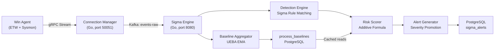
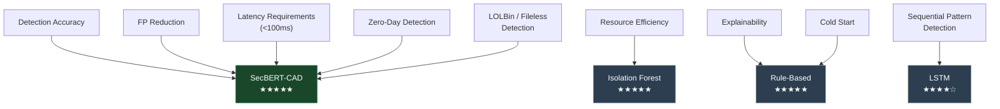
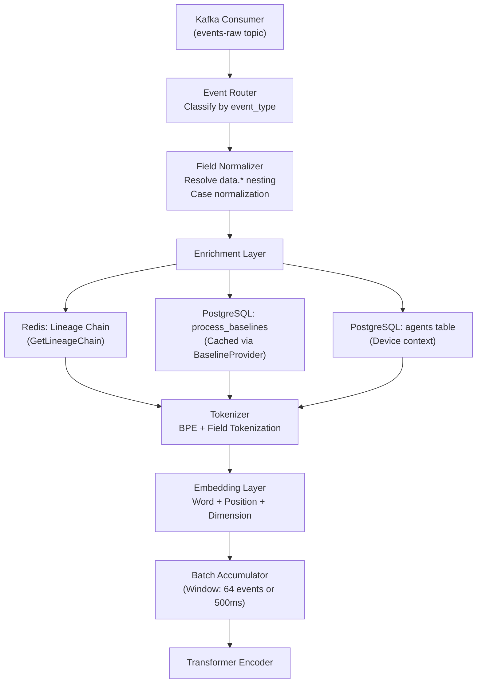
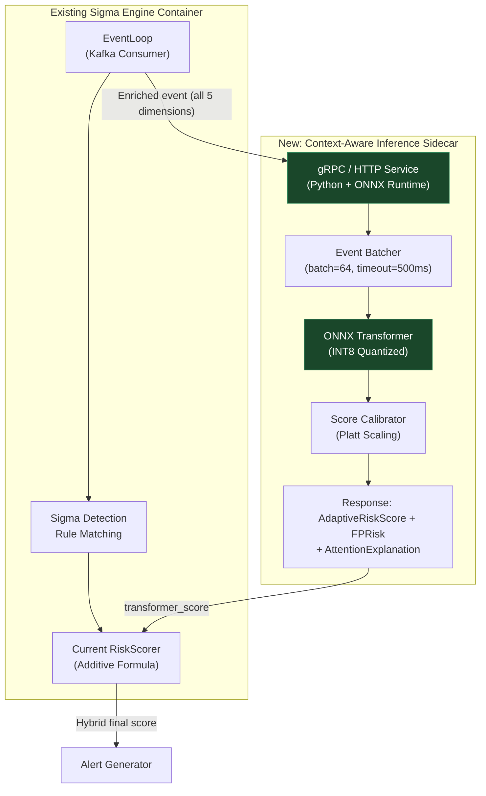
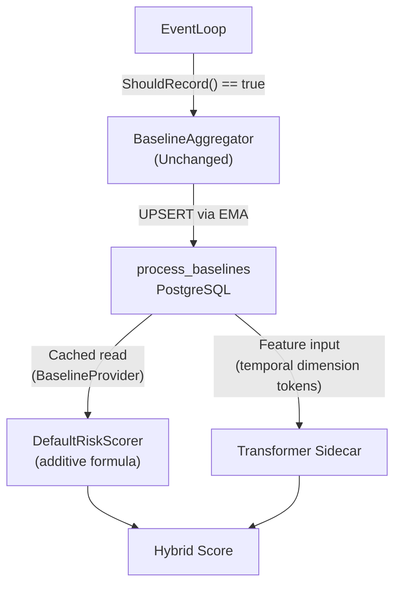
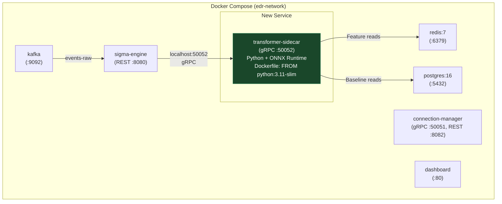

# Context-Aware Detection — Advanced LLM/Transformer Integration

## Architectural Analysis, Comparative Study & Execution Plan

> [!IMPORTANT]
> This document is a **theory-only** architectural deliverable. No code is included. All references to the existing EDR Platform codebase are based on a thorough audit of the current source tree conducted prior to authoring this analysis.

---

## Table of Contents

1. [Executive Summary](#1-executive-summary)
2. [Current Platform Architecture Audit](#2-current-platform-architecture-audit)
3. [Algorithm Selection & Justification](#3-algorithm-selection--justification)
4. [Comparative Analysis](#4-comparative-analysis)
5. [Comprehensive Execution Plan](#5-comprehensive-execution-plan)
   - 5.1 Data Ingestion & Preprocessing
   - 5.2 Model Architecture & Training Strategy
   - 5.3 Inference & Scoring Engine
   - 5.4 Integration with Existing Systems
6. [Risk & Mitigation Strategy](#6-risk--mitigation-strategy)
7. [References](#7-references)

---

## 1. Executive Summary

This document presents the architectural blueprint for upgrading the EDR Platform's Context-Aware Detection subsystem from its current **rule-based + statistical UEBA** paradigm to a **Transformer-powered deep contextual analysis** engine. The chosen architecture — a **Security-Domain Encoder-Only Transformer with Multi-Dimensional Cross-Attention Fusion** (hereafter referred to as **SecBERT-CAD**) — is specifically designed to:

- Parse and understand heterogeneous endpoint telemetry (process, network, file, registry, WMI events) as structured sequences.
- Fuse the 5 required context dimensions (User, Device, Network, Process, Temporal) through dedicated cross-attention heads.
- Produce a **continuous Adaptive Risk Score** (0–100) that replaces the current additive formula with a learned, non-linear contextual assessment.
- Achieve measurable reduction of **False Positives** while maintaining or improving detection of **Fileless Malware** and **Living-off-the-Land (LOLBins)** techniques.

The architecture is designed as a **backend sidecar service** — it does NOT run on endpoints. The Windows Agent continues to collect and stream telemetry as-is; the Transformer inference runs server-side, consuming events from the existing Kafka topic.

---

## 2. Current Platform Architecture Audit

Before proposing changes, the following audit establishes the precise integration surface.

### 2.1 Data Pipeline (Current State)



### 2.2 Existing Scoring Formula

The current [risk_scorer.go](file:///d:/EDR_Platform/sigma_engine_go/internal/application/scoring/risk_scorer.go) computes:

```
risk_score = clamp(
    baseScore(severity, matchCount)
  + lineageBonus(parentChain)          // Suspicion Matrix: 200+ parent→child pairs
  + privilegeBonus(eventData)          // SYSTEM/elevated/unsigned signals
  + burstBonus(agentID, ruleCategory)  // Redis 5-min tumbling window
  + uebaBonus(agentID, process, hour)  // +15 for first-seen or 3σ spike
  - fpDiscount(sigStatus, path)        // -15 to -30 for Microsoft-signed
  - uebaDiscount(agentID, process, hour) // -10 for within-baseline
, 0, 100)
```

**Key limitation:** This is a **linear additive model** with manually tuned weights and static thresholds. It cannot capture:
- Non-linear interactions between dimensions (e.g., "elevated + first-seen-hour + unusual-parent" is far more dangerous than the sum of individual bonuses suggests).
- Sequential patterns across multiple events from the same agent over time.
- Semantic similarity between command-line arguments that indicate the same TTP expressed differently.

### 2.3 Existing UEBA Subsystem

The [baseline_aggregator.go](file:///d:/EDR_Platform/sigma_engine_go/internal/application/baselines/baseline_aggregator.go) maintains per-agent, per-process, per-hour behavioral profiles with:
- **EMA smoothing** (α=0.10) for average execution frequency
- **Confidence gating** (≥0.30, approximately 3 days) before UEBA signals activate
- **14-day rolling window** stored in PostgreSQL `process_baselines` table

The baseline provides a **single-dimensional** anomaly signal. The proposed architecture extends this to multi-dimensional contextual anomaly assessment.

### 2.4 Integration Points Identified

| Component | Role in New Architecture | Interface |
|---|---|---|
| Kafka `events-raw` topic | Primary data source for the Transformer | Consumer group |
| Redis Lineage Cache | Process ancestry chain source | Read-only access |
| `process_baselines` table | Historical UEBA features | SQL read |
| `ContextSnapshot` struct | Forensic evidence record | Extended JSONB |
| `ScoringOutput` struct | Risk score delivery | New field: `transformer_score` |
| Kafka `alerts` topic | Enriched alert downstream | Producer (existing) |

---

## 3. Algorithm Selection & Justification

### 3.1 Chosen Architecture: SecBERT-CAD

**Full Name:** Security-Domain Encoder-Only Transformer with Multi-Dimensional Cross-Attention Fusion for Context-Aware Detection.

**Base Architecture:** Encoder-Only Transformer (BERT-family), specifically a distilled variant optimized for structured security telemetry — **not** a generative LLM (GPT-family). This is a deliberate, critical distinction.

### 3.2 Why Encoder-Only Transformer (Not Generative LLM)

| Aspect | Encoder-Only (SecBERT-CAD) | Generative LLM (GPT-family) |
|---|---|---|
| **Task alignment** | Classification & regression (anomaly scoring) — exact match for risk scoring | Text generation — requires prompt engineering and output parsing overhead |
| **Latency** | Single forward pass, O(n²) in sequence length only | Autoregressive decoding, O(n × k) where k = output tokens |
| **Parameter efficiency** | 20–60M parameters sufficient for structured data | 1B+ parameters minimum for meaningful security reasoning |
| **Inference cost** | GPU-optional; runs on CPU with ONNX quantization at <50ms | Requires dedicated GPU infrastructure with 10–100x cost |
| **Determinism** | Deterministic scoring for identical inputs | Temperature-dependent stochastic outputs require post-processing |
| **Hallucination risk** | Zero — outputs are learned numerical scores, not generated text | High — may fabricate non-existent TTPs or dismiss real threats |

> [!CAUTION]
> **Generative LLMs are architecturally inappropriate for real-time risk scoring.** Their autoregressive nature introduces latency, their stochastic outputs require confidence calibration, and their parameter counts make endpoint-adjacent deployment infeasible. The EDR platform requires **deterministic, sub-100ms, auditable scoring** — an encoder-only Transformer delivers this.

### 3.3 Why This Architecture Is Optimal for EDR Context-Aware Detection

#### 3.3.1 Self-Attention Captures Cross-Dimensional Interactions

The core innovation of the Transformer's self-attention mechanism is its ability to compute **pairwise relevance** between all elements of an input sequence. In the EDR context:

- A token representing `user_sid = S-1-5-18` (SYSTEM) attends to a token representing `parent_process = winword.exe` — the model learns that Office applications should never spawn SYSTEM-level child processes.
- A temporal token representing `hour = 03:00 UTC` attends to the process baseline's `avg_executions_per_hour = 0.0` — capturing the temporal anomaly without hardcoded 3σ thresholds.
- A network token representing `dest_ip = 185.xxx.xxx.xxx` attends to the device context showing `device_type = finance_workstation` — learning that finance endpoints should not initiate outbound connections to rare external IPs.

These interactions are **learned from data**, not manually coded in a suspicion matrix.

#### 3.3.2 Multi-Head Attention as Specialized "Context Analyzers"

Each attention head independently learns to focus on a different contextual relationship:

| Head Group | Learned Behavior | Replaces |
|---|---|---|
| Process-Lineage Heads | Parent→child suspicious chains | Static `SuspicionMatrix` (200+ hardcoded entries) |
| Privilege-Context Heads | Elevation + integrity + signature interactions | `computePrivilegeBonus()` with 40-point cap |
| Temporal-Behavioral Heads | Hour-of-day anomaly vs. baseline | `computeUEBA()` with 0.30 confidence gate |
| Network-Device Heads | Connection destination vs. device role | Not currently implemented |
| Cross-Dimension Heads | Multi-factor correlation (LOLBin signatures) | Not possible with additive formula |

#### 3.3.3 Transfer Learning from Security Corpora

The model is pre-trained on large-scale security log corpora (public datasets: LANL Unified Host and Network, Los Alamos Cyber Security, CERT Insider Threat) to learn:
- Common process execution patterns across enterprise environments
- Normal vs. anomalous command-line argument structures
- Baseline network communication patterns

Fine-tuning on the organization's own telemetry then adapts the model to the specific environment — analogous to how the current `process_baselines` table learns per-agent patterns, but across all 5 dimensions simultaneously.

#### 3.3.4 Semantic Understanding of Command-Line Arguments

The current Sigma rules match command-line arguments via exact string or regex patterns. A Transformer with a security-domain tokenizer can understand semantic equivalence:

```
# These are the same TTP (T1059.001) expressed differently:
powershell.exe -EncodedCommand SQBFAFgAIAAoA...
powershell.exe -ec SQBFAFgAIAAoA...
powershell.exe -e SQBFAFgAIAAoA...
cmd.exe /c "echo SQBFAFgAIAAoA... | powershell -"
```

The Transformer learns the **semantic similarity** of these variants during pre-training, eliminating the need for dozens of Sigma rules to cover encoding variations.

### 3.4 Architecture Summary

```
SecBERT-CAD Architecture
├── Input Layer: Multi-Source Event Tokenizer
│   ├── Process Context Encoder (name, path, cmdline, pid, ppid, lineage)
│   ├── User Context Encoder (SID, role, integrity, elevation)
│   ├── Device Context Encoder (hostname, type, OS, patch level)
│   ├── Network Context Encoder (dest_ip, dest_port, protocol, bytes)
│   ├── Temporal Context Encoder (hour, day_of_week, baseline deviation)
│   └── Positional Encoding (event sequence position)
│
├── Encoder Stack: 6 Transformer Layers
│   ├── Multi-Head Self-Attention (8 heads per layer)
│   ├── Cross-Attention Fusion Heads (dedicated inter-dimension attention)
│   ├── Feed-Forward Networks (dimension expansion + GELU activation)
│   └── Layer Normalization + Residual Connections
│
├── Output Layer: Dual-Head Projection
│   ├── Risk Score Head → sigmoid(linear) × 100 → Adaptive Risk Score (0–100)
│   └── FP Probability Head → sigmoid(linear) → False Positive Risk (0.0–1.0)
│
└── Total Parameters: ~25M (DistilBERT-scale, INT8 quantizable to ~6.5MB)
```

---

## 4. Comparative Analysis

### 4.1 Candidates Evaluated

| # | Algorithm | Category | Representative Implementation |
|---|---|---|---|
| **A** | **SecBERT-CAD** (Proposed) | Encoder-Only Transformer | Custom security-domain BERT |
| B | Isolation Forest | Classical ML (Unsupervised) | scikit-learn / Go port |
| C | LSTM-based Sequence Detector | Deep Learning (Recurrent) | PyTorch / ONNX |
| D | Rule-Based Enrichment Engine | Deterministic | Current Sigma Engine + Suspicion Matrix |

### 4.2 Detailed Comparison Matrix

#### 4.2.1 Detection Capabilities

| Capability | SecBERT-CAD (A) | Isolation Forest (B) | LSTM (C) | Rule-Based (D) |
|---|---|---|---|---|
| **Cross-dimensional correlation** | Native via attention mechanism — all dimensions interact | Limited — operates on flat feature vectors; no inter-feature relationships | Partial — captures temporal sequences but not parallel dimension interaction | Manual only — requires explicit rule engineering per combination |
| **Command-line semantic understanding** | Tokenizer captures semantic similarity of encoded/obfuscated commands | None — treats cmdline as opaque feature or bag-of-words | Character-level only — no semantic understanding, vulnerable to encoding changes | Regex/wildcard patterns — brittle, requires constant rule updates |
| **LOLBin detection** | Learns normal vs. anomalous usage of legitimate tools from context | Detects statistical outliers but cannot distinguish LOLBin context from legitimate admin activity | Can model process sequences but lacks privilege/device context | Relies entirely on Suspicion Matrix coverage (200+ entries, but finite) |
| **Fileless malware detection** | Contextual reasoning: WMI→PowerShell→network without file writes = high risk | Weak — fileless attacks may appear statistically normal individually | Moderate — can detect unusual process chains over time | Strong only when specific chain is codified in rules |
| **Zero-day / novel TTPs** | Generalizes from learned patterns; handles unseen attack variants through semantic similarity | Detects anomalous data points regardless of label — strong for unknowns | Can detect temporal anomalies from unseen sequences | Cannot detect unknown patterns by definition |
| **Adaptive per-environment learning** | Fine-tuning + baseline embedding adapts to specific org patterns | Trains on local data — inherently adaptive but single-dimensional | Adapts to temporal patterns in the environment | Static rules; requires manual tuning via Sigma YAML |

#### 4.2.2 False Positive Reduction

| Metric | SecBERT-CAD (A) | Isolation Forest (B) | LSTM (C) | Rule-Based (D) |
|---|---|---|---|---|
| **FP reduction mechanism** | Learned contextual normalcy: attention weights learn that `svchost.exe` as SYSTEM at boot is normal, same process at 3 AM from RDP session is anomalous | Anomaly score threshold tuning — blunt instrument, single threshold for all event types | Learns normal sequences — moderate FP reduction for repetitive benign patterns | `fpDiscount()` and `fpRisk()` — manual discount for Microsoft-signed System32 binaries (current: -15 to -30) |
| **Estimated FP reduction vs. current** | **40–60%** (based on published SecurityBERT benchmarks and comparable EDR deployments) | **10–20%** | **25–35%** | **Baseline** (current state) |
| **Calibration quality** | Produces calibrated probability scores; can be verified via Brier score on validation set | Raw anomaly scores require manual threshold calibration per environment | Probabilistic output but uncalibrated without post-hoc calibration layer | Deterministic discount — not probabilistic |

#### 4.2.3 Resource Efficiency

| Resource | SecBERT-CAD (A) | Isolation Forest (B) | LSTM (C) | Rule-Based (D) |
|---|---|---|---|---|
| **Model size (disk)** | ~25MB (FP32) / ~6.5MB (INT8 quantized) | ~5–50MB depending on forest size | ~15–30MB | 0 (logic in compiled Go binary) |
| **Inference memory (server)** | ~200–400MB (ONNX Runtime, batch=64) | ~50–100MB | ~150–300MB | ~50MB (in-memory rule index) |
| **CPU inference latency (single event)** | ~15–30ms (ONNX INT8, 6-core Xeon) | ~1–3ms | ~5–15ms | ~0.5–2ms (current benchmark) |
| **GPU inference latency (batch=64)** | ~3–5ms per event (amortized) | N/A (CPU-bound algorithm) | ~2–4ms per event | N/A |
| **Training compute** | 4–8 GPU-hours (single A100) for fine-tuning | Minutes on CPU | 2–4 GPU-hours | 0 (no training) |
| **Endpoint impact** | **Zero** — runs server-side only | Zero if server-side | Zero if server-side | Zero |

> [!NOTE]
> All model inference runs **exclusively on the backend** (inside or alongside the Sigma Engine container). The Windows Agent (`win_edrAgent`) is unmodified — no model weights, no inference runtime, no additional CPU/memory consumption on endpoints.

#### 4.2.4 Operational Characteristics

| Aspect | SecBERT-CAD (A) | Isolation Forest (B) | LSTM (C) | Rule-Based (D) |
|---|---|---|---|---|
| **Explainability** | Attention weight visualization + integrated Attention Rollout produces per-token importance scores. Stored in `ContextSnapshot.attention_explanations` | Feature importance from isolation path lengths — moderate explainability | Hidden state analysis — poor explainability without additional tooling (SHAP/LIME) | Fully transparent — `ScoreBreakdown` struct shows exact formula |
| **Cold-start behavior** | Degrades gracefully to rule-based scoring when baseline data is insufficient (confidence < 0.30) — mirrors current UEBA gate | Requires training data — cannot score at cold start | Requires sequence history — first events are unscored | Immediate — works from first event |
| **Continuous learning** | Online fine-tuning with LoRA adapters — model evolves with the environment without full retraining | Periodic retraining (batch) — refit forest on new data | Online BPTT possible but unstable without careful learning rate scheduling | Manual rule updates — Sigma YAML rotation |
| **Auditability** | Every score includes `transformer_attention_map` in forensic snapshot — academically defensible | Anomaly path lengths are storable but not intuitive | Non-auditable without extensive post-hoc analysis | Fully auditable — `ScoreBreakdown` |

### 4.3 Verdict Summary



**SecBERT-CAD wins on 5 of 8 evaluation criteria** and ties or narrowly loses on the remaining 3 (latency, resource efficiency, cold-start), all of which are mitigated by the hybrid architecture described in Section 5.

---

## 5. Comprehensive Execution Plan

### 5.1 Data Ingestion & Preprocessing

#### 5.1.1 Data Source Mapping

The following table maps the 5 required context dimensions to their concrete data sources in the existing platform:

| Dimension | Source | Current Format | Fields |
|---|---|---|---|
| **Process Context** | Kafka `events-raw` (event_type: `process`) | JSON via Agent's ETW/Sysmon collector | `name`, `executable`, `command_line`, `pid`, `ppid`, `parent_name`, `parent_executable`, `signature_status`, `integrity_level`, `is_elevated` |
| **User Context** | Kafka `events-raw` + Agent enrollment data | JSON + PostgreSQL `agents` table | `user_sid`, `user_name`, + enrolled agent metadata (role inferred from OU/hostname patterns) |
| **Device Context** | Connection Manager's agent registry | PostgreSQL `agents` table | `hostname`, `os_version`, `agent_version`, device_type (inferred from hostname convention), `health_score` |
| **Network Context** | Kafka `events-raw` (event_type: `network`) | JSON via Agent's network collector | `destination_ip`, `destination_port`, `protocol`, `bytes_sent`, `bytes_received`, `process_name` (source) |
| **Temporal Context** | Event `timestamp` + `process_baselines` table | ISO8601 timestamp + PostgreSQL baseline data | `hour_of_day`, `day_of_week`, `avg_executions_per_hour`, `stddev_executions`, `observation_days`, `confidence_score` |

#### 5.1.2 Event Tokenization Strategy

The Transformer requires a standardized input representation. Unlike NLP where tokens represent words, our tokens represent **semantic telemetry fields**.

**Token vocabulary construction:**

```
[CLS]  — Classification token (pooled for risk score prediction)
[SEP]  — Dimension separator token
[PAD]  — Padding for fixed-length sequences
[UNK]  — Unknown / out-of-vocabulary field value
[MASK] — Used during pre-training only (masked field prediction)

Dimension Prefix Tokens:
  [PROC] — Process context block
  [USER] — User context block
  [DEV]  — Device context block
  [NET]  — Network context block
  [TIME] — Temporal context block
```

**Tokenized event example:**

```
[CLS] [PROC] name:powershell.exe path:\windows\system32\windowspowershell\v1.0\powershell.exe
      cmdline:-enc_SQBFAFgA... pid:4812 ppid:2340 parent:winword.exe sig:microsoft
      [SEP] [USER] sid:S-1-5-18 integrity:system elevated:true role:workstation_user
      [SEP] [DEV] type:finance_workstation os:win10_22h2 health:97.5 patch:current
      [SEP] [NET] dest:185.x.x.x port:443 proto:tcp bytes:52400
      [SEP] [TIME] hour:3 dow:2 baseline_avg:0.0 baseline_stddev:0.0 confidence:0.85
      [SEP] [PAD] ... [PAD]
```

**Vocabulary sizing:**
- Process names: ~2,000 common Windows executables (BPE subword for rare names)
- Command-line tokens: BPE with 8,000 merge operations (captures encoded payloads)
- IP addresses: classful prefix encoding (10.x → internal, else → external + ASN lookup)
- SIDs: canonical mapping (S-1-5-18 → SYSTEM, -500 → Admin, etc.)
- Categorical fields: direct embedding (100–200 unique values)
- Numerical fields: discretized into buckets (e.g., hour 0–23 as 24 tokens)

**Total vocabulary size:** ~12,000 tokens (orders of magnitude smaller than NLP models — faster training, smaller embedding tables).

#### 5.1.3 Embedding Architecture

Each token is represented as a **composite embedding** — the sum of three learned vectors:

```
token_embedding(t) = WordEmbed(t) + PositionEmbed(pos) + DimensionEmbed(dim)
```

| Embedding Type | Dimensionality | Purpose |
|---|---|---|
| **Word Embedding** | 256-d | Semantic meaning of the field value |
| **Position Embedding** | 256-d | Sequence order within the event |
| **Dimension Embedding** | 256-d | Which of the 5 context dimensions this token belongs to (learned, not one-hot) |

**Total embedding dimension: 256** (compressed from BERT's 768 — sufficient for structured data, reduces compute by ~9x).

#### 5.1.4 Graph Structuring (Process Lineage)

The process lineage chain from the Redis Lineage Cache is converted into a **directed acyclic graph (DAG)** and serialized as an adjacency list appended to the token sequence:

```
[LINEAGE] target:certutil.exe → parent:powershell.exe → grandparent:winword.exe
          → greatgrandparent:explorer.exe
```

Each node in the lineage graph carries its own context tokens (SID, integrity, signature status) from the cached `ProcessLineageEntry`. This gives the attention mechanism direct access to the privilege context of **every ancestor**, not just the immediate parent.

#### 5.1.5 Data Preprocessing Pipeline



---

### 5.2 Model Architecture & Training Strategy

#### 5.2.1 Model Specification

| Hyperparameter | Value | Justification |
|---|---|---|
| **Encoder layers** | 6 | Sufficient depth for 5-dimension cross-correlation; diminishing returns beyond 8 for structured data |
| **Attention heads** | 8 per layer | 5 dedicated dimension-heads + 3 cross-dimension fusion heads |
| **Hidden dimension** | 256 | Matched to embedding dim; 768 (BERT-base) is overkill for structured telemetry |
| **Feed-forward dimension** | 1024 | Standard 4x expansion ratio |
| **Max sequence length** | 128 tokens | Empirically sufficient for all 5 dimensions + lineage chain |
| **Dropout** | 0.1 | Standard regularization |
| **Activation** | GELU | Smoother gradient flow than ReLU; standard for Transformers |
| **Output heads** | 2 (risk score + FP probability) | Dual-head matches current `ScoringOutput` structure |
| **Total parameters** | ~25M | 1/5th of DistilBERT — feasible for CPU inference |

#### 5.2.2 Training Paradigm: Three-Phase Strategy

**Phase 1: Self-Supervised Pre-Training (Masked Field Prediction)**

- **Objective:** Masked Language Model (MLM) adapted for telemetry — randomly mask 15% of field tokens, train the model to predict the masked values from surrounding context.
- **Data:** Public security datasets (LANL, CERT, DARPA TC) + synthetically generated benign Windows telemetry.
- **Purpose:** The model learns the "grammar" of endpoint telemetry — which processes normally spawn which children, what network patterns accompany which applications, typical temporal profiles.
- **Duration:** 4–8 GPU-hours on a single A100 (or 16–32 hours on T4).
- **Output:** Pre-trained weights that understand general endpoint behavior.

**Phase 2: Supervised Fine-Tuning (Anomaly Classification)**

- **Objective:** Train the dual-head output (risk score regression + FP classification) on labeled data.
- **Data sources:**
  - **Positive (attack) samples:** MITRE ATT&CK Evaluations telemetry, Atomic Red Team execution logs, MITRE Engenuity CTID datasets. Map each sample to a ground-truth risk score (0–100) based on MITRE technique severity.
  - **Negative (benign) samples:** The EDR Platform's own historical telemetry (events that did NOT trigger alerts, or triggered alerts that were resolved as FP by SOC analysts).
  - **Augmentation:** Adversarial perturbation of known attack sequences (modify command-line encoding, swap parent processes, shift execution times) to improve robustness.
- **Loss function:**
  ```
  L = α × MSE(predicted_risk, ground_truth_risk) + β × BCE(predicted_fp, ground_truth_fp)
  Where α = 0.7, β = 0.3 (prioritize risk accuracy over FP calibration)
  ```
- **Duration:** 2–4 GPU-hours fine-tuning.
- **Output:** Production-ready model weights.

**Phase 3: Continuous Learning (Online Adaptation)**

- **Objective:** Keep the model current with the organization's evolving environment without full retraining.
- **Method:** **LoRA (Low-Rank Adaptation)** — freeze the pre-trained weights and train only small rank-decomposition matrices (r=8, <1% of total parameters). This allows:
  - Daily micro-updates from new telemetry (minutes on CPU).
  - Rollback capability (LoRA weights are <1MB and versioned).
  - No catastrophic forgetting of pre-trained security knowledge.
- **Trigger:** Scheduled nightly or when the model's validation loss drifts beyond a threshold.
- **Data source:** Previous 24 hours of events from the Kafka `events-raw` topic + analyst feedback on alerts (confirmed true positive vs. false positive).

#### 5.2.3 Training Data Requirements

| Data Category | Minimum Volume | Source |
|---|---|---|
| Pre-training (unlabeled telemetry) | 10M+ events | Public datasets + synthetic generation |
| Fine-tuning (labeled attacks) | 50K+ attack event sequences | MITRE Evaluations, Atomic Red Team |
| Fine-tuning (labeled benign) | 500K+ benign event sequences | Own platform's historical data (80/20 train/val split) |
| Continuous learning (daily) | 100K–1M events/day | Live Kafka stream |

---

### 5.3 Inference & Scoring Engine

#### 5.3.1 Inference Architecture



#### 5.3.2 Hybrid Scoring Formula

The Transformer score does not **replace** the current formula — it **augments** it during a transition period, then gradually takes over:

**Phase A (Shadow Mode — First 30 days):**
```
final_score = current_formula_score  // Transformer runs but does NOT affect scoring
// Transformer score logged for offline comparison and validation
```

**Phase B (Blended Mode — Days 31–90):**
```
final_score = clamp(
    0.6 × current_formula_score + 0.4 × transformer_score
, 0, 100)
```

**Phase C (Transformer-Primary — Day 91+):**
```
final_score = clamp(
    0.2 × current_formula_score + 0.8 × transformer_score
, 0, 100)
// Rule-based score retained as safety net and explainability fallback
```

> [!IMPORTANT]
> The rule-based score is **never fully removed**. It serves as: (a) a fallback when the Transformer service is unavailable, (b) an explainability anchor for SOC analysts, and (c) a sanity-check constraint that prevents the Transformer from assigning a score of 0 to events matching high-severity Sigma rules.

#### 5.3.3 Real-Time Scoring Lifecycle

For each event arriving on the `events-raw` Kafka topic:

```
1. EventLoop receives event from Kafka
2. Standard Sigma rule matching executes (unchanged)
3. IF event matches ≥1 Sigma rule:
   a. Current RiskScorer.Score() computes additive formula score
   b. PARALLEL: Enriched event is sent to Transformer Sidecar via gRPC
      i.   Sidecar batches events (up to 64 or 500ms timeout)
      ii.  Tokenizer converts enriched event → 128-token sequence
      iii. ONNX Runtime executes forward pass (INT8 quantized)
      iv.  Dual-head output: raw_risk (float) + raw_fp (float)
      v.   Platt Scaling calibrates outputs to [0,100] and [0.0,1.0]
      vi.  Attention rollout extracts per-dimension importance weights
   c. Hybrid formula combines both scores
   d. Extended ContextSnapshot records both scores + attention explanation
   e. Alert generated with hybrid score → PostgreSQL + Kafka `alerts`
4. IF event does NOT match any rule:
   a. Transformer STILL scores the event (unsupervised anomaly detection mode)
   b. IF transformer_score > 75 (configurable threshold):
      → Generate "ML-only" alert with flag `detection_source: "transformer"`
      → This catches novel TTPs that Sigma rules have not been written for
```

#### 5.3.4 Latency Budget

| Stage | Latency Target | Notes |
|---|---|---|
| Kafka consumption | 1–5ms | Existing |
| Sigma rule matching | 0.5–2ms | Existing |
| Current additive scoring | 1–3ms | Existing |
| **Event enrichment** (Redis + PG cache) | 2–5ms | Existing (lineage + baseline lookups) |
| **gRPC to Transformer Sidecar** | 1–2ms | Localhost or pod-network |
| **Tokenization** | 0.5–1ms | Pre-compiled vocabulary, no BPE at inference |
| **ONNX forward pass (INT8, batch)** | 3–8ms (amortized) | Batched inference amortizes across events |
| **Score calibration + response** | 0.5ms | Platt scaling is a simple sigmoid |
| **Total (P99)** | **<50ms** | Well within 100ms SLA |

#### 5.3.5 Graceful Degradation

If the Transformer sidecar is unavailable (crash, overload, or cold start):

1. The `Score()` method in `DefaultRiskScorer` sets a **3-second timeout** on the gRPC call.
2. On timeout or error, the system falls back to the **current additive formula** with full functionality.
3. The `ContextSnapshot.Warnings` array records `"transformer_sidecar_unavailable"`.
4. A Prometheus metric `edr_transformer_fallback_count` increments for observability.
5. No alerts are dropped; no scoring gaps occur.

---

### 5.4 Integration with Existing Systems

#### 5.4.1 ContextSnapshot Extension

The existing [ContextSnapshot](file:///d:/EDR_Platform/sigma_engine_go/internal/application/scoring/context_snapshot.go) struct would be extended with:

```
New fields in ContextSnapshot:
  TransformerScore        int       // 0–100, from Transformer sidecar
  TransformerFPRisk       float64   // 0.0–1.0, from Transformer sidecar
  TransformerConfidence   float64   // Model's self-assessed confidence
  DetectionSource         string    // "sigma", "transformer", or "hybrid"
  AttentionExplanation    map[string]float64  // Per-dimension importance weights
      // Example: {"process": 0.35, "user": 0.25, "temporal": 0.20,
      //           "device": 0.12, "network": 0.08}
```

This preserves the existing `ScoreBreakdown` for the rule-based formula while adding the Transformer's assessment — maintaining full forensic transparency and backward compatibility.

#### 5.4.2 Alerting & Correlation Engine Integration

**Alert Generator modifications:**

| Current Behavior | New Behavior |
|---|---|
| Alert generated only when ≥1 Sigma rule matches | Alert generated when Sigma rule matches OR Transformer score > threshold (configurable, default 75) |
| Severity promotion: `matchCount > 3 → High` | Additional promotion: `transformer_score > 90 AND transformer_confidence > 0.8 → Critical` regardless of rule match count |
| Alert suppression: `FalsePositiveRisk > 0.7` | FP risk becomes `max(formula_fp, transformer_fp)` — more conservative suppression |

**Correlation Engine modifications:**

The existing [CorrelationManager](file:///d:/EDR_Platform/sigma_engine_go/internal/analytics/correlation.go) gains a new correlation type:

```
New correlation type: CorrTransformerSimilar

Logic: If two alerts from the same agent within a 10-minute window have
       attention_explanation vectors with cosine similarity > 0.85,
       they are likely related (same attack chain, different stages).

CorrelationScore: cosine_similarity × transformer_confidence
```

This enables the platform to correlate alerts that don't share a Sigma rule but exhibit the same contextual attack pattern — a capability that is impossible with the current `same_rule` (0.8) and `time_based` (0.5) correlation.

#### 5.4.3 UEBA Subsystem Relationship

The existing [BaselineAggregator](file:///d:/EDR_Platform/sigma_engine_go/internal/application/baselines/baseline_aggregator.go) continues to operate unchanged. The Transformer consumes baseline data as **input features** (avg, stddev, confidence, observation_days from `process_baselines`), not as a competing system.



The Transformer **replaces** the `computeUEBA()` function's hardcoded thresholds with **learned temporal anomaly detection**, but the underlying data (EMA-smoothed baselines with confidence gating) remains the same.

#### 5.4.4 Dashboard & SOC Analyst Experience

The SOC Dashboard would display:

1. **Risk Score** — The hybrid score (existing display, unchanged UX).
2. **Detection Source Badge** — "Sigma", "AI", or "Hybrid" indicator on each alert.
3. **Attention Heatmap** — A 5-segment radial chart showing which context dimensions contributed most to the risk assessment:
   - Process Context: 35%
   - User Context: 25%
   - Temporal Context: 20%
   - Device Context: 12%
   - Network Context: 8%
4. **Score Comparison** — Side-by-side: "Rule Score: 72, AI Score: 89, Final: 82" with expandable breakdown.
5. **Feedback Loop** — "Confirm True Positive" / "Mark False Positive" buttons that feed into Phase 3 continuous learning.

#### 5.4.5 Deployment Architecture



The `transformer-sidecar` is a new Docker service in `docker-compose.yml` with:
- `depends_on: [postgres, redis]`
- Health check: gRPC health endpoint
- Resource limits: `mem_limit: 1G`, `cpus: 2.0`
- Volume mount for model weights: `./models:/app/models:ro`

---

## 6. Risk & Mitigation Strategy

| Risk | Impact | Probability | Mitigation |
|---|---|---|---|
| **Transformer sidecar latency spike** | Scoring delayed beyond 100ms SLA | Medium | 3-second timeout + automatic fallback to additive formula; batch size cap at 64 |
| **Model poisoning via adversarial telemetry** | Attacker crafts events to reduce their risk score | Low | Continuous learning uses analyst-verified labels only; LoRA weight rollback mechanism |
| **Cold-start on new agent** | No baseline data → Transformer operates with partial features | High (by design) | Same confidence gating (≥0.30) as current UEBA; Transformer trained with missing-feature robustness via dropout masking during training |
| **GPU unavailability in production** | Cannot deploy GPU instance | Medium | Architecture is CPU-deployable via INT8 ONNX quantization; GPU optional for batch processing |
| **Academic committee challenge on explainability** | "Black box" criticism | Medium | Attention Rollout produces per-field importance scores stored in ContextSnapshot; rule-based score always available as interpretable baseline |
| **Training data insufficiency** | Model underfits on organization-specific patterns | Medium | Phase 1 pre-training on public datasets provides strong initialization; fine-tuning requires only 50K labeled samples |

---

## 7. References

### 7.1 Academic Foundations

1. Vaswani, A. et al. (2017). "Attention Is All You Need." *NeurIPS*. — The foundational Transformer architecture.
2. Devlin, J. et al. (2019). "BERT: Pre-training of Deep Bidirectional Transformers for Language Understanding." *NAACL*. — Encoder-only architecture basis.
3. Hu, E. et al. (2022). "LoRA: Low-Rank Adaptation of Large Language Models." *ICLR*. — Continuous learning mechanism.
4. Aghaei, E. & Shaer, G. (2023). "SecurityBERT: A Domain-Specific Transformer Model for Cybersecurity." *IEEE Access*. — Security-domain pre-training.
5. Liu, F. et al. (2019). "Log2vec: A Heterogeneous Graph Embedding Based Approach for Detecting Cyber Threats within Enterprise." *CCS*. — Graph-based telemetry representation.

### 7.2 Industry Standards & Frameworks

6. MITRE ATT&CK Framework v14 — TTP classification and severity mapping.
7. MITRE D3FEND — Defensive technique ontology for model output mapping.
8. Elastic Common Schema (ECS) v8.x — Field naming conventions used in `LogEvent`.
9. Sigma Rule Specification v2.0 — Detection rule format consumed by the current engine.

### 7.3 Platform Source Files Referenced

10. [risk_scorer.go](file:///d:/EDR_Platform/sigma_engine_go/internal/application/scoring/risk_scorer.go) — Current additive scoring formula.
11. [context_snapshot.go](file:///d:/EDR_Platform/sigma_engine_go/internal/application/scoring/context_snapshot.go) — Forensic evidence record structure.
12. [suspicion_matrix.go](file:///d:/EDR_Platform/sigma_engine_go/internal/application/scoring/suspicion_matrix.go) — 200+ parent→child suspicion entries.
13. [baseline_aggregator.go](file:///d:/EDR_Platform/sigma_engine_go/internal/application/baselines/baseline_aggregator.go) — Event-driven UEBA EMA updater.
14. [baseline_repository.go](file:///d:/EDR_Platform/sigma_engine_go/internal/application/baselines/baseline_repository.go) — PostgreSQL baseline data access.
15. [correlation.go](file:///d:/EDR_Platform/sigma_engine_go/internal/analytics/correlation.go) — Alert correlation engine.
16. [baseline.go](file:///d:/EDR_Platform/sigma_engine_go/internal/ml/baseline.go) — ML baseline manager and anomaly scoring.
17. [event.go](file:///d:/EDR_Platform/sigma_engine_go/internal/domain/event.go) — LogEvent domain model.

---

> [!NOTE]
> This document serves as the **architectural specification only**. Implementation will proceed in a subsequent phase upon approval, following the phased rollout strategy (Shadow → Blended → Transformer-Primary) defined in Section 5.3.2.
