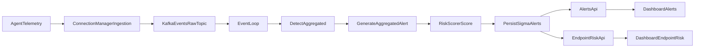

<div dir="rtl">

## وثيقة تصميم داخلية (Internal Design Doc)

### الموضوع

**Context-Aware Risk Scoring v2** في منصة `edr-platform` — من لحظة وصول الـ event حتى ظهور `risk_score` و`risk_level` في الـ Dashboard، مع توثيق المعادلات، مصادر القيم، ملفات الكود المسؤولة، والقيم الثابتة وكيف تتم إدارتها من ملف config واحد.

### الهدف من v2

- **مصدر واحد للثوابت**: كل الأوزان/العتبات/الـ multipliers الخاصة بالـ scoring أصبحت تُدار من:
  - `sigma_engine_go/config/config.yaml` تحت المفتاح `risk_scoring:`
- **تفسير موحّد** لدرجة الخطورة في الواجهة:
  - `risk_level` يُحسب في الـ backend من `risk_score` باستخدام عتبات من `risk_scoring.risk_levels`.
- **سياسات سياق deterministic**:
  - Policy واحدة فعّالة لكل `(scope_type, scope_value)` ويتم **استبدالها (upsert)** بدل stacking.

</div>

<div dir="rtl">

## 8) Quick Reference (Field → Source → Formula → UI)

</div>

<div dir="ltr">

| Field | Source (code/data) | Formula / Computation | UI Surface |
|---|---|---|---|
| `base_score` | `computeBaseScore(...)` in `risk_scorer.go`; severity from `primary.Rule.Severity()` | Severity map + match correlation bonus (`risk_scoring.base_score.*`) | `Alerts` Context modal (`score_breakdown.base_score`) |
| `lineage_bonus` | `rs.matrix.ComputeBonus(lineageChain)` + lineage from cache lookup | Suspicion matrix bonus by process ancestry | `Alerts` Context modal (`score_breakdown.lineage_bonus`) |
| `privilege_bonus` | `computePrivilegeBonus(event.RawData, cfg.Privilege)` | Adds configured bonuses for SYSTEM/admin/elevation/signature states | `Alerts` Context modal (`score_breakdown.privilege_bonus`) |
| `burst_bonus` | `BurstTracker.IncrAndGet(...)` then `computeBurstBonus(...)` | Thresholded bonus from configured burst buckets | `Alerts` Context modal (`score_breakdown.burst_bonus`) |
| `fp_discount` | `computeFPDiscount(sigStatus, executable, cfg.FalsePositive)` | Discount for trusted signed binaries/paths | `Alerts` Context modal (`score_breakdown.fp_discount`) |
| `false_positive_risk` | `computeFPRisk(sigStatus, executable, cfg.FalsePositive)` | Probability bucket by signature/path trust | `Alerts` summary + details |
| `ueba_bonus` / `ueba_discount` | `computeUEBA(...)` using baseline provider | Anomaly bonus or normalcy discount from UEBA thresholds | `Alerts` Context modal (`score_breakdown.ueba_*`) |
| `interaction_bonus` | `computeInteractionBonus(..., cfg.Interaction)` | Extra bonus when multiple high signals co-occur | `Alerts` Context modal (`score_breakdown.interaction_bonus`) |
| `UserRoleWeight` | `ContextPolicyProvider.Resolve(...)` | Multiplicative factor from policy precedence (`global→agent→user`) | `context_snapshot` + details panel |
| `DeviceCriticalityWeight` | `ContextPolicyProvider.Resolve(...)` | Multiplicative factor from matched policies | `context_snapshot` + details panel |
| `NetworkAnomalyFactor` | `ContextPolicyProvider.Resolve(...)` + CIDR trusted check | Policy factor then trusted/untrusted multiplier | `context_snapshot` + details panel |
| `context_multiplier` | `ContextFactors.Multiplier(cfg.ContextPolicy)` | `clamp(user*device*network, min,max)` | `score_breakdown.context_multiplier` |
| `quality_factor` | `computeContextQualityFactor(score, missing, cfg.Quality)` | Bucketed multiplier from context completeness | `score_breakdown.quality_factor` |
| `raw_score` | `Score(...)` in `risk_scorer.go` | Sum bonuses − discounts before multipliers | `score_breakdown.raw_score` |
| `context_adjusted_score` | `Score(...)` in `risk_scorer.go` | `round(raw_score * context_multiplier * quality_factor)` | `score_breakdown.context_adjusted_score` |
| `final_score` / `risk_score` | `Score(...)` then persisted in alerts table | `clamp(context_adjusted_score, 0, 100)` | Alerts table badge + detail modal + endpoint aggregate APIs |
| `risk_level` | `RiskLevelFromScore(...)` in `risk_level.go`; added by `alerts.go` response mapper | Threshold mapping from `risk_scoring.risk_levels.*` | `Alerts` badge styling (prefers backend `risk_level`) |

</div>

<div dir="rtl">

## 9) Compliance Matrix (الخطة → التنفيذ الفعلي)

</div>

<div dir="ltr">

| Plan Requirement | Implementation Status | Files / Symbols |
|---|---|---|
| Centralize scoring constants in one YAML config | Completed | `sigma_engine_go/config/config.yaml` (`risk_scoring`), `sigma_engine_go/internal/infrastructure/config/config.go` (`Config.RiskScoring`), `sigma_engine_go/internal/application/scoring/scoring_config.go` |
| Inject config into scorer/provider and remove hardcoded constants | Completed | `sigma_engine_go/internal/application/scoring/risk_scorer.go` (`NewDefaultRiskScorerWithConfig`, config-driven compute functions), `sigma_engine_go/internal/application/scoring/context_policy_provider.go` (`NewPostgresContextPolicyProviderWithConfig`, config clamps/multipliers), `sigma_engine_go/cmd/sigma-engine-kafka/main.go` (wiring) |
| Add backend risk-level mapping from final_score | Completed | `sigma_engine_go/internal/application/scoring/risk_level.go` (`RiskLevelFromScore`), `sigma_engine_go/internal/handlers/alerts.go` (`RiskLevel` in response), `sigma_engine_go/internal/handlers/server.go` (pass `RiskLevelsConfig`) |
| Align dashboard with backend risk level source-of-truth | Completed | `dashboard/src/api/client.ts` (`Alert.risk_level`), `dashboard/src/pages/Alerts.tsx` (`RiskScoreBadge` prefers `risk_level`) |
| Keep one-policy-per-scope and avoid stacking | Completed | `connection-manager/internal/database/migrations/017_create_context_policies.up.sql` (`UNIQUE(scope_type, scope_value)`), `connection-manager/internal/repository/context_policy_repo.go` (`Create` as UPSERT/replace), `connection-manager/pkg/api/handlers_other.go` (global `scope_value='*'` validation) |
| Produce formal design doc with formulas/pipeline/rationale | Completed | `docs/context-aware-scoring-v2.md` |
| Add targeted tests for config-driven behavior | Completed | `sigma_engine_go/internal/application/scoring/risk_level_test.go`, `sigma_engine_go/internal/application/scoring/context_multiplier_test.go` |

</div>

<div dir="rtl">

## 10) Baseline Deep Dive (نفس نمط أسئلتك التفصيلي)

### 10.1 ما هو baseline في هذا النظام؟

الـ baseline هنا هو **ملف سلوك process** لكل:
- `agent_id` + `process_name` + `hour_of_day (UTC)`

أي أن النطاق الأساسي هو:
- **مستوى الجهاز + العملية + الساعة**
- وليس baseline per user بشكل مباشر.

### 10.2 ما هي الحقول التي تُجمع من الوكيل؟

الحقول التي تُستخرج إلى `AggregationInput` (من event الخام):
- `AgentID`
- `ProcessName` (`name`)
- `ProcessPath` (`executable`)
- `SigStatus` (`signature_status`)
- `IntegrityLevel` (`integrity_level`)
- `IsElevated` (`is_elevated`)
- `ParentName` (`parent_name`)
- `ObservedAt`

الكود المسؤول:
- `sigma_engine_go/internal/application/baselines/baseline_aggregator.go`
  - `ExtractAggregationInput(...)`

### 10.3 كيف يتم اختيار الأحداث التي تدخل baseline؟

بالدالة:
- `ShouldRecord(eventData)` في نفس الملف.

المنطق:
- يقبل process creation (`event_id` 1 أو 4688) أو `event_type=process`
- fallback: وجود `name` كإشارة process event

### 10.4 أين يُخزن baseline في السيرفر؟

في PostgreSQL، جدول:
- `process_baselines`

والتمثيل البرمجي:
- `ProcessBaseline` في:
  - `sigma_engine_go/internal/application/baselines/baseline_repository.go`

### 10.5 كيف تتم عملية التعلم (learning)؟

التعلم **event-driven** وليس cron:
- كل process event يتم enqueue بشكل غير حاجب (fire-and-forget)
- background workers تقوم `Upsert` للـ baseline

الكود:
- `BaselineAggregator.Record(...)`, `worker(...)`, `upsert(...)`
  - `sigma_engine_go/internal/application/baselines/baseline_aggregator.go`

### 10.6 ما هي الخوارزمية المستخدمة؟

داخل `PostgresBaselineRepository.Upsert(...)`:
- EMA للمتوسط:
  - `new_avg = 0.90*old_avg + 0.10*1.0`
- EWMV/Stddev:
  - تحديث `stddev_executions` بصيغة EWMA variance
- observation_days:
  - يزيد يوميًا حتى سقف 14
- confidence_score:
  - `1 - exp(-days/7)` مع cap `0.99`

الكود:
- `sigma_engine_go/internal/application/baselines/baseline_repository.go`

### 10.7 فترة التعلم (learning period)؟

عمليًا عندك مستويان:
1. نافذة baseline المخزنة: `baseline_window_days = 14`
2. تفعيل إشارة UEBA في الـ scorer عند:
   - `ConfidenceScore >= risk_scoring.ueba.confidence_gate` (default 0.30)

هذا يعني أن baseline يبدأ يتعلم من أول حدث، لكن التأثير في scoring يُفعّل بعد تخطي confidence gate.

### 10.8 هل baseline مستخدم الآن فعليًا؟

نعم، في المسار الإنتاجي الحالي:
- bootstrapping:
  - `sigma_engine_go/cmd/sigma-engine-kafka/main.go`
  - ينشئ `BaselineRepository` + `BaselineCache` + `BaselineAggregator`
- event loop:
  - `sigma_engine_go/internal/infrastructure/kafka/event_loop.go`
  - يسجل process events إلى aggregator
- scorer:
  - `sigma_engine_go/internal/application/scoring/risk_scorer.go`
  - يستدعي `computeUEBA(...)` ويستخدم baseline lookup

### 10.9 ما دوره وتأثيره في النتيجة؟

التأثير المباشر في المعادلة:
- `ueba_bonus` (anomaly) يزيد `raw_score`
- `ueba_discount` (normal) ينقص `raw_score`

يعني baseline يدخل في decision النهائي عبر UEBA فقط (في النسخة الحالية).

### 10.10 أين وكيف يتم تحديث baseline؟

التحديث يتم مع كل event process مقبول:
- enqueue في channel
- upsert async إلى DB

إذا queue ممتلئة:
- drop best-effort (لا يؤثر على correctness pipeline، لكنه يؤثر على غنى baseline)

</div>

<div dir="ltr">

## 11) ContextSnapshot Deep Dive (same detailed framing)

### 11.1 What is ContextSnapshot?

`ContextSnapshot` is the forensic payload captured at scoring time and stored per alert.

Definition:
- `sigma_engine_go/internal/application/scoring/context_snapshot.go`

Built in:
- `buildContextSnapshot(...)` in `sigma_engine_go/internal/application/scoring/risk_scorer.go`

### 11.2 How is it constructed?

`Score(...)` computes all score components, then:
1. Creates `ScoreBreakdown`.
2. Calls `buildContextSnapshot(...)` with lineage/burst/breakdown.
3. Adds warnings for non-fatal degradation (lineage/burst/ueba/context provider errors).
4. Injects context factors:
   - `UserRoleWeight`
   - `DeviceCriticalityWeight`
   - `NetworkAnomalyFactor`
   - `ContextMultiplier`
   - `ContextQualityScore`
   - `QualityFactor`
   - `MissingContextFields`

### 11.3 What fields does it contain?

Major groups:
- Process image
- Privilege context
- Parent/grandparent/ancestor chain
- Burst metadata
- Rule metadata
- ScoreBreakdown
- Context policy factors and quality
- Warnings

### 11.4 Where is it stored?

Persisted into alerts table as JSONB:
- `context_snapshot`
- `score_breakdown`

Persistence path:
- `sigma_engine_go/internal/infrastructure/database/alert_writer.go`
- `sigma_engine_go/internal/infrastructure/database/alert_repo.go`
- migration: `sigma_engine_go/internal/infrastructure/database/migrations/014_add_risk_scoring.up.sql`

### 11.5 Is ContextSnapshot used now?

Yes:
- API returns it via alerts endpoints.
- Dashboard reads and renders:
  - process lineage
  - UEBA signal
  - score breakdown
  - context multiplier and quality details

UI surfaces:
- `dashboard/src/pages/Alerts.tsx` (detail modal/context tab)

### 11.6 Role and impact

`ContextSnapshot` itself does not change score after computation; it is explainability/evidence.
Its practical impact is:
- analyst trust
- tuning/debugging
- post-incident forensic traceability

</div>

<div dir="ltr">

## 1) End-to-End Pipeline (Agent → Sigma Engine → DB → API → Dashboard)

### 1.1 Execution flow (high level)



### 1.2 Where each step lives (code map)

- **Event processing and scoring invocation**
  - `sigma_engine_go/internal/infrastructure/kafka/event_loop.go`
    - Calls `RiskScorer.Score(...)` right after alert generation.
- **Scoring algorithm**
  - `sigma_engine_go/internal/application/scoring/risk_scorer.go`
  - `sigma_engine_go/internal/application/scoring/context_policy_provider.go`
  - `sigma_engine_go/internal/application/scoring/context_snapshot.go`
  - `sigma_engine_go/internal/application/scoring/scoring_config.go`
- **Persistence**
  - `sigma_engine_go/internal/infrastructure/database/migrations/014_add_risk_scoring.up.sql`
  - `sigma_engine_go/internal/infrastructure/database/alert_writer.go`
  - `sigma_engine_go/internal/infrastructure/database/alert_repo.go`
- **Alerts API**
  - `sigma_engine_go/internal/handlers/alerts.go`
  - `sigma_engine_go/internal/handlers/server.go`
- **Dashboard**
  - `dashboard/src/api/client.ts`
  - `dashboard/src/pages/Alerts.tsx`
  - `dashboard/src/pages/EndpointRisk.tsx`
  - `dashboard/src/pages/settings/ContextPolicies.tsx`

</div>

<div dir="rtl">

## 2) مصدر الثوابت (Single Source of Truth)

### ملف الإعدادات

- **الملف**: `sigma_engine_go/config/config.yaml`
- **المفتاح**: `risk_scoring:`
- **الكود الذي يحمّله**:
  - `sigma_engine_go/internal/infrastructure/config/config.go`
  - حيث تمت إضافة `RiskScoring scoring.RiskScoringConfig \`yaml:\"risk_scoring\"\``

### لماذا هذا مهم؟

لأن كل الأرقام التي كانت موزعة داخل `risk_scorer.go` و`context_policy_provider.go` أصبحت الآن:
- قابلة للتغيير من YAML دون إعادة بناء منطق الكود.
- موثقة في مكان واحد.
- قابلة للتدقيق (Audit) والتبرير (Rationale).

</div>

<div dir="ltr">

## 3) Core Algorithm: Equations, Field Provenance, and Timing

All equations below are computed inside:
- `DefaultRiskScorer.Score(...)` in `sigma_engine_go/internal/application/scoring/risk_scorer.go`

### 3.0 Canonical code snippet (score assembly)

```go
// sigma_engine_go/internal/application/scoring/risk_scorer.go
raw := baseScore + lineageBonus + privilegeBonus + burstBonus + uebaBonus + interactionBonus - fpDiscount - uebaDiscount
contextAdjusted := int(math.Round(float64(raw) * contextFactors.Multiplier(rs.cfg.ContextPolicy) * qualityFactor))
finalScore := clamp(contextAdjusted, 0, 100)
```

### 3.1 Raw score equation

\[
raw\_score =
base\_score
 + lineage\_bonus
 + privilege\_bonus
 + burst\_bonus
 + ueba\_bonus
 + interaction\_bonus
 - fp\_discount
 - ueba\_discount
\]

**Where computed**
- `risk_scorer.go` inside `Score(...)`:
  - `raw := baseScore + lineageBonus + privilegeBonus + burstBonus + uebaBonus + interactionBonus - fpDiscount - uebaDiscount`

**Field provenance**
- `base_score`: `computeBaseScore(severity, matchCount, cfg.BaseScore)`
  - Severity comes from Sigma rule: `primary.Rule.Severity()`
  - Match count: `input.MatchResult.MatchCount()`
  - Constants: `risk_scoring.base_score.*`
- `lineage_bonus`: `rs.matrix.ComputeBonus(lineageChain)`
  - Lineage chain from cache: `rs.lineageCache.GetLineageChain(...)`
  - Matrix: `sigma_engine_go/internal/application/scoring/suspicion_matrix.go`
- `privilege_bonus`: `computePrivilegeBonus(event.RawData, cfg.Privilege)`
  - Fields: `user_sid`, `integrity_level`, `is_elevated`, `signature_status`, `executable`
  - Constants: `risk_scoring.privilege.*`
- `burst_bonus`: `computeBurstBonus(burstCount, cfg.Burst)`
  - Count from `BurstTracker.IncrAndGet(agentID, ruleCategory)`
  - Constants: `risk_scoring.burst.threshold_*` and `risk_scoring.burst.bonus_*`
- `fp_discount` and `false_positive_risk`:
  - `computeFPDiscount(sigStatus, executable, cfg.FalsePositive)`
  - `computeFPRisk(sigStatus, executable, cfg.FalsePositive)`
  - Constants: `risk_scoring.false_positive.*`
- `ueba_bonus / ueba_discount`:
  - `rs.computeUEBA(...)` uses baseline provider
  - Constants: `risk_scoring.ueba.*`
- `interaction_bonus`:
  - `computeInteractionBonus(..., cfg.Interaction)`
  - Constants: `risk_scoring.interaction.*`

### 3.2 Context factors and multiplier

Context factors are returned by:
- `ContextPolicyProvider.Resolve(ctx, agentID, userName, sourceIP)`
  - file: `sigma_engine_go/internal/application/scoring/context_policy_provider.go`

Factors:
- `UserRoleWeight`
- `DeviceCriticalityWeight`
- `NetworkAnomalyFactor`

Multiplier:
\[
context\_multiplier = clamp(UserRoleWeight \times DeviceCriticalityWeight \times NetworkAnomalyFactor,\ min,\ max)
\]

**Where computed**
- `ContextFactors.Multiplier(cfg.ContextPolicy)`

Canonical code:

```go
// sigma_engine_go/internal/application/scoring/context_policy_provider.go
func (f ContextFactors) Multiplier(cfg ContextPolicyConfig) float64 {
    cfg = defaultContextPolicyConfig(cfg)
    return clampFloat(
        f.UserRoleWeight*f.DeviceCriticalityWeight*f.NetworkAnomalyFactor,
        cfg.MultiplierClampMin, cfg.MultiplierClampMax,
    )
}
```

**Constants**
- `risk_scoring.context_policy.per_factor_clamp_min/max`
- `risk_scoring.context_policy.multiplier_clamp_min/max`
- `risk_scoring.context_policy.trusted_network_multiplier`
- `risk_scoring.context_policy.untrusted_network_multiplier`

### 3.3 Quality factor

\[
quality\_factor = f(context\_quality\_score,\ missing\_context\_fields)
\]

**Where computed**
- `computeContextQualityFactor(contextQualityScore, missingCount, cfg.Quality)`

**Constants**
- `risk_scoring.quality.*`

### 3.4 Context-adjusted score and final score

\[
context\_adjusted = round(raw\_score \times context\_multiplier \times quality\_factor)
\]
\[
final\_score = clamp(context\_adjusted, 0, 100)
\]

**Where computed**
- `contextAdjusted := round(raw * contextFactors.Multiplier(...) * qualityFactor)`
- `finalScore := clamp(contextAdjusted, 0, 100)`

</div>

<div dir="rtl">

## 4) `risk_level` وكيف يظهر في الـ Dashboard

### من أين يأتي؟

- `risk_level` يُحسب في الـ Sigma Engine API layer وليس في UI.
- الكود:
  - `sigma_engine_go/internal/application/scoring/risk_level.go`
  - `sigma_engine_go/internal/handlers/alerts.go` (يضيفه إلى response)
  - `sigma_engine_go/internal/handlers/server.go` (يمرر config thresholds إلى `AlertHandler`)

### العتبات (Thresholds)

من `sigma_engine_go/config/config.yaml`:
- `risk_scoring.risk_levels.low_max`
- `risk_scoring.risk_levels.medium_max`
- `risk_scoring.risk_levels.high_max`
- `risk_scoring.risk_levels.critical_min`

### أين يظهر؟

- صفحة **Alerts**:
  - `dashboard/src/pages/Alerts.tsx`
  - `RiskScoreBadge` يفضل `alert.risk_level` إن وُجد.

</div>

<div dir="ltr">

Canonical code (server → handler → response):

```go
// sigma_engine_go/cmd/sigma-engine-kafka/main.go
apiServer = handlers.NewServer(apiCfg, ruleRepo, alertRepo, auditLogger, cfg.RiskScoring.RiskLevels)
```

```go
// sigma_engine_go/internal/handlers/alerts.go
RiskLevel: scoring.RiskLevelFromScore(alert.RiskScore, h.riskLevels),
```

## 5) Context Policy Model (Deterministic Replacement, not stacking)

### Storage

- Table: `context_policies`
  - migration: `connection-manager/internal/database/migrations/017_create_context_policies.up.sql`
  - uniqueness: `UNIQUE(scope_type, scope_value)`

### CRUD hardening (replacement semantics)

- `connection-manager/internal/repository/context_policy_repo.go`
  - `Create(...)` is implemented as **UPSERT** on `(scope_type, scope_value)`
- `connection-manager/pkg/api/handlers_other.go`
  - validation enforces `global` must use `scope_value='*'`

### Resolution precedence

In Sigma Engine provider:
- `global -> agent -> user`
- multiply factors and clamp each step
- apply trusted/untrusted network adjustment based on `sourceIP` CIDR membership

Provider code:
- `sigma_engine_go/internal/application/scoring/context_policy_provider.go`

</div>

<div dir="rtl">

## 6) سيناريو عملي موثّق بالأرقام (Trusted vs Untrusted)

### سياسة تم إنشاؤها

نفترض أنك أنشأت Policy (scope=user, scope_value=me) مع:\n- `user_role_weight=0.8`\n- `device_criticality_weight=1.2`\n- `network_anomaly_factor=1.1`\n- `trusted_networks=[\"10.10.0.0/16\"]`\n\nوسياسة agent (A1):\n- `device_criticality_weight=1.3`\n\n### حساب الـ factors\n\nقبل CIDR:\n- user = 0.8\n- device = 1.3 * 1.2 = 1.56\n- network = 1.1\n\nTrusted:\n- network *= `trusted_network_multiplier` (default 0.9) => 0.99\n- multiplier = 0.8 * 1.56 * 0.99 = 1.23552\n\nUntrusted:\n- network *= `untrusted_network_multiplier` (default 1.1) => 1.21\n- multiplier = 0.8 * 1.56 * 1.21 = 1.51008\n\n### افترض raw_score=62 وquality_factor=0.97\n\nTrusted:\n- adjusted = round(62 * 1.23552 * 0.97) = 74\n- final_score=74 → risk_level=high\n\nUntrusted:\n- adjusted = round(62 * 1.51008 * 0.97) = 91\n- final_score=91 → risk_level=critical\n\n**نفس raw_score، لكن عامل الشبكة نقل القرار من High إلى Critical.**\n\n</div>

<div dir="ltr">

## 7) Rationale and References (for audit)

This design follows widely used security engineering patterns:\n\n- **NIST SP 800-61**: incident triage and prioritization concepts (severity, context, response urgency).\n- **NIST SP 800-92**: log management and statistical anomaly rationale (referenced in UEBA Z-score logic).\n- **UEBA best practices**: confidence gating, baseline-driven anomaly vs normalcy discount.\n\nImplementation rationale:\n- Additive raw score captures independent security signals.\n- Multiplicative context multiplier provides proportional amplification/suppression.\n- Quality factor prevents overconfident scoring under missing context.\n- Risk level tiering provides consistent analyst triage semantics.\n\n</div>

