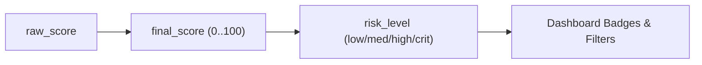
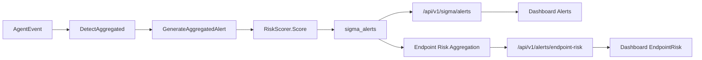

## هدف الخطة

- ترقية نموذج الـ context-aware risk scoring إلى نسخة v2 أكثر نضجًا، مع:
  - توثيق رسمي كامل للـ pipeline والمعادلات.
  - مركزية كل الأوزان/العتبات في ملف إعدادات واحد (config) لسهولة الإدارة.
  - ربط التصميم بمراجع أمنية (NIST، UEBA، ممارسات EDR تجارية) كتبرير.

## 1) جمع وتحليل الكود الحالي (قراءة فقط)

- مراجعة الملفات الأساسية ذات الصلة بالـ scoring:
  - [sigma_engine_go/internal/application/scoring/risk_scorer.go](sigma_engine_go/internal/application/scoring/risk_scorer.go)
  - [sigma_engine_go/internal/application/scoring/context_policy_provider.go](sigma_engine_go/internal/application/scoring/context_policy_provider.go)
  - [sigma_engine_go/internal/application/scoring/context_snapshot.go](sigma_engine_go/internal/application/scoring/context_snapshot.go)
  - [sigma_engine_go/internal/infrastructure/kafka/event_loop.go](sigma_engine_go/internal/infrastructure/kafka/event_loop.go)
  - [sigma_engine_go/internal/infrastructure/database/alert_writer.go](sigma_engine_go/internal/infrastructure/database/alert_writer.go)
  - [sigma_engine_go/internal/infrastructure/database/alert_repo.go](sigma_engine_go/internal/infrastructure/database/alert_repo.go)
  - [connection-manager/internal/repository/alert_repo.go](connection-manager/internal/repository/alert_repo.go)
  - [dashboard/src/api/client.ts](dashboard/src/api/client.ts)
  - [dashboard/src/pages/Alerts.tsx](dashboard/src/pages/Alerts.tsx)
  - [dashboard/src/pages/EndpointRisk.tsx](dashboard/src/pages/EndpointRisk.tsx)
- استخراج جميع الثوابت/الأوزان/العتبات المستخدمة حاليًا:
  - قيم `base_score` per severity.
  - حدود `burst_bonus`, `privilege_bonus`, `interaction_bonus`, `fp_discount`, `ueba_*`.
  - clamps و multipliers في `ContextFactors` و `quality_factor`.

## 2) تصميم طبقة Risk Level & Thresholds (v2)

- تعريف mapping رسمي من `final_score` إلى `risk_level` (low/medium/high/critical) يوثَّق بوضوح في design doc.
- تحديد مكان الحساب:
  - إما كـ دالة مساعدة في [risk_scorer.go](sigma_engine_go/internal/application/scoring/risk_scorer.go)، أو في طبقة الـ API (`handlers/alerts.go`).
- استخدام `risk_level` في:
  - استجابات API (إضافة حقل إلى JSON للـ alerts).
  - الـ Dashboard (Alerts/EndpointRisk) لعرض badges وفلاتر مبنية على هذا التصنيف، مع الاحتفاظ بـ `severity` الأصلية.

## 3) مركزية الأوزان والعتبات في ملف Config واحد

- تعريف بنية إعدادات جديدة في config الخاص بالـ sigma_engine:
  - ملف مثل: [sigma_engine_go/config/config.yaml] أو قسم جديد في config الحالي.
  - قسم `risk_scoring` يحتوي على:
    - base scores per severity.
    - bonuses/discounts (lineage, privilege, burst, interaction, ueba, fp).
    - context multipliers clamps.
    - quality_factor buckets.
    - trusted/untrusted network multipliers (0.9/1.1 حالياً).
- إضافة struct مقابلة في Go:
  - `RiskScoringConfig` في ملف جديد مثل: [sigma_engine_go/internal/infrastructure/config/risk_scoring.go].
- تعديل الدوال:
  - `computeBaseScore`, `computePrivilegeBonus`, `computeBurstBonus`, `computeInteractionBonus`, `computeFPRisk`, `computeFPDiscount`, `computeContextQualityFactor`, `ContextFactors.Multiplier`, `PostgresContextPolicyProvider.Resolve` لتقرأ من config بدل القيم الـ hard-coded.
- الحفاظ على قيم default مساوية للقيم الحالية لضمان عدم تغيير السلوك قبل tuning.

## 4) تحسين Model الجودة (Context Quality v2) – تصميم فقط في هذه المرحلة

- تصميم معادلة quality جديدة تعتمد على completeness الفعلي:
  - تعريف لائحة حقول سياقية مهمة (user, sid, ip, lineage, signature, integrity...).
  - لكل حقل وزن أهمية.
  - معادلة مقترحة:
    - contextqualityscore = 100 * (\sum weightspresent / \sum weightsall)
  - الاحتفاظ بـ buckets النهائية (0.85..1.0) لتبقى المعادلة الكلية simple.
- توثيق هذا التصميم داخل المستند، مع plan لاحق لتطبيقه تدريجيًا.

## 5) توثيق كامل للـ Pipeline والمعادلات (Design Doc رسمي)

- إنشاء مستند تصميم داخلي (Markdown) مثل:
  - `[docs/risk-scoring-v2-design.md]` في جذر المشروع.
- محتوياته:
  1. نظرة عامة على الهدف (لماذا سياق-aware، ولماذا v2).
  2. مخطط pipeline من agent → Kafka → RiskScorer → DB → APIs → Dashboard (مع مخططات mermaid):

1. توثيق كل معادلة:
  - raw_score, context_multiplier, quality_factor, context_adjusted_score, final_score, risk_level.
  - لكل معادلة: الصيغة الرياضية، الحقول، المصدر (file/function)، التوقيت في الـ pipeline، rationale أمني.
2. شرح تفصيلي لـ `ScoreBreakdown` و `ContextSnapshot`:
  - جداول حقول + شرح، مع أمثلة JSON مقتطفة من الكود.
3. سيناريو متكامل بالأرقام (مثل السيناريو الذي بنيناه ولكن محدث بقيم config):
  - Policy من dashboard → context_policies → Resolve → حساب factors → ضربها في raw score + quality → تخزين → ظهور في Alerts و EndpointRisk.
4. قسم “Tuning & Calibration” يشرح كيف يمكن معايرة الأوزان مستقبلاً بناءً على بيانات حقيقية.
5. قسم “Security Rationale” يربط التصميم بمراجع:
  - NIST SP 800‑61 (incident handling).
  - NIST SP 800‑92 (log management) لجزء UEBA/temporal.
  - UEBA best practices (زكر عام: behavioral baselines, Z‑score anomaly detection).
  - تقارير EDR عامة (مثل منهجيات CrowdStrike/Microsoft في تصنيف المخاطر).

## 6) ربط الـ Dashboard بالتحسينات (بدون تغيير المعادلات نفسها)

- تحديث typings في [dashboard/src/api/client.ts](dashboard/src/api/client.ts) لإضافة `risk_level` (إن أضفناه في الـ API).
- في [dashboard/src/pages/Alerts.tsx](dashboard/src/pages/Alerts.tsx):
  - استخدام `risk_level` مع `risk_score` و `severity` لعرض badges موحدة.
  - عرض جزء مختصر من config (مثل “Context-aware scoring v2”) في Tooltip أو Help section.
- في [dashboard/src/pages/EndpointRisk.tsx](dashboard/src/pages/EndpointRisk.tsx):
  - توضيح في الـ UI أن ترتيب endpoints يعتمد على `peak_risk_score` (final_score) المستند إلى v2 model.

## 7) Plan للتدرّج في التفعيل والتحسين

- مرحلة 1 (Short term):
  - إضافة config struct + قراءة الأوزان من config مع نفس default values.
  - إضافة `risk_level` داخل backend + API + UI.
  - كتابة المستند التصميمي بالكامل مع المخططات والمعادلات.
- مرحلة 2 (Medium term):
  - تفعيل ContextQuality v2 (إن رغبت) بعد مراجعة التصميم.
  - إضافة logging/metrics لاستخدامها في tuning لاحق.
- مرحلة 3 (Long term):
  - مراجعة البيانات الفعلية مع فريق SOC.
  - ضبط الأوزان/العتبات في ملف config بناءً على التحليل، بدون تعديل الكود.

هذا كله يبقى ضمن إطار خوارزمي deterministic، شفاف، وقابل للتعديل من ملف إعدادات واحد، مع توثيق رسمي يمكن مشاركته داخل المؤسسة.