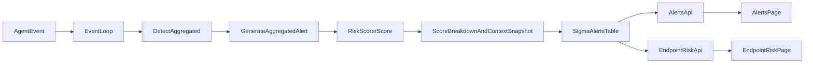

# Context-Aware Scoring V2 Implementation Plan

## Recommended Decisions

- Keep `context_policies` as **one effective policy per `(scope_type, scope_value)`**.
  - Rationale: the current schema already enforces this in [connection-manager/internal/database/migrations/017_create_context_policies.up.sql](connection-manager/internal/database/migrations/017_create_context_policies.up.sql), which keeps the model deterministic and avoids hard-to-debug compounded multipliers.
- Make **one YAML config in `sigma_engine_go`** the single source of truth for all scoring constants and thresholds.
  - Rationale: current constants are scattered across [sigma_engine_go/internal/application/scoring/risk_scorer.go](sigma_engine_go/internal/application/scoring/risk_scorer.go) and [sigma_engine_go/internal/application/scoring/context_policy_provider.go](sigma_engine_go/internal/application/scoring/context_policy_provider.go); centralizing them reduces tuning risk.

## Architecture Changes

### 1. Centralize Scoring Constants in Config

Extend [sigma_engine_go/internal/infrastructure/config/config.go](sigma_engine_go/internal/infrastructure/config/config.go) with a dedicated `RiskScoringConfig` section for:

- Base score mapping by severity
- Match-count correlation bonus
- Privilege bonus weights and caps
- Burst thresholds and bonus values
- FP discount and FP risk constants
- UEBA thresholds and bonus/discount values
- Interaction bonus thresholds
- Context factor clamps and trusted/untrusted network multipliers
- Quality-factor buckets
- Risk-level thresholds used for display/documentation consistency

Representative code to replace hardcoded behavior:

```10:22:sigma_engine_go/internal/application/scoring/context_policy_provider.go
type ContextFactors struct {
	UserRoleWeight          float64
	DeviceCriticalityWeight float64
	NetworkAnomalyFactor    float64
}

func (f ContextFactors) Multiplier() float64 {
	return clampFloat(f.UserRoleWeight*f.DeviceCriticalityWeight*f.NetworkAnomalyFactor, 0.25, 4.0)
}
```

```223:246:sigma_engine_go/internal/application/scoring/risk_scorer.go
raw := baseScore + lineageBonus + privilegeBonus + burstBonus + uebaBonus + interactionBonus - fpDiscount - uebaDiscount
contextAdjusted := int(math.Round(float64(raw) * contextFactors.Multiplier() * qualityFactor))
finalScore := clamp(contextAdjusted, 0, 100)
```

Plan:

- Introduce config structs and defaults.
- Inject scoring config into `DefaultRiskScorer` and context-policy provider.
- Replace all hardcoded magic numbers in scoring functions with config lookups.

### 2. Harden Policy Resolution Model

Keep the current precedence path in [sigma_engine_go/internal/application/scoring/context_policy_provider.go](sigma_engine_go/internal/application/scoring/context_policy_provider.go):

- `global -> agent -> user`
- Per-factor multiplication
- Per-step clamp
- Trusted/untrusted network post-adjustment

Plan:

- Preserve one-policy-per-scope behavior in DB and CRUD.
- Improve validation and documentation in [connection-manager/pkg/api/handlers_other.go](connection-manager/pkg/api/handlers_other.go) and [connection-manager/internal/repository/context_policy_repo.go](connection-manager/internal/repository/context_policy_repo.go).
- Explicitly document that a second policy for the same scope replaces/updates the existing one rather than stacking.

### 3. Add a First-Class Risk Level Mapping

Formalize `final_score -> risk_level` in backend code for consistency with dashboard display.

Suggested mapping:

- `0-39 low`
- `40-69 medium`
- `70-89 high`
- `90-100 critical`

Plan:

- Add a helper in the scoring/domain layer.
- Expose the mapped level in API payloads where useful.
- Keep existing Sigma `severity` separate from runtime `risk_level`.
- Align dashboard badges in [dashboard/src/pages/Alerts.tsx](dashboard/src/pages/Alerts.tsx) and [dashboard/src/pages/EndpointRisk.tsx](dashboard/src/pages/EndpointRisk.tsx) to this single source of truth where possible.

### 4. Improve Explainability Fields Without Reworking the Model

Keep `ScoreBreakdown` and `ContextSnapshot` as the canonical explainability objects in:

- [sigma_engine_go/internal/application/scoring/context_snapshot.go](sigma_engine_go/internal/application/scoring/context_snapshot.go)
- [sigma_engine_go/internal/application/scoring/risk_scorer.go](sigma_engine_go/internal/application/scoring/risk_scorer.go)

Plan:

- Ensure every configured constant referenced in formulas is documented and, where appropriate, emitted into breakdown metadata.
- Keep persistence path unchanged through:
  - [sigma_engine_go/internal/infrastructure/kafka/event_loop.go](sigma_engine_go/internal/infrastructure/kafka/event_loop.go)
  - [sigma_engine_go/internal/infrastructure/database/alert_writer.go](sigma_engine_go/internal/infrastructure/database/alert_writer.go)
  - [sigma_engine_go/internal/infrastructure/database/alert_repo.go](sigma_engine_go/internal/infrastructure/database/alert_repo.go)

## Documentation Deliverables

### 1. Formal Internal Design Doc

Create a new internal design document in the repo that covers:

- Full algorithm pipeline from event ingestion to dashboard rendering
- Every formula in math notation and exact code path
- Every field in each formula:
  - source
  - file/function
  - computation timing
  - effect on final score
- Final score interpretation and how it becomes the dashboard-visible number
- Fixed constants, their default values, and why they were chosen
- Tuning guidance and change-management rules
- References to NIST/UEBA/EDR rationale

Primary source files to cite in the doc:

- [sigma_engine_go/internal/application/scoring/risk_scorer.go](sigma_engine_go/internal/application/scoring/risk_scorer.go)
- [sigma_engine_go/internal/application/scoring/context_policy_provider.go](sigma_engine_go/internal/application/scoring/context_policy_provider.go)
- [sigma_engine_go/internal/application/scoring/context_snapshot.go](sigma_engine_go/internal/application/scoring/context_snapshot.go)
- [sigma_engine_go/internal/infrastructure/kafka/event_loop.go](sigma_engine_go/internal/infrastructure/kafka/event_loop.go)
- [sigma_engine_go/internal/infrastructure/database/migrations/014_add_risk_scoring.up.sql](sigma_engine_go/internal/infrastructure/database/migrations/014_add_risk_scoring.up.sql)
- [connection-manager/internal/database/migrations/017_create_context_policies.up.sql](connection-manager/internal/database/migrations/017_create_context_policies.up.sql)
- [dashboard/src/api/client.ts](dashboard/src/api/client.ts)
- [dashboard/src/pages/Alerts.tsx](dashboard/src/pages/Alerts.tsx)
- [dashboard/src/pages/EndpointRisk.tsx](dashboard/src/pages/EndpointRisk.tsx)
- [dashboard/src/pages/settings/ContextPolicies.tsx](dashboard/src/pages/settings/ContextPolicies.tsx)

### 2. Mermaid Pipeline Diagram

Include a compact end-to-end flow such as:




## Validation and Safety

- Add or update targeted tests around scoring config loading and formula behavior in [sigma_engine_go/internal/application/scoring/risk_scorer_test.go](sigma_engine_go/internal/application/scoring/risk_scorer_test.go).
- Add tests for context policy validation/CRUD where useful.
- Preserve backward compatibility for existing alerts storage schema unless a migration is absolutely required.
- If the dashboard cannot be fully switched to backend-provided `risk_level` in one pass, document the temporary split and finish the alignment in the same change set if practical.

## Execution Order

1. Add scoring config structs/defaults and wire config loading.
2. Refactor scorer/provider to consume config instead of hardcoded constants.
3. Add formal `risk_level` mapping and align UI/API usage.
4. Harden context policy validation and single-policy-per-scope semantics.
5. Write the internal design doc with code-path citations, formulas, examples, and references.
6. Run focused lint/test verification on edited files.

