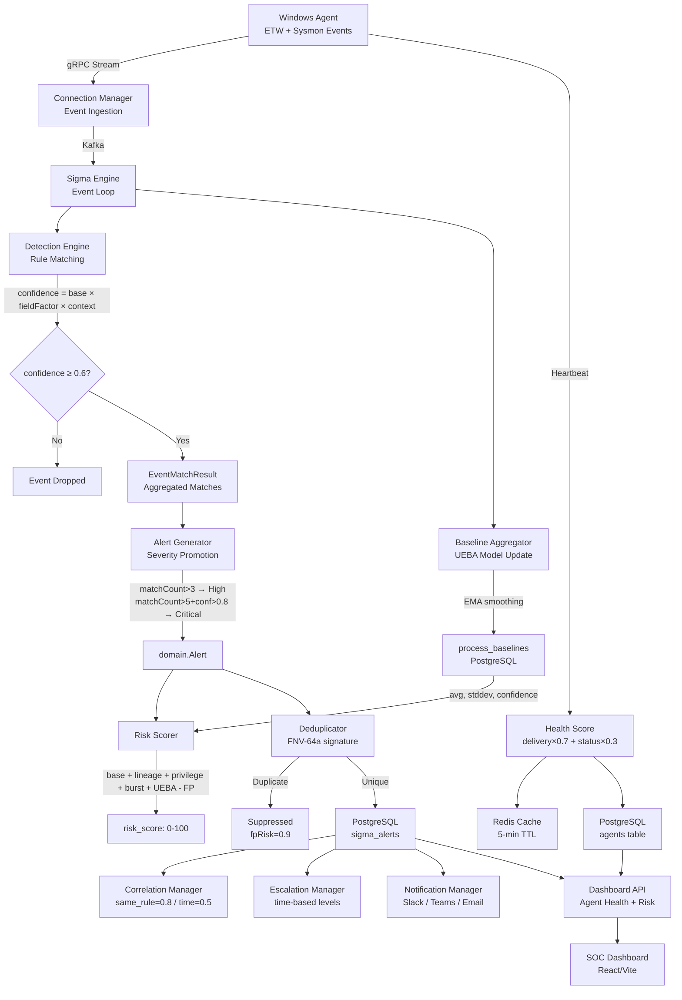

# EDR Platform — Complete Mathematical & Scoring Analysis Report

> [!IMPORTANT]
> This report documents **every** mathematical formula, scoring algorithm, confidence calculation, and risk assessment function across the entire EDR Platform codebase. Each entry includes the exact source file, line numbers, code snippets, and worked numerical examples.

---

## Table of Contents

1. [Risk Scoring (Context-Aware Risk Score)](#1-risk-scoring)
2. [Detection Confidence](#2-detection-confidence)
3. [Severity Scoring](#3-severity-scoring)
4. [Alert Generation & Aggregation](#4-alert-generation--aggregation)
5. [Correlation Engine](#5-correlation-engine)
6. [ML Baseline & Anomaly Detection](#6-ml-baseline--anomaly-detection)
7. [Escalation & Notification](#7-escalation--notification)
8. [Agent Health Scoring](#8-agent-health-scoring)
9. [Event Risk Classification](#9-event-risk-classification)
10. [Dashboard Risk Calculations](#10-dashboard-risk-calculations)
11. [Sigma Rule Scoring](#11-sigma-rule-scoring)
12. [Complete Data Flow Diagram](#12-complete-data-flow-diagram)

---

## 1. Risk Scoring

### 1.1 Master Risk Score Formula

**File:** [risk_scorer.go](file:///d:/EDR_Platform/sigma_engine_go/internal/application/scoring/risk_scorer.go#L108-L118)

```
risk_score = clamp(
    baseScore(severity, matchCount)
  + lineageBonus(parentChain)
  + privilegeBonus(eventData)
  + burstBonus(agentID, ruleCategory)
  + uebaAnomalyBonus(agentID, processName, hourOfDay)
  - fpDiscount(signatureStatus, executablePath)
  - uebaNormalcyDiscount(agentID, processName, hourOfDay)
, 0, 100)
```

Final computation at [line 186](file:///d:/EDR_Platform/sigma_engine_go/internal/application/scoring/risk_scorer.go#L186):

```go
raw := baseScore + lineageBonus + privilegeBonus + burstBonus + uebaBonus - fpDiscount - uebaDiscount
finalScore := clamp(raw, 0, 100)
```

---

### 1.2 Base Score — Severity Mapping + Multi-Rule Bonus

**File:** [risk_scorer.go](file:///d:/EDR_Platform/sigma_engine_go/internal/application/scoring/risk_scorer.go#L306-L333)

**Formula:**

```
baseScore = severityMap[severity] + min((matchCount - 1) × 5, 15)
```

| Severity | Base Score |
|---|---|
| Informational | 10 |
| Low | 25 |
| Medium | 45 |
| High | 65 |
| Critical | 85 |
| Unknown | 35 |

**Multi-Rule Correlation Bonus:**

```
bonus = min((matchCount - 1) × 5, 15)   // +5 per extra rule, capped at +15
```

```go
if matchCount > 1 {
    bonus := (matchCount - 1) * 5
    if bonus > 15 { bonus = 15 }
    base += bonus
}
```

**Example:** High severity + 4 matching rules → `65 + min(3×5, 15) = 65 + 15 = 80`

---

### 1.3 Lineage Bonus — Suspicion Matrix

**File:** [suspicion_matrix.go](file:///d:/EDR_Platform/sigma_engine_go/internal/application/scoring/suspicion_matrix.go#L708-L750)

**Algorithm:** Walk the process ancestry chain and return the **highest** bonus found (not additive).

```
lineageBonus = max(wildcardBonus(chain[0]), max(exactBonus(chain[i]→chain[i+1]) for all i))
```

| Suspicion Level | Bonus |
|---|---|
| Critical | +40 |
| High | +30 |
| Medium | +20 (some +15) |
| Low | +10 |
| None | 0 |

```go
func (m *SuspicionMatrix) ComputeBonus(chain []*ProcessLineageEntry) (bonus int, level string) {
    maxBonus := 0
    // Check wildcard for target process (index 0)
    if entry, ok := m.wildcardChild[targetName]; ok {
        if entry.Bonus > maxBonus { maxBonus = entry.Bonus }
    }
    // Check exact pairs along the chain
    for i := 0; i < len(chain)-1; i++ {
        key := matrixKey{parent: chain[i+1].Name, child: chain[i].Name}
        if entry, ok := m.exact[key]; ok {
            if entry.Bonus > maxBonus { maxBonus = entry.Bonus }
        }
    }
    return maxBonus, string(maxLevel)
}
```

**Matrix Size:** 200+ entries covering Office macros, browsers, PDF readers, LSASS, svchost, web shells, LOLBins, WMI, credential dumping tools — each mapped to MITRE ATT&CK techniques.

**Example:** `winword.exe → powershell.exe → certutil.exe`
- chain[0]=certutil.exe (wildcard: not found)
- pair certutil←powershell: exact match → +30
- pair powershell←winword: exact match → +40 (Critical)
- **lineageBonus = max(30, 40) = 40**

---

### 1.4 Privilege Bonus — Cumulative, Capped

**File:** [risk_scorer.go](file:///d:/EDR_Platform/sigma_engine_go/internal/application/scoring/risk_scorer.go#L340-L383)

**Formula:**

```
privilegeBonus = min(sum_of_signals, 40)
```

| Signal | Bonus | Condition |
|---|---|---|
| NT AUTHORITY\SYSTEM | +20 | `user_sid` starts with `S-1-5-18` |
| Built-in Administrator | +15 | `user_sid` ends with `-500` |
| System Integrity | +15 | `integrity_level == "system"` |
| High Integrity + Elevated | +10 | `integrity_level == "high" && is_elevated` |
| Elevated Token | +10 | `is_elevated && integrity != "system"` |
| Unsigned Binary | +15 | `signature_status == "unsigned"` |
| **Cap** | **40** | Maximum cumulative privilege bonus |

**Example:** SYSTEM + System Integrity + Unsigned = `20 + 15 + 15 = 50` → capped to **40**

---

### 1.5 Temporal Burst Bonus

**File:** [risk_scorer.go](file:///d:/EDR_Platform/sigma_engine_go/internal/application/scoring/risk_scorer.go#L387-L398)

**Formula (step function):**

```
burstBonus = {
    30  if count ≥ 30
    20  if count ≥ 10
    10  if count ≥ 3
    0   otherwise
}
```

**Window:** 5 minutes (tumbling window via Redis INCR + EXPIRE)

**File:** [burst_tracker.go](file:///d:/EDR_Platform/sigma_engine_go/internal/application/scoring/burst_tracker.go#L40-L48)

```go
burstWindowTTL = 5 * time.Minute
// Key: "burst:{agentID}:{category}"
```

**Example:** 12 events in 5 min for same category → `burstBonus = 20`

---

### 1.6 False-Positive Discount

**File:** [risk_scorer.go](file:///d:/EDR_Platform/sigma_engine_go/internal/application/scoring/risk_scorer.go#L403-L437)

**Formula:**

```
fpDiscount = min(signature_discount + path_discount, 30)
```

| Condition | Discount |
|---|---|
| Microsoft-signed | −15 |
| Microsoft + System32/SysWOW64 path | additional −10 |
| Trusted (3rd party signed) | −8 |
| **Cap** | **−30** |

---

### 1.7 False-Positive Risk Probability

**File:** [risk_scorer.go](file:///d:/EDR_Platform/sigma_engine_go/internal/application/scoring/risk_scorer.go#L441-L461)

```
fpRisk ∈ [0.0, 1.0]

fpRisk = {
    0.35  if Microsoft-signed + System32
    0.25  if Microsoft-signed (other path)
    0.20  if Trusted (3rd party)
    0.05  if Unsigned
    0.15  otherwise
}
```

---

### 1.8 UEBA Behavioral Baseline Adjustment

**File:** [risk_scorer.go](file:///d:/EDR_Platform/sigma_engine_go/internal/application/scoring/risk_scorer.go#L238-L298)

**Gate:** Confidence ≥ 0.30 (approximately 3 days of observations)

**Anomaly Detection (uebaBonus = +15):**
```
Case A: avg < 0.05 (process never runs at this hour)    → +15
Case B: 1 > (avg + 3σ) AND stddev > 0                   → +15 (3σ spike)
```

**Normalcy Discount (uebaDiscount = −10):**
```
If stddev == 0 AND avg ≥ 0.5                             → -10
If |1 - avg| ≤ stddev                                    → -10 (within 1σ)
```

```go
if baseline.ConfidenceScore < 0.30 {
    return 0, 0, UEBASignalNone, nil  // Model not converged
}
if baseline.ObservationDays == 0 || avg < 0.05 {
    return 15, 0, UEBASignalAnomaly, nil  // Never seen at this hour
}
if stddev > 0 {
    spike := avg + 3.0*stddev
    if float64(1) > spike { return 15, 0, UEBASignalAnomaly, nil }
}
if math.Abs(1.0-avg) <= stddev {
    return 0, 10, UEBASignalNormal, nil  // Within 1σ
}
```

**Example:** Process `notepad.exe`, avg=0.0 at 3:00 AM, confidence=0.50 → **uebaBonus = +15** (first-seen hour anomaly)

---

### 1.9 Complete Worked Example

**Scenario:** `winword.exe → powershell.exe` spawns unsigned binary at 3 AM as SYSTEM, 12 events in 5 min, High severity rule, 2 rules matched, process never seen at this hour.

```
baseScore        = 65 (high) + 5 (1 extra rule)    = 70
lineageBonus     = 40 (critical: Office→PowerShell)
privilegeBonus   = min(20+15+15, 40)                = 40
burstBonus       = 20 (≥10 events)
uebaBonus        = 15 (first-seen hour)
fpDiscount       = 0  (unsigned)
uebaDiscount     = 0  (anomalous)

raw = 70 + 40 + 40 + 20 + 15 - 0 - 0 = 185
finalScore = clamp(185, 0, 100) = 100
```

---

## 2. Detection Confidence

### 2.1 Confidence Score Formula

**File:** [detection_engine.go](file:///d:/EDR_Platform/sigma_engine_go/internal/application/detection/detection_engine.go#L470-L511)

```
confidence = clamp(baseConf × fieldFactor × contextScore, 0.0, 1.0)
```

Where:
- `baseConf` = rule level confidence
- `fieldFactor` = matchedFieldCount / totalPositiveFields
- `contextScore` = context validation multiplier (default 1.0)

---

### 2.2 Base Confidence from Rule Level

**File:** [detection_engine.go](file:///d:/EDR_Platform/sigma_engine_go/internal/application/detection/detection_engine.go#L685-L700)

| Rule Level | Base Confidence |
|---|---|
| critical | 1.0 |
| high | 0.8 |
| medium | 0.6 |
| low | 0.4 |
| informational | 0.2 |
| unknown | 0.5 |

---

### 2.3 Field Match Factor

```go
fieldFactor := 1.0
if totalFields > 0 {
    fieldFactor = float64(fieldCount) / float64(totalFields)
}
```

> [!NOTE]
> Only positive (non-filter) selections count toward `totalFields`. Filter selections are excluded to prevent confidence deflation.

---

### 2.4 Context Validation Score

**File:** [detection_engine.go](file:///d:/EDR_Platform/sigma_engine_go/internal/application/detection/detection_engine.go#L516-L544)

```
contextScore = 1.0
  × (0.8 if rule needs ParentImage but event lacks it)
  × (0.85 if rule needs CommandLine but event lacks it)
  × (0.9 if rule needs User but event lacks it)
```

**Example:** High rule, 3/4 fields matched, missing ParentImage:
```
confidence = 0.8 × (3/4) × 0.8 = 0.48
→ Below MinConfidence (0.6) → detection DROPPED
```

---

### 2.5 Minimum Confidence Gate

**File:** [detection_engine.go](file:///d:/EDR_Platform/sigma_engine_go/internal/application/detection/detection_engine.go#L85-L87)

```
Default MinConfidence = 0.6 (60%)
if confidence < MinConfidence → detection REJECTED
```

---

### 2.6 Combined Confidence (Multi-Rule Aggregation)

**File:** [detection_result.go](file:///d:/EDR_Platform/sigma_engine_go/internal/domain/detection_result.go#L265-L284)

```
combinedConfidence = min(maxConfidence + min((matchCount - 1) × 0.05, 0.2), 1.0)
```

```go
multiMatchBonus := float64(len(emr.Matches)-1) * 0.05
if multiMatchBonus > 0.2 { multiMatchBonus = 0.2 }
combined := maxConf + multiMatchBonus
if combined > 1.0 { combined = 1.0 }
```

**Example:** 4 rules matched, max confidence = 0.8:
```
combined = 0.8 + min(3 × 0.05, 0.2) = 0.8 + 0.15 = 0.95
```

---

### 2.7 Alternative Confidence (DetectionResult.CalculateConfidence)

**File:** [detection_result.go](file:///d:/EDR_Platform/sigma_engine_go/internal/domain/detection_result.go#L87-L99)

```
confidence = min(1.0,
    0.7
  + min(0.2, matchedFields × 0.02)
  + min(0.1, matchedSelections × 0.03)
)
```

---

## 3. Severity Scoring

### 3.1 Severity Enum (Integer Mapping)

**File:** [severity.go](file:///d:/EDR_Platform/sigma_engine_go/internal/domain/severity.go#L11-L17)

```go
type Severity int
const (
    SeverityInformational Severity = 1  // iota + 1
    SeverityLow           Severity = 2
    SeverityMedium        Severity = 3
    SeverityHigh          Severity = 4
    SeverityCritical      Severity = 5
)
```

### 3.2 Severity Rank (for comparison/sorting)

**File:** [detection_result.go](file:///d:/EDR_Platform/sigma_engine_go/internal/domain/detection_result.go#L352-L367)

| Level | Rank |
|---|---|
| critical | 5 |
| high | 4 |
| medium | 3 |
| low | 2 |
| informational | 1 |
| unknown | 0 |

### 3.3 Individual Alert Severity Adjustment

**File:** [alert_generator.go](file:///d:/EDR_Platform/sigma_engine_go/internal/application/alert/alert_generator.go#L120-L138)

```
if confidence ≥ 0.9 AND severity < Critical  → severity + 1  (escalate)
if confidence < 0.5 AND severity > Info       → severity - 1  (reduce)
```

---

## 4. Alert Generation & Aggregation

### 4.1 Aggregated Alert — Severity Promotion Rules

**File:** [alert_generator.go](file:///d:/EDR_Platform/sigma_engine_go/internal/application/alert/alert_generator.go#L421-L448)

```
Rule 1: if matchCount > 3 AND baseSeverity < High  → severity = High
Rule 2: if matchCount > 5 AND combinedConf > 0.8   → severity = Critical
Rule 3: if combinedConf > 0.9 AND severity < Critical → severity++
```

**Example:** 6 rules matched, baseSeverity=Medium, combinedConfidence=0.85:
```
Rule 1: 6 > 3 AND Medium < High → promote to High
Rule 2: 6 > 5 AND 0.85 > 0.8 AND High < Critical → promote to Critical
Rule 3: 0.85 < 0.9 → no change
Final: Critical (promoted from Medium)
```

### 4.2 Alert Suppression (FP > 0.7)

**File:** [alert.go](file:///d:/EDR_Platform/sigma_engine_go/internal/domain/alert.go#L132-L134)

```go
func (a *Alert) ShouldSuppress() bool {
    return a.Suppressed || a.FalsePositiveRisk > 0.7
}
```

### 4.3 Deduplication

**File:** [deduplicator.go](file:///d:/EDR_Platform/sigma_engine_go/internal/application/alert/deduplicator.go#L105-L124)

**Signature:** FNV-64a hash of `RuleID + RuleTitle + critical_fields(Image, CommandLine, ParentImage, User, TargetFilename) + round(confidence×10)`

- **Duplicate detected:** `FalsePositiveRisk = 0.9`, `Suppressed = true`
- **Window:** Configurable (default: 1 hour)

---

## 5. Correlation Engine

**File:** [correlation.go](file:///d:/EDR_Platform/sigma_engine_go/internal/analytics/correlation.go#L74-L135)

### 5.1 Correlation Scores (Static)

| Correlation Type | Score | Condition |
|---|---|---|
| `same_rule` | **0.8** | Both alerts have identical `RuleID` |
| `time_based` | **0.5** | Alerts within 5-minute window |

```go
if cached.RuleID == alert.RuleID {
    rel.CorrelationScore = 0.8   // Line 99
}
if alert.Timestamp.Sub(cached.Timestamp).Abs() < 5*time.Minute {
    rel.CorrelationScore = 0.5   // Line 114
}
```

---

## 6. ML Baseline & Anomaly Detection

### 6.1 Confidence from Sample Size

**File:** [baseline.go](file:///d:/EDR_Platform/sigma_engine_go/internal/ml/baseline.go#L227-L238)

| Sample Size | Confidence |
|---|---|
| < 10 | 0.30 |
| 10–49 | 0.50 |
| 50–199 | 0.70 |
| 200–999 | 0.85 |
| ≥ 1000 | 0.95 |

### 6.2 Z-Score Deviation (Anomaly Score)

**File:** [baseline.go](file:///d:/EDR_Platform/sigma_engine_go/internal/ml/baseline.go#L318-L344)

```
deviation(Z) = {
    0.5  if process exists in baseline with high confidence (>0.8)
    1.0  if process exists but low confidence
    3.0  if process NOT in baseline (unknown process)
}
```

### 6.3 Z-Score → 0–100 Scale Conversion

**File:** [baseline.go](file:///d:/EDR_Platform/sigma_engine_go/internal/ml/baseline.go#L294-L299)

```
anomalyScore = clamp(50 + Z × 16.67, 0, 100)
```

| Z-Score | Anomaly Score | Meaning |
|---|---|---|
| 0 | 50 | Matches baseline |
| 0.5 | 58.3 | Low anomaly |
| 1.0 | 66.7 | Slight deviation |
| 3.0 | 100 | Highly anomalous |

### 6.4 Process Pattern: Standard Deviation (Simplified)

**File:** [baseline.go](file:///d:/EDR_Platform/sigma_engine_go/internal/ml/baseline.go#L175)

```go
StdDev: math.Sqrt(count)  // Simplified Poisson approximation
```

```
σ = √count
avgDaily = count / totalEvents
```

---

## 7. Escalation & Notification

### 7.1 Enhanced Alert — Confidence Adjustment

**File:** [enhanced_alert.go](file:///d:/EDR_Platform/sigma_engine_go/internal/domain/enhanced_alert.go#L119-L144)

```
multiplier = 1.0
  × (2.0 if eventCount > 50, else 1.5 if eventCount > 10)
  × (1.3 if countTrend == "↑")

adjustedConfidence = clamp(confidence × multiplier, 0.0, 1.0)
```

**Example:** confidence=0.4, eventCount=55, trend="↑":
```
multiplier = 2.0 × 1.3 = 2.6
adjusted = min(0.4 × 2.6, 1.0) = min(1.04, 1.0) = 1.0
```

### 7.2 Escalation Check Conditions

**File:** [enhanced_alert.go](file:///d:/EDR_Platform/sigma_engine_go/internal/domain/enhanced_alert.go#L152-L187)

```
shouldEscalate = ANY of:
  1. eventCount > countThreshold (default 100)
  2. ratePerMinute > rateThreshold (default 10.0)
  3. countTrend == "↑" AND eventCount > 50
  4. severity == Critical (if enableCriticalEscalation)
```

### 7.3 Time-Based Escalation Levels

**File:** [escalation.go](file:///d:/EDR_Platform/sigma_engine_go/internal/automation/escalation.go#L196-L217)

```
for each alert with status ≠ "resolved":
    elapsed_minutes = now - alert.CreatedAt
    for each escalation level:
        if elapsed_minutes ≥ level.TimeThreshold AND alert.EscalatedTo < level.Level:
            → trigger escalation (notify / create_ticket / page_oncall)
```

---

## 8. Agent Health Scoring

### 8.1 Heartbeat Health Score (Realtime — Connection Manager)

**File:** [heartbeat.go](file:///d:/EDR_Platform/connection-manager/pkg/handlers/heartbeat.go#L167-L189)

```
healthScore = deliveryRatio × 0.7 + statusScore × 0.3
```

Where:
```
deliveryRatio = (eventsSent / eventsGenerated) × 100    // default 100 if no events
statusScore = { HEALTHY: 100, DEGRADED: 80, CRITICAL: 50, default: 70 }
```

### 8.2 Agent Model Health Score (Persistent — 3-Factor)

**File:** [agent.go](file:///d:/EDR_Platform/connection-manager/pkg/models/agent.go#L97-L134)

```
healthScore = deliveryRatio × 0.5 + statusScore × 0.3 + dropScore × 0.2
```

| Factor | Weight | Calculation |
|---|---|---|
| Delivery Ratio | 50% | `(eventsDelivered / eventsCollected) × 100` |
| Status Score | 30% | Online=100, Degraded=80, Offline=50, Suspended=0 |
| Drop Score | 20% | Penalizes drop rates >5% |

**Drop Score Formula:**
```
dropRate = eventsDropped / eventsCollected

if dropRate > 0.20: dropScore = 0      (severe: blinding attack)
if 0.05 < dropRate ≤ 0.20:
    dropScore = (0.20 - dropRate) / 0.15 × 100   (linear degradation)
if dropRate ≤ 0.05: dropScore = 100    (healthy)
```

**Example:** 10000 collected, 9500 delivered, 300 dropped, status=Online:
```
deliveryRatio = 9500/10000 × 100 = 95.0
statusScore = 100.0
dropRate = 300/10000 = 0.03 → dropScore = 100 (< 5%)
healthScore = 95.0 × 0.5 + 100.0 × 0.3 + 100.0 × 0.2
            = 47.5 + 30.0 + 20.0 = 97.5
```

### 8.3 Health Status Labels

**File:** [heartbeat.go](file:///d:/EDR_Platform/connection-manager/pkg/handlers/heartbeat.go#L192-L205)

| Score Range | Status |
|---|---|
| ≥ 95 | Excellent |
| 80–94 | Good |
| 60–79 | Acceptable |
| 40–59 | Degraded |
| < 40 | Critical |

---

## 9. Event Risk Classification

### 9.1 Endpoint Risk Summary (SQL Aggregation)

**File:** [phase2_models.go](file:///d:/EDR_Platform/connection-manager/pkg/models/phase2_models.go#L91-L100)

```sql
SELECT agent_id,
       COUNT(*) AS total_alerts,
       MAX(risk_score) AS peak_risk_score,
       AVG(risk_score) AS avg_risk_score,
       COUNT(*) FILTER (WHERE risk_score >= 90) AS critical_count,
       COUNT(*) FILTER (WHERE risk_score BETWEEN 70 AND 89) AS high_count,
       COUNT(*) FILTER (WHERE status = 'open') AS open_count,
       MAX(detected_at) AS last_alert_at
FROM alerts
GROUP BY agent_id
```

### 9.2 Risk Tiers

| Score Range | Classification |
|---|---|
| ≥ 90 | Critical |
| 70–89 | High |
| 45–69 | Medium |
| 25–44 | Low |
| 0–24 | Informational |

---

## 10. Dashboard Risk Calculations

### 10.1 Endpoint Risk Intelligence

The dashboard (React/TypeScript) fetches pre-computed risk data from two APIs:

| API Endpoint | Data Source |
|---|---|
| `/api/v1/risk/endpoints` | `EndpointRiskSummary` (SQL GROUP BY) |
| `/api/v1/agents` | Agent metadata (hostname, OS, health_score) |

The frontend merges these datasets client-side and uses the `peak_risk_score`, `avg_risk_score`, `critical_count`, and `high_count` fields directly from the backend.

### 10.2 Alert Severity Color Mapping (Frontend)

From the notification system colors, consistent across Slack/Teams/Dashboard:

| Severity | Color Code |
|---|---|
| Critical | `#FF0000` / 🔴 |
| High | `#FF6600` / 🟠 |
| Medium | `#FFCC00` / 🟡 |
| Low | `#0066FF` / 🔵 |

---

## 11. Sigma Rule Scoring

### 11.1 Rule Level → Severity

**File:** [severity.go](file:///d:/EDR_Platform/sigma_engine_go/internal/domain/severity.go#L39-L55)

The `SeverityFromString()` function maps YAML `level:` field to the Severity enum:

```
"informational"/"info" → SeverityInformational (1)
"low"                  → SeverityLow (2)
"medium"               → SeverityMedium (3)
"high"                 → SeverityHigh (4)
"critical"             → SeverityCritical (5)
unknown                → SeverityMedium (3) + error
```

### 11.2 Level Rank (Load Filtering)

**File:** [detection_engine.go](file:///d:/EDR_Platform/sigma_engine_go/internal/application/detection/detection_engine.go#L666-L682)

```
critical=4, high=3, medium=2, low=1, info=0, unknown=2
```

### 11.3 Rule Quality Filtering

```go
type RuleQualityConfig struct {
    MinLevel         string     // e.g., "medium" → only load medium+ rules
    AllowedStatus    []string   // e.g., ["stable","test"]
    SkipExperimental bool       // skip rules with status "experimental"
}
```

### 11.4 Highest Severity Selection (Aggregation)

**File:** [detection_result.go](file:///d:/EDR_Platform/sigma_engine_go/internal/domain/detection_result.go#L213-L233)

```
primary = match with max(severityRank)
if tie: prefer higher confidence
```

---

## 12. Complete Data Flow Diagram



---

## Summary of All Mathematical Constants

| Constant | Value | Location |
|---|---|---|
| Min Confidence Gate | 0.6 | detection_engine.go:86 |
| UEBA Confidence Gate | 0.30 | risk_scorer.go:259 |
| UEBA Anomaly Bonus | +15 | risk_scorer.go:269 |
| UEBA Normalcy Discount | −10 | risk_scorer.go:289 |
| Burst Window | 5 min | burst_tracker.go:44 |
| Burst Bonus Tiers | 10/20/30 | risk_scorer.go:388-397 |
| Lineage Bonus Tiers | 10/20/30/40 | suspicion_matrix.go:30-34 |
| Privilege Cap | 40 | risk_scorer.go:378 |
| FP Discount Cap | 30 | risk_scorer.go:432 |
| Multi-Rule Risk Bonus | +5/rule, cap 15 | risk_scorer.go:324-328 |
| Multi-Match Conf Bonus | +0.05/match, cap 0.2 | detection_result.go:273-276 |
| Severity Promotion (>3 matches) | → High | alert_generator.go:430 |
| Severity Promotion (>5 + high conf) | → Critical | alert_generator.go:436 |
| Dedup Window | 1 hour (default) | deduplicator.go:41 |
| Correlation (same rule) | 0.8 | correlation.go:99 |
| Correlation (time-based) | 0.5 | correlation.go:114 |
| Health: Delivery Weight | 50% (model) / 70% (heartbeat) | agent.go:132 / heartbeat.go:188 |
| Health: Status Weight | 30% | agent.go:132 / heartbeat.go:188 |
| Health: Drop Rate Weight | 20% | agent.go:132 |
| Alert Suppression Threshold | FP > 0.7 | alert.go:133 |
| Enhanced Conf Multiplier (>50 events) | 2.0× | enhanced_alert.go:124 |
| Enhanced Conf Multiplier (>10 events) | 1.5× | enhanced_alert.go:126 |
| Trend Multiplier (↑) | 1.3× | enhanced_alert.go:131 |
