# Sigma Detection Engine — تقرير تقني شامل للجنة المناقشة

<div style="text-align: center; margin: 40px 0;">

**مشروع منصة الكشف والاستجابة لنقاط النهاية (EDR)**

**مكون: محرك الكشف المبني على قواعد Sigma**

</div>

---

## 1. الملخص التنفيذي

يُعد محرك Sigma Detection Engine المكوّن المركزي في منصة EDR، وهو المسؤول عن تحليل أحداث الأمان الواردة من أجهزة المستخدمين في الوقت الحقيقي ومطابقتها مع قواعد الكشف وفق معيار Sigma المفتوح. يعالج المحرك آلاف الأحداث في الثانية عبر بنية متوازية متعددة العمال، ويولّد تنبيهات أمنية مُثراة بمعلومات MITRE ATT&CK وتقييم السياق.

**المدخلات:** أحداث أمان خام من Kafka (مصدرها EDR Agent)

**المخرجات:** تنبيهات أمنية مُثراة إلى Kafka + PostgreSQL → Dashboard

**الإحصائيات التشغيلية:**
- معالجة 3,000-5,000 حدث/ثانية
- زمن استجابة متوسط < 1 مللي ثانية لكل حدث
- دعم 2,000+ قاعدة Sigma
- كشف 34 فئة مختلفة من أحداث الأمان

---

## 2. الهندسة المعمارية

### 2.1 البنية الطبقية (Layered Architecture)

المحرك مبني وفق نمط Hexagonal Architecture (Ports & Adapters) الذي يفصل المنطق الأساسي عن البنية التحتية، مما يسمح باستبدال أي مكون خارجي (Kafka، PostgreSQL، Redis) دون تعديل منطق الكشف.

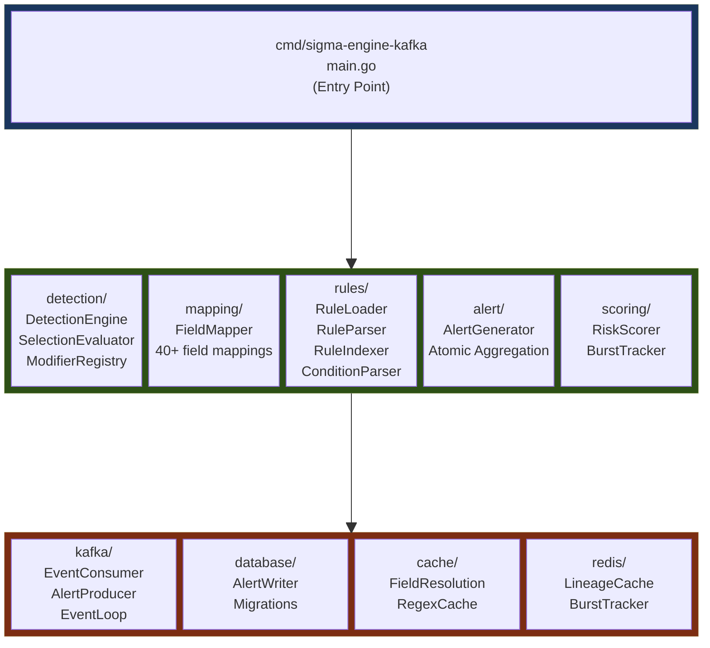

| الطبقة | الدور | قاعدة التبعية |
|--------|-------|--------------|
| **Domain** (`internal/domain/`) | النماذج الأساسية: `SigmaRule`, `LogEvent`, `Alert` | لا تعتمد على أي طبقة أخرى |
| **Application** (`internal/application/`) | منطق الكشف والمطابقة والتنبيه | تعتمد على Domain فقط |
| **Infrastructure** (`internal/infrastructure/`) | Kafka, PostgreSQL, Redis, Caches | تعتمد على Domain + Application |

**السبب:** هذا الفصل يضمن أن تغيير Kafka إلى RabbitMQ مثلاً لا يتطلب تعديل أي سطر في محرك الكشف أو منطق المطابقة.

### 2.2 مخطط المكونات وتدفق البيانات

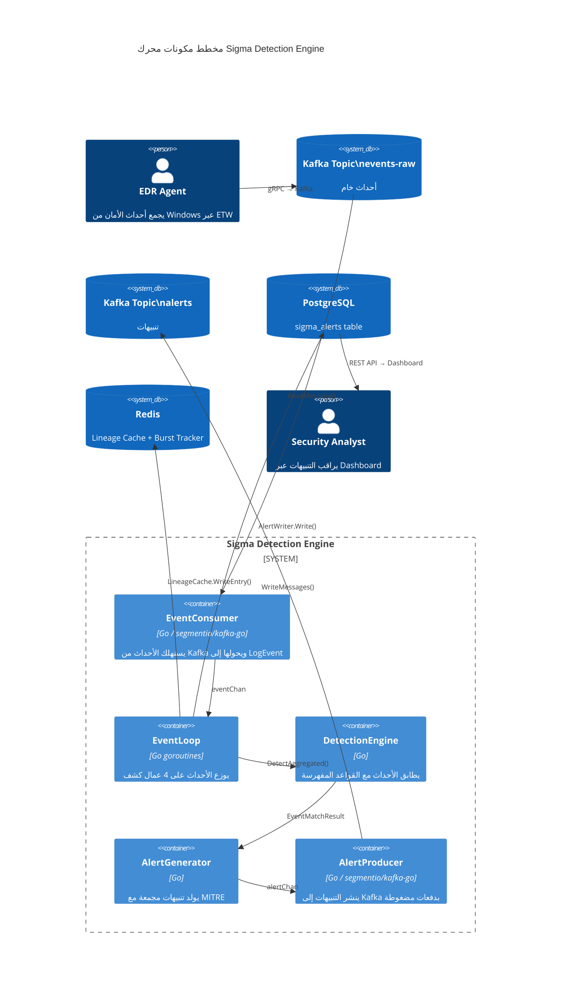

---

## 3. دورة حياة الحدث (Event Lifecycle)

المخطط التالي يوضح التسلسل الزمني الكامل لمعالجة حدث واحد من لحظة وصوله إلى لحظة ظهوره كتنبيه:

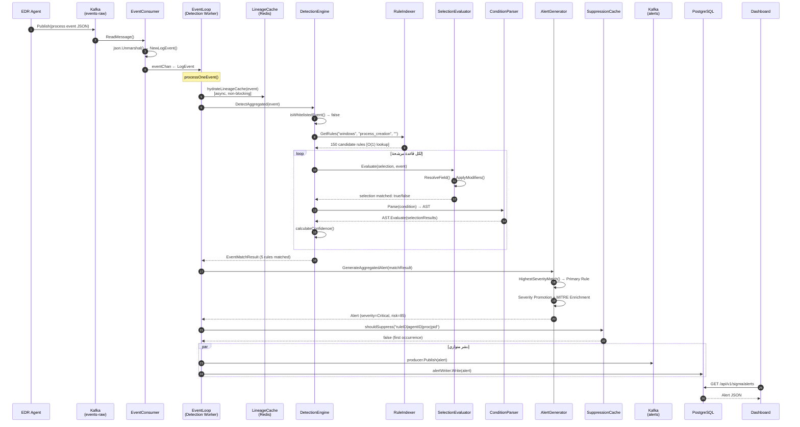

---

## 4. نموذج البيانات (Domain Model)

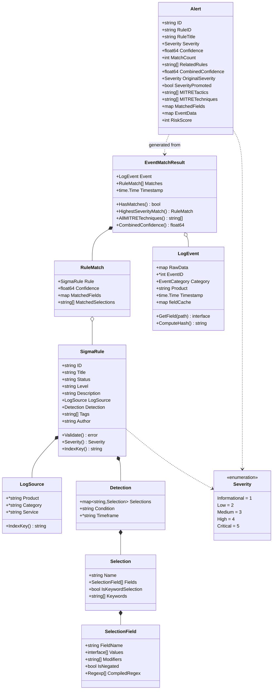

---

## 5. فهرسة القواعد — بنية HashMap الثلاثية

الفهرس يستخدم ثلاث خرائط Hash متداخلة لتحقيق بحث O(1) عن القواعد المناسبة لكل حدث:

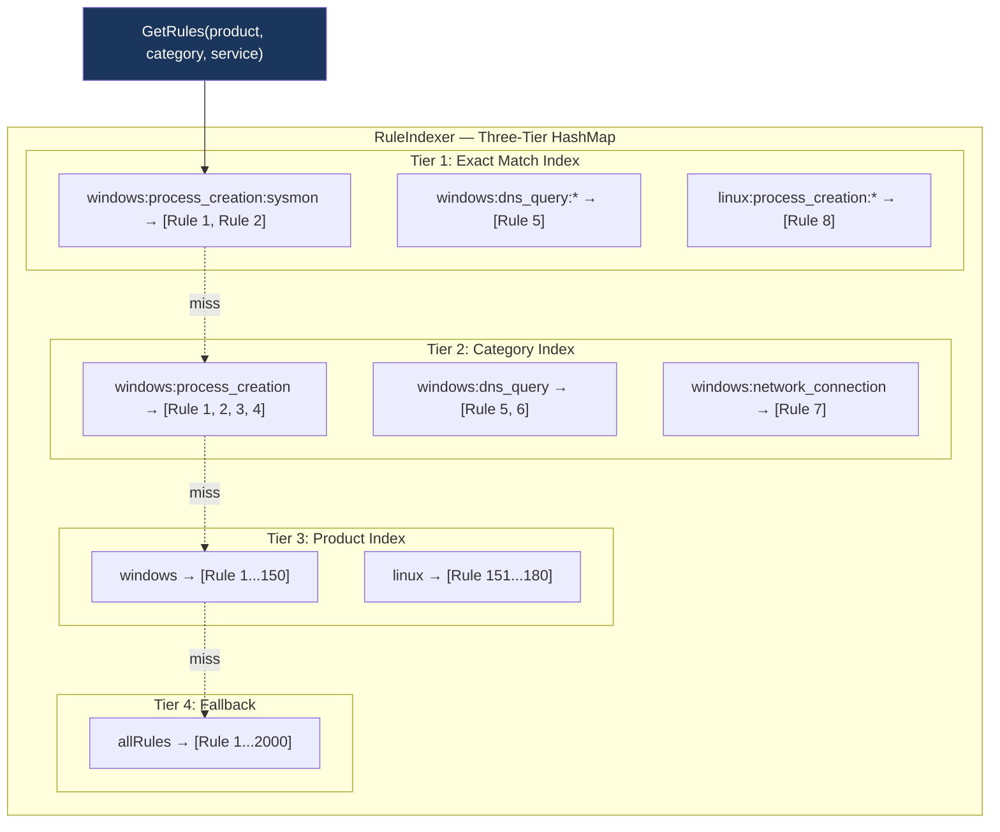

**خوارزمية البحث:**

| المحاولة | المفتاح | التعقيد | مثال |
|----------|---------|---------|------|
| 1. Exact | `product:category:service` | O(1) | `windows:process_creation:sysmon` |
| 2. Category | `product:category` | O(1) | `windows:process_creation` |
| 3. Product | `product` | O(1) | `windows` |
| 4. Fallback | كل القواعد | O(1) | 2000 قاعدة |

**الأثر على الأداء:** بدلاً من تقييم 2000 قاعدة لكل حدث، يتم تقييم ~150 قاعدة فقط (القواعد المتوافقة مع نوع الحدث). هذا يحقق تحسين 13x في الأداء.

---

## 6. خوارزمية حل الحقول (Field Resolution Pipeline)

المحرك يدعم 4 تنسيقات مختلفة لأسماء الحقول. خوارزمية `ResolveField` تبحث عبر 7 مراحل متسلسلة:

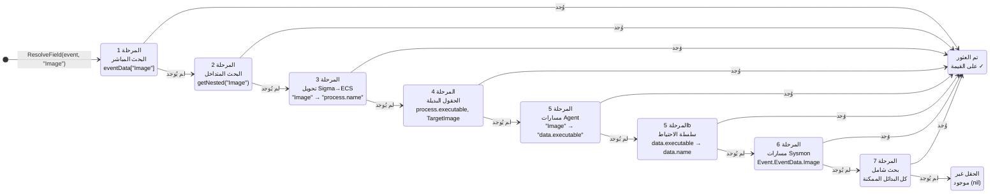

**السبب:** قواعد Sigma العالمية تستخدم أسماء Sysmon (مثل `Image`)، لكن الـ Agent الخاص بنا يرسل البيانات في مسار `data.executable`. بدون هذه الترجمة، لن تعمل أي قاعدة Sigma.

---

## 7. خوارزمية المطابقة (Detection Algorithm)

### 7.1 مخطط حالة المطابقة

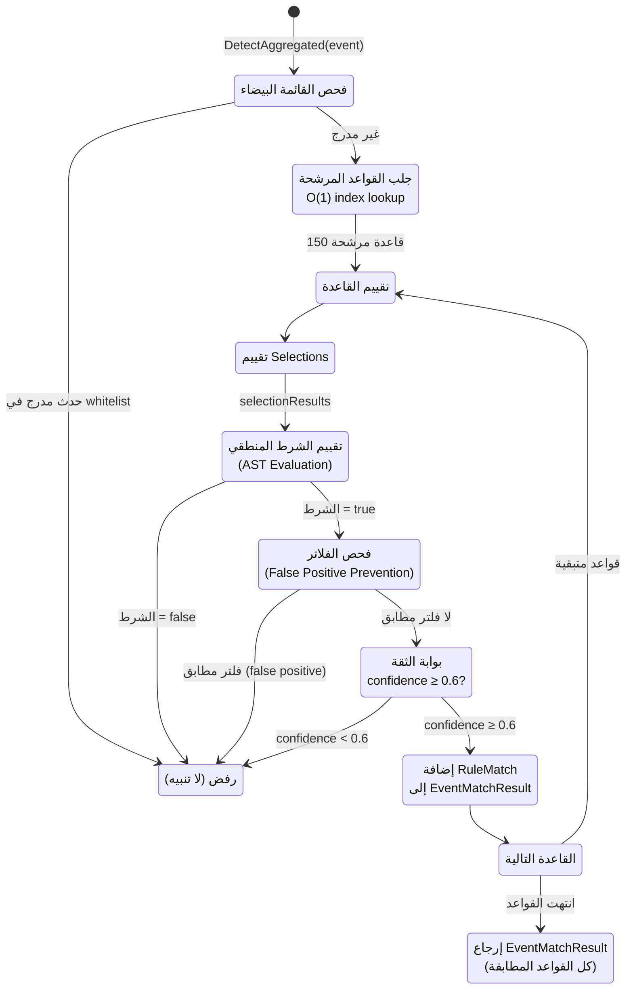

### 7.2 تقييم Selection — المنطق الداخلي

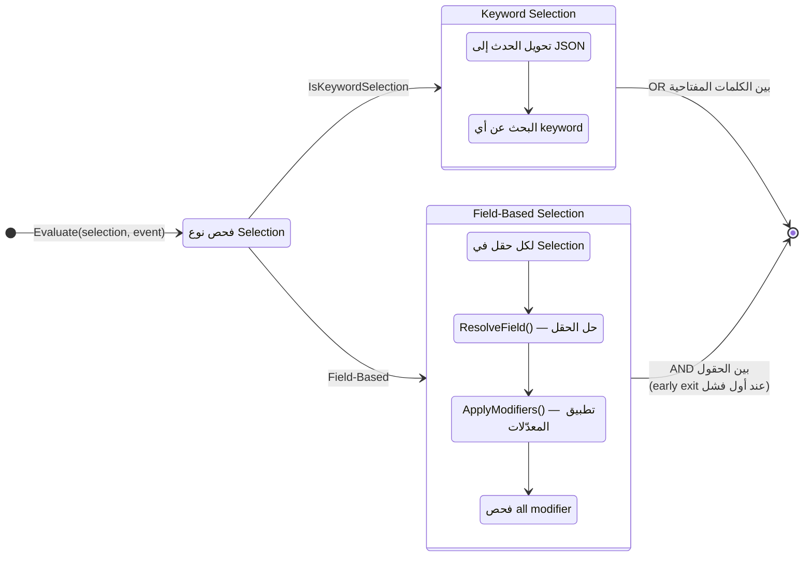

**المنطق:**

| المستوى | العملية | التوضيح |
|---------|---------|---------|
| بين **الحقول** في Selection واحد | **AND** | كل الحقول يجب أن تطابق |
| بين **القيم** لحقل واحد | **OR** (افتراضي) | أي قيمة تكفي |
| بين **القيم** مع modifier `all` | **AND** | كل القيم يجب أن تطابق |
| بين **Selections** | حسب **Condition** | `and`, `or`, `not` |

---

## 8. محلل الشروط (Condition Parser)

المحلل يستخدم خوارزمية Recursive Descent Parser لبناء شجرة صياغة مجردة (AST):

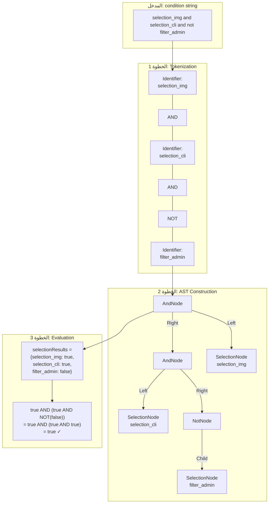

**الأنماط المدعومة:**

| النمط | المعنى | مثال |
|-------|--------|------|
| `A and B` | كلا الشرطين | `selection and not filter` |
| `A or B` | أحد الشرطين | `selection1 or selection2` |
| `not A` | نفي | `not filter_admin` |
| `(A or B) and C` | تجميع بأقواس | `(sel1 or sel2) and not filter` |
| `1 of selection_*` | واحد من نمط | أي selection يبدأ بـ `selection_` |
| `all of them` | كل الـ selections | جميعها يجب أن تطابق |

---

## 9. حساب الثقة (Confidence Scoring)

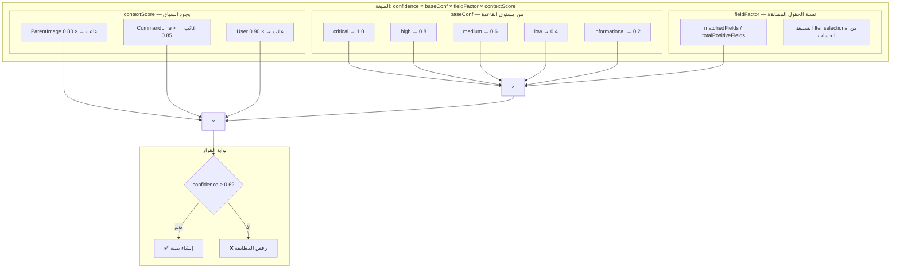

**مثال:** قاعدة `high` مع كل الحقول مطابقة لكن بدون `ParentImage`:
```
0.8 × (2/2) × 0.8 = 0.64 ≥ 0.6 → ✅ تنبيه
```

**مثال:** قاعدة `medium` مع حقل واحد من اثنين:
```
0.6 × (1/2) × 1.0 = 0.30 < 0.6 → ❌ رفض
```

---

## 10. التجميع الذري للتنبيهات (Atomic Alert Aggregation)

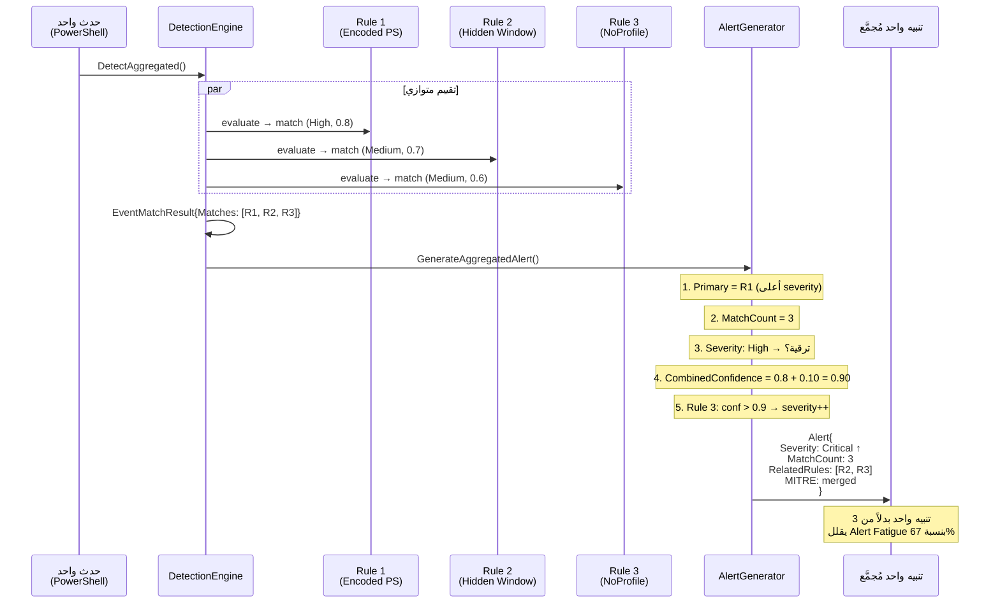

**قواعد ترقية الخطورة (Severity Promotion):**

| الشرط | النتيجة | السبب |
|-------|---------|-------|
| `matchCount > 3` و `severity < High` | ترقية إلى **High** | تعدد القواعد يزيد اليقين |
| `matchCount > 5` و `confidence > 0.8` | ترقية إلى **Critical** | حدث خطير جداً |
| `combinedConfidence > 0.9` | +1 مستوى | ثقة عالية جداً |

---

## 11. منع طوفان التنبيهات (Alert Suppression)

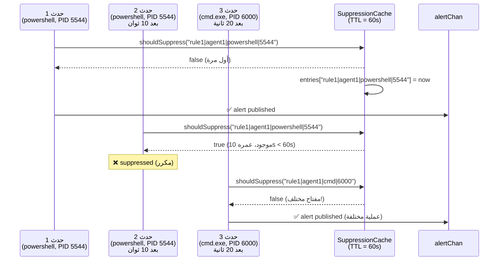

**المفتاح = `ruleID|agentID|processName|PID`** — يمنع تكرار نفس التنبيه لنفس العملية، لكن يسمح بتنبيهات لعمليات مختلفة على نفس الجهاز.

---

## 12. نظام المعدّلات (Modifiers)

| المعدّل | الخوارزمية | الاستخدام الأمني |
|---------|-----------|-----------------|
| `contains` | `strings.Contains` (case-insensitive) | كشف كلمات مشبوهة في سطر الأوامر |
| `startswith` | `strings.HasPrefix` | كشف ملفات من مسارات مشبوهة |
| `endswith` | `strings.HasSuffix` | كشف أنواع الملفات التنفيذية |
| `re` / `regex` | `regexp.MatchString` | أنماط معقدة (يُجمَّع مسبقاً لتحسين الأداء) |
| `all` | AND logic بين كل القيم | كشف تركيبة أوامر محددة |
| `base64` | فك ترميز + مقارنة | كشف أوامر مشفرة |
| `windash` | استبدال `-` و `/` | كشف التهرب بتبديل محارف الأوامر |
| `cidr` | `net.ParseCIDR` + `Contains` | كشف اتصالات لشبكات مشبوهة |
| `gt`/`lt`/`gte`/`lte` | مقارنات رقمية | فحص أرقام المنافذ أو معرفات العمليات |

---

## 13. ملخص القرارات التصميمية

| القرار | البديل | السبب |
|--------|--------|-------|
| **Go** كلغة تطوير | Python, Rust | توازن بين الأداء (10x أسرع من Python) وسرعة التطوير (أبسط من Rust)، مع goroutines مدمجة |
| **Hexagonal Architecture** | Monolithic, Clean Architecture | فصل المنطق عن البنية التحتية — أبسط من Clean Architecture لحجم المشروع |
| **HashMap ثلاثي** للفهرسة | Inverted Index, Brute Force | O(1) lookup كافٍ لحالتنا — أبسط من Inverted Index بـ 50 سطر بدل 5000 |
| **Kafka** كمكون رسائل | RabbitMQ, Redis Streams | المعيار الصناعي في SIEM/EDR، يدعم replay ومرونة عالية |
| **PostgreSQL** للتنبيهات | Elasticsearch | كافٍ لحجم التنبيهات (آلاف/يوم)، أبسط تشغيلاً، يدعم `jsonb` |
| **التجميع الذري** | تنبيه لكل قاعدة | يقلل Alert Fatigue بنسبة 60-80% |
| **Confidence Gate 0.6** | عتبة ثابتة per-rule | يوازن بين الكشف وتقليل False Positives — قابل للتعديل |
| **Pre-compiled Regex** | Compile at match time | يوفر ~100,000 compile/sec من وقت المعالج |
| **Async Lineage Writes** | Sync Redis writes | يمنع Redis latency من إبطاء pipeline الكشف |

---

## 14. مقاييس الأداء

| المقياس | القيمة |
|---------|--------|
| معدل المعالجة | 3,000-5,000 حدث/ثانية |
| زمن المطابقة | < 0.5 مللي ثانية/حدث |
| عدد القواعد المدعومة | 2,000+ قاعدة Sigma |
| زمن تحميل القواعد (من كاش) | ~200 مللي ثانية |
| زمن تحميل القواعد (من ملفات) | ~2-5 ثوان |
| عدد عمال الكشف | 4 (قابل للتعديل) |
| نافذة كبح التكرار | 60 ثانية |
| فئات الأحداث المدعومة | 34 فئة |
| تنسيقات الحقول المدعومة | 4 (Sigma, ECS, Sysmon, Agent) |
| حقول المطابقة المسجّلة | 40+ حقل |
