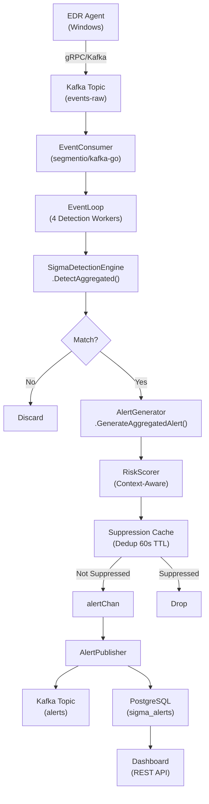
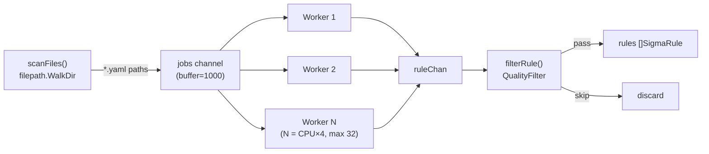
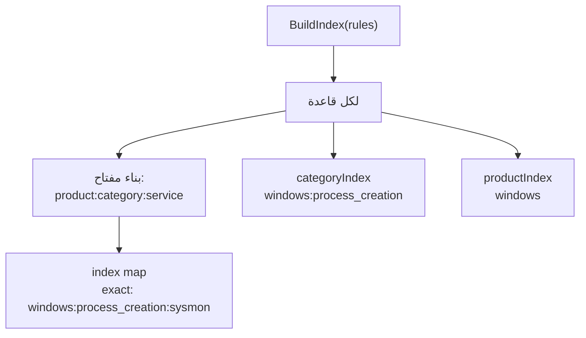

# Sigma Detection Engine — شرح تفصيلي شامل

## الفهرس
1. [نظرة معمارية عامة](#1-نظرة-معمارية-عامة)
2. [تسلسل الإقلاع (Startup Sequence)](#2-تسلسل-الإقلاع)
3. [تحميل القواعد وتحليلها (Rule Loading & Parsing)](#3-تحميل-القواعد-وتحليلها)
4. [فهرسة القواعد (Rule Indexing)](#4-فهرسة-القواعد)
5. [استهلاك الأحداث من Kafka](#5-استهلاك-الأحداث-من-kafka)
6. [تطبيع الأحداث (Event Normalization)](#6-تطبيع-الأحداث)
7. [خوارزمية Field Mapping](#7-خوارزمية-field-mapping)
8. [خوارزمية المطابقة (Detection & Matching)](#8-خوارزمية-المطابقة)
9. [تقييم الشروط (Condition Evaluation)](#9-تقييم-الشروط)
10. [نظام المعدّلات (Modifiers)](#10-نظام-المعدلات)
11. [حساب الثقة (Confidence Scoring)](#11-حساب-الثقة)
12. [توليد التنبيهات (Alert Generation)](#12-توليد-التنبيهات)
13. [كبح التنبيهات المكررة (Suppression)](#13-كبح-التنبيهات-المكررة)
14. [نشر التنبيهات وحفظها](#14-نشر-التنبيهات-وحفظها)
15. [مثال عملي كامل: من Kafka إلى لوحة التحكم](#15-مثال-عملي-كامل)

---

## 1. نظرة معمارية عامة



المحرك مبني بنمط **Hexagonal Architecture** ومقسم إلى:

| الطبقة | المسار | الدور |
|--------|--------|-------|
| Domain | `internal/domain/` | النماذج الأساسية: `SigmaRule`, `LogEvent`, `Alert`, `DetectionResult` |
| Application | `internal/application/` | المنطق: `detection/`, `mapping/`, `rules/`, `alert/`, `scoring/` |
| Infrastructure | `internal/infrastructure/` | Kafka, PostgreSQL, Redis, Cache |
| Entry Point | `cmd/sigma-engine-kafka/` | `main.go` — نقطة الدخول |

---

## 2. تسلسل الإقلاع

> المرجع: [main.go](file:///d:/EDR_Platform/sigma_engine_go/cmd/sigma-engine-kafka/main.go)

```
1. تحميل الإعدادات (config.yaml + env vars)
2. تهيئة الكاش (FieldResolutionCache + RegexCache)
3. بناء المكونات:
   ├─ FieldMapper        → ربط حقول Sigma ↔ ECS ↔ Agent
   ├─ ModifierRegistry   → تسجيل 12 modifier (contains, regex, etc.)
   ├─ QualityConfig      → عتبة الثقة + الفلاتر
   └─ SigmaDetectionEngine
4. تحميل القواعد (loadRules):
   ├─ محاولة من الكاش (gob file)
   └─ إن فشل: تحميل من المجلد بالتوازي → حفظ في الكاش
5. detectionEngine.LoadRules(rules)  → بناء الفهرس + pre-parse conditions
6. تهيئة Kafka Consumer + Producer
7. تهيئة Redis (LineageCache + BurstTracker) — أو fallback
8. تهيئة PostgreSQL (migrations + seed rules)
9. EventLoop.Start() → تشغيل 4 detection workers + alert publisher
10. انتظار إشارة الإيقاف (SIGTERM)
```

---

## 3. تحميل القواعد وتحليلها

### 3.1 المسح والتحميل المتوازي

> المرجع: [parser.go](file:///d:/EDR_Platform/sigma_engine_go/internal/application/rules/parser.go)



**الخوارزمية:**
1. `scanFiles()` يمشي شجرة المجلد recursively ويرسل مسارات `.yaml`/`.yml` إلى قناة `jobs`
2. `N` عمال (`worker()`) يقرأون من `jobs` بالتوازي — كل عامل يستدعي `ParseFile()`
3. `ParseFile()` يقوم بـ:
   - قراءة الملف بـ buffered I/O (64KB)
   - تحليل YAML إلى `yamlRule` struct
   - التحقق: title ≥ 5 أحرف، وجود detection + condition، صحة level/status
   - فلترة المنتج (product whitelist)
   - تحويل إلى `domain.SigmaRule` عبر `toSigmaRule()`

### 3.2 تحليل Detection Section

> المرجع: [parseDetection()](file:///d:/EDR_Platform/sigma_engine_go/internal/application/rules/parser.go#L477-L509)

```yaml
# مثال قاعدة Sigma
detection:
  selection:
    CommandLine|contains|all:
      - '-nop'
      - '-w hidden'
      - '-enc'
    Image|endswith: '\powershell.exe'
  filter:
    User: 'NT AUTHORITY\SYSTEM'
  condition: selection and not filter
```

**خوارزمية التحليل:**
1. استخراج `condition` (string) و `timeframe` (optional)
2. لكل مفتاح آخر → `parseSelection(name, data)`:
   - إذا كان **list** → `IsKeywordSelection = true` مع `Keywords[]`
   - إذا كان **map** → لكل حقل: `parseSelectionField(fieldSpec, values)`
3. `parseSelectionField("CommandLine|contains|all", [...])`:
   - يقسم بـ `|` → `fieldName = "CommandLine"`, `modifiers = ["contains", "all"]`
   - يحول القيم إلى `[]interface{}`
   - إذا وُجد modifier `regex`/`re` → **يجمع regex مسبقاً** (`regexp.Compile`) ويخزنها في `CompiledRegex`

### 3.3 فلتر الجودة (QualityFilter)

> المرجع: [loader.go](file:///d:/EDR_Platform/sigma_engine_go/internal/application/rules/loader.go#L118-L170)

```
filterRule(rule) → bool:
  1. إذا min_level = "medium":
     levelRank(rule.Level) < levelRank("medium") → skip
     (informational=0, low=1, medium=2, high=3, critical=4)
  2. إذا skip_experimental && status == "experimental" → skip
  3. إذا allowed_status = ["stable","test"]:
     status ∉ allowed_status → skip
  4. deprecated → skip دائماً
```

**الإعدادات الافتراضية:** `min_level: medium`, `allowed_status: [stable, test]`, `skip_experimental: true`

---

## 4. فهرسة القواعد

> المرجع: [rule_indexer.go](file:///d:/EDR_Platform/sigma_engine_go/internal/application/rules/rule_indexer.go)



**ثلاث طبقات فهرسة:**

| الفهرس | المفتاح | مثال |
|--------|---------|------|
| `index` (exact) | `product:category:service` | `windows:process_creation:sysmon` |
| `categoryIndex` | `product:category` | `windows:process_creation` |
| `productIndex` | `product` | `windows` |

**خوارزمية البحث `GetRules(product, category, service)` — O(1):**
```
1. ابحث في index["windows:process_creation:sysmon"]     → إن وُجد: أرجع
2. ابحث في categoryIndex["windows:process_creation"]      → إن وُجد: أرجع
3. ابحث في productIndex["windows"]                        → إن وُجد: أرجع
4. fallback: أرجع allRules (كل القواعد)
```

> [!IMPORTANT]
> هذا التصميم يضمن أن كل حدث يُقيَّم فقط مقابل القواعد المتوافقة مع `logsource` الخاص به، مما يقلل عدد القواعد المُقيَّمة بشكل كبير.

---

## 5. استهلاك الأحداث من Kafka

> المرجع: [consumer.go](file:///d:/EDR_Platform/sigma_engine_go/internal/infrastructure/kafka/consumer.go)

```
Kafka Topic (events-raw)
    │
    ├─ ConsumerReader 1 ──┐
    └─ ConsumerReader 2 ──┤ ReadMessage() → JSON Unmarshal → NewLogEvent()
                          │
                          ▼
                    eventChan (buffer=1000)
                          │
              ┌───────────┼───────────┐──────────┐
              ▼           ▼           ▼          ▼
          Worker 0    Worker 1    Worker 2    Worker 3
        processOneEvent() × 4 goroutines
```

**خطوات الاستهلاك:**
1. `ReadMessage()` من Kafka مع timeout = `MaxWait` (5s)
2. `json.Unmarshal(msg.Value)` → `map[string]interface{}`
3. إضافة metadata الكافكا (`_kafka_partition`, `_kafka_offset`, etc.)
4. `domain.NewLogEvent(rawData)` → استنتاج الفئة والمنتج والوقت
5. إرسال إلى `eventChan` (مع timeout 500ms لمنع الانسداد)

---

## 6. تطبيع الأحداث

> المرجع: [event.go](file:///d:/EDR_Platform/sigma_engine_go/internal/domain/event.go)

عند إنشاء `NewLogEvent(rawData)` يحدث التالي بالتسلسل:

### 6.1 استخراج EventID
```
يبحث بالترتيب في: event.code → EventID → event_id → winlog.event_id → System.EventID
```

### 6.2 استنتاج الفئة (`inferCategory`)
```
الأولوية:
1. حقل event_type من الـ Agent ("process"→process_creation, "network"→network_connection, ...)
2. EventID → جدول EventIDToCategory (Sysmon: 1→process, 3→network, 11→file, ...)
3. event.action (يحتوي "exec"→process, "connect"→network, ...)
4. event.category (يحتوي "process", "network", ...)
5. وجود حقول مميزة (Image+CommandLine→process, DestinationIp→network, ...)
6. fallback: "unknown"
```

### 6.3 استنتاج المنتج
```
يبحث في: source.os_type, agent.type, log.type → يبحث عن "windows"/"linux"/"macos"
fallback: "windows"
```

---

## 7. خوارزمية Field Mapping

> المرجع: [field_mapper.go](file:///d:/EDR_Platform/sigma_engine_go/internal/application/mapping/field_mapper.go)

هذه الخوارزمية الأهم — تربط بين **أسماء حقول Sigma** (مثل `Image`, `CommandLine`) وبين **البيانات الفعلية** في الحدث.

**`ResolveField(eventData, fieldName)` — 7 مراحل بالترتيب:**

```
المرحلة 1: البحث المباشر    → eventData["CommandLine"]
المرحلة 2: البحث المتداخل    → eventData.process.command_line (dot notation)
المرحلة 3: تحويل Sigma→ECS  → "CommandLine" → "process.command_line" → بحث متداخل
المرحلة 4: البدائل           → mapping.Alternatives (process.args, ProcessCommandLine, ...)
المرحلة 5: مسارات Agent      → "CommandLine" → "data.command_line" → بحث في data sub-map
المرحلة 5b: سلسلة Fallback   → Image: [data.executable, data.name] — أول قيمة غير فارغة
المرحلة 6: مسارات Sysmon     → Event.EventData.CommandLine, EventData.CommandLine
المرحلة 7: بحث شامل          → كل البدائل الممكنة (Sigma + ECS + alternatives)
```

**مثال عملي:** القاعدة تبحث عن `Image|endswith: '\powershell.exe'`
```
ResolveField(event, "Image"):
  1. eventData["Image"] → nil
  2. nested "Image" → nil (لا نقاط)
  3. SigmaToECS("Image") → "process.name" → nested → nil
  4. alternatives: process.executable, TargetImage, ... → nil
  5. sigmaToAgentData["Image"] → "data.executable" → getNested → "C:\Windows\System32\WindowsPowerShell\v1.0\powershell.exe" ✓
```

---

## 8. خوارزمية المطابقة

> المرجع: [detection_engine.go](file:///d:/EDR_Platform/sigma_engine_go/internal/application/detection/detection_engine.go)

### 8.1 التدفق الرئيسي `DetectAggregated(event)`

```
┌─────────────────────────────────────────────────────┐
│ 1. فحص Whitelist العام                              │
│    isWhitelistedEvent(event) → إذا true: أرجع فارغ  │
├─────────────────────────────────────────────────────┤
│ 2. جلب القواعد المرشحة (O(1))                       │
│    getCandidateRules(event)                          │
│    → ruleIndex.GetRules(product, category, service)  │
├─────────────────────────────────────────────────────┤
│ 3. لكل قاعدة مرشحة:                                │
│    evaluateRuleForAggregation(rule, event)           │
│    → إذا طابقت: أضفها لـ EventMatchResult            │
└─────────────────────────────────────────────────────┘
```

### 8.2 `evaluateRuleForAggregation(rule, event)` — 5 خطوات

```
الخطوة 1: تقييم كل Selection
  ┌─ لكل selection في rule.Detection.Selections:
  │   evaluateSelection(selection, event) → true/false
  │   تحفظ النتيجة في selectionResults["selection_name"] = bool
  └─ إذا طابقت selection إيجابية: تسجل الحقول المطابقة في matchedFields

الخطوة 2: تقييم الشرط (Condition)
  conditionParser.Parse("selection and not filter") → AST
  AST.Evaluate(selectionResults) → true/false
  → إذا false: ارجع nil (لم تطابق)

الخطوة 3: فحص الفلاتر الإضافية
  إذا quality.EnableFilters:
    لكل selection اسمها يبدأ بـ "filter":
      إذا طابقت: ارجع nil (كُبحت كـ false positive)

الخطوة 4: حساب الثقة
  calculateConfidence(rule, event, matchedFields)
  → إذا < MinConfidence (0.6): ارجع nil

الخطوة 5: أرجع RuleMatch مع الحقول المطابقة
```

### 8.3 تقييم Selection واحد

> المرجع: [selection_evaluator.go](file:///d:/EDR_Platform/sigma_engine_go/internal/application/detection/selection_evaluator.go)

```
Evaluate(selection, event):
  إذا IsKeywordSelection:
    → serialize event as JSON → ابحث عن أي keyword (OR logic)
  
  وإلا (field-based):
    لكل field في selection.Fields:     ← AND logic
      EvaluateField(field, event):
        1. resolveFieldValue(fieldName, event) → استخدم FieldMapper
        2. إذا لم يوجد الحقل → false
        3. إذا يوجد modifier regex + CompiledRegex → استخدم المُجمَّع مسبقاً
        4. إذا modifier = "all":
           → كل القيم يجب أن تطابق (AND logic)
        5. وإلا: أي قيمة تطابق تكفي (OR logic بين القيم)
      إذا أي field لم يطابق → ارجع false (early exit)
```

---

## 9. تقييم الشروط

> المرجع: [condition_parser.go](file:///d:/EDR_Platform/sigma_engine_go/internal/application/rules/condition_parser.go)

**الخوارزمية: Recursive Descent Parser مع Lookahead**

```
Condition: "selection and not filter"

Tokenizer يحول النص إلى tokens:
  [Identifier:"selection", And, Not, Identifier:"filter", EOF]

Parser يبني AST:
  AndNode
  ├─ Left:  SelectionNode("selection")
  └─ Right: NotNode
              └─ Child: SelectionNode("filter")

Evaluate({selection: true, filter: false}):
  AndNode: true AND NOT(false) = true AND true = true ✓
```

**الأنماط المدعومة:**

| النمط | المعنى |
|-------|--------|
| `selection` | Selection واحد |
| `selection1 and selection2` | كلاهما |
| `selection1 or selection2` | أحدهما |
| `not filter` | نفي |
| `1 of selection_*` | واحد على الأقل من pattern |
| `all of them` | كل الـ selections |
| `selection and not filter` | مع استبعاد |

---

## 10. نظام المعدّلات

> المرجع: [modifier.go](file:///d:/EDR_Platform/sigma_engine_go/internal/application/detection/modifier.go)

| المعدّل | الوظيفة | مثال |
|---------|---------|------|
| `contains` | `strings.Contains` (case-insensitive) | `CommandLine\|contains: '-enc'` |
| `startswith` | `strings.HasPrefix` | `Image\|startswith: 'C:\Windows'` |
| `endswith` | `strings.HasSuffix` | `Image\|endswith: '\powershell.exe'` |
| `regex`/`re` | `regexp.MatchString` | `CommandLine\|re: '(?i)invoke-.*'` |
| `all` | كل القيم يجب أن تطابق (AND) | `CommandLine\|contains\|all: ['-nop','-enc']` |
| `base64` | بحث في محتوى base64 | — |
| `base64offset` | base64 مع 3 offsets | — |
| `windash` | تبادل `-` و `/` في أوامر Windows | — |
| `cidr` | فحص IP ضمن شبكة CIDR | `DestinationIp\|cidr: '10.0.0.0/8'` |
| `lt`/`lte`/`gt`/`gte` | مقارنات رقمية | — |

---

## 11. حساب الثقة

```
confidence = baseConf × fieldFactor × contextScore

baseConf (من مستوى القاعدة):
  critical=1.0, high=0.8, medium=0.6, low=0.4, informational=0.2

fieldFactor:
  matchedFields / totalPositiveFields  (فقط non-filter selections)

contextScore (اختياري):
  إذا القاعدة تشير لـ ParentImage لكنه غائب: ×0.8
  إذا القاعدة تشير لـ CommandLine لكنه غائب: ×0.85
  إذا القاعدة تشير لـ User لكنه غائب: ×0.9

النتيجة تُقيَّد في [0.0, 1.0]
إذا < MinConfidence (0.6): تُرفض المطابقة
```

---

## 12. توليد التنبيهات

> المرجع: [alert_generator.go](file:///d:/EDR_Platform/sigma_engine_go/internal/application/alert/alert_generator.go)

**`GenerateAggregatedAlert(EventMatchResult)` — دمج ذري:**

```
حدث واحد + 5 قواعد مطابقة → تنبيه واحد مُجمَّع (بدل 5 تنبيهات)

1. اختيار القاعدة الأساسية: الأعلى severity (ثم الأعلى confidence)
2. جمع كل MITRE techniques من كل القواعد المطابقة
3. حساب severity نهائي مع ترقية:
   - matchCount > 3 و severity < High → ترقية إلى High
   - matchCount > 5 و confidence > 0.8 → ترقية إلى Critical
   - confidence > 0.9 → +1 مستوى
4. CombinedConfidence = max(confidence) + min(0.2, (matchCount-1)×0.05)
5. بناء Alert مع كل الحقول المطابقة مدمجة + القواعد المرتبطة
```

---

## 13. كبح التنبيهات المكررة

```
suppressionKey = "ruleID|agentID|processName|pid"
TTL = 60 ثانية

shouldSuppress(key):
  إذا الـ key موجود وعمره < 60s → true (كُبح)
  وإلا → سجّل الـ key وارجع false (مرر)

تنظيف تلقائي كل 30 ثانية لحذف المنتهية
```

---

## 14. نشر التنبيهات وحفظها

```
alertChan ──→ alertPublisher goroutine:
  │
  ├─ producer.Publish(alert)     → Kafka topic "alerts" (batched, snappy)
  │                                Key = ruleID, Headers: severity + rule_id
  │
  └─ alertWriter.Write(alert)    → PostgreSQL sigma_alerts table
                                   (batched inserts, configurable flush)

Dashboard ← REST API (/api/v1/sigma/alerts) ← PostgreSQL
```

---

## 15. مثال عملي كامل

### السيناريو: مهاجم ينفذ PowerShell مشفر

#### الخطوة 1: الحدث من Agent
Agent يلتقط عملية عبر ETW ويرسل عبر gRPC → Connection Manager → Kafka:

```json
{
  "agent_id": "agent-abc123",
  "event_type": "process",
  "timestamp": "2026-04-08T07:00:00Z",
  "data": {
    "pid": 5544,
    "ppid": 1234,
    "name": "powershell.exe",
    "executable": "C:\\Windows\\System32\\WindowsPowerShell\\v1.0\\powershell.exe",
    "command_line": "powershell.exe -nop -w hidden -enc SQBFAFgAIAAoAE4AZQB3AC...",
    "parent_executable": "C:\\Windows\\explorer.exe",
    "user_name": "CORP\\john.doe"
  }
}
```

#### الخطوة 2: Kafka Consumer
- `ReadMessage()` يقرأ الرسالة من topic `events-raw`
- `json.Unmarshal` → `map[string]interface{}`
- `NewLogEvent(rawData)`:
  - `event_type = "process"` → **Category = `process_creation`**
  - Product = `"windows"` (default)
  - EventID = nil (غير موجود)

#### الخطوة 3: Detection Worker يستلم الحدث
`processOneEvent(event)`:

**3a. Lineage Cache Hydration:**
- `event_type == "process"` ✓ → بناء `ProcessLineageEntry` → إرسال غير متزامن لـ Redis

**3b. UEBA Baseline:**
- `baselines.ShouldRecord` → تسجيل في نموذج السلوك

#### الخطوة 4: `DetectAggregated(event)`

**4a. Whitelist Check:**
- `Image = "C:\Windows\System32\...\powershell.exe"` → ليس في whitelist ✓

**4b. Candidate Rules:**
```
ruleIndex.GetRules("windows", "process_creation", "")
→ categoryIndex["windows:process_creation"] → 150 قاعدة مرشحة
```

**4c. تقييم القاعدة "Suspicious Encoded PowerShell":**

```yaml
# القاعدة المفترضة
title: Suspicious Encoded PowerShell Command Line
logsource:
  product: windows
  category: process_creation
detection:
  selection:
    Image|endswith: '\powershell.exe'
    CommandLine|contains|all:
      - '-nop'
      - '-w hidden'
      - '-enc'
  condition: selection
level: high
tags:
  - attack.execution
  - attack.t1059.001
```

**تقييم selection:**

| الحقل | ResolveField | القيمة | المعدّل | النتيجة |
|-------|-------------|--------|---------|---------|
| `Image` | `data.executable` → `C:\...\powershell.exe` | `endswith '\powershell.exe'` | ✅ |
| `CommandLine` (all) | `data.command_line` → `powershell.exe -nop -w hidden -enc ...` | `contains '-nop'` | ✅ |
| | | | `contains '-w hidden'` | ✅ |
| | | | `contains '-enc'` | ✅ |

**Selection = true** (كل الحقول طابقت — AND logic)

**Condition AST:** `SelectionNode("selection")` → `Evaluate({selection: true})` → **true**

**Confidence:**
```
baseConf = 0.8 (high)
fieldFactor = 2/2 = 1.0
contextScore = 1.0 (كل السياق متوفر)
confidence = 0.8 × 1.0 × 1.0 = 0.8 ≥ 0.6 ✓
```

#### الخطوة 5: توليد التنبيه
`GenerateAggregatedAlert(matchResult)`:
- Primary Rule: "Suspicious Encoded PowerShell"
- severity = HIGH
- MITRE: Tactics=["Execution"], Techniques=["T1059.001"]
- matchedFields = {Image: "...\powershell.exe", CommandLine: "..."}

#### الخطوة 6: Risk Scoring
```
RiskScorer.Score():
  base_score = 80 (من severity HIGH)
  lineage_bonus = +5 (explorer.exe → powershell.exe سلسلة مشتبهة)
  burst_bonus = 0 (أول تنبيه لهذا الـ agent)
  fp_discount = 0
  final_score = min(100, 85) = 85
```

#### الخطوة 7: Suppression Check
```
suppressKey = "rule-xxx|agent-abc123|powershell.exe|5544"
→ أول مرة → NOT suppressed ✓
```

#### الخطوة 8: النشر
```
alertChan ← alert
  │
  ├─ Kafka "alerts" topic: {"id":"alert-uuid","rule_title":"Suspicious Encoded PowerShell",
  │                          "severity":"high","risk_score":85,...}
  │
  └─ PostgreSQL sigma_alerts: INSERT (id, rule_id, title, severity, risk_score,
                               matched_fields, event_data, context_snapshot, ...)
```

#### الخطوة 9: Dashboard
```
Dashboard → GET /api/v1/sigma/alerts?severity=high
  → PostgreSQL query → JSON response
  → يظهر التنبيه في لوحة التحكم مع:
     - العنوان: "Suspicious Encoded PowerShell Command Line"
     - الخطورة: HIGH (risk_score: 85)
     - MITRE: Execution / T1059.001
     - الحقول المطابقة: Image, CommandLine
     - بيانات الحدث: المستخدم، العملية الأب، PID
```

---

> [!TIP]
> **ملخص الأداء:** كل حدث يُعالج في أقل من 1ms. مع 4 workers و 2 Kafka readers، المحرك يعالج آلاف الأحداث/ثانية. الفهرسة بـ O(1) تضمن أن فقط القواعد المتوافقة مع نوع الحدث تُقيَّم.
