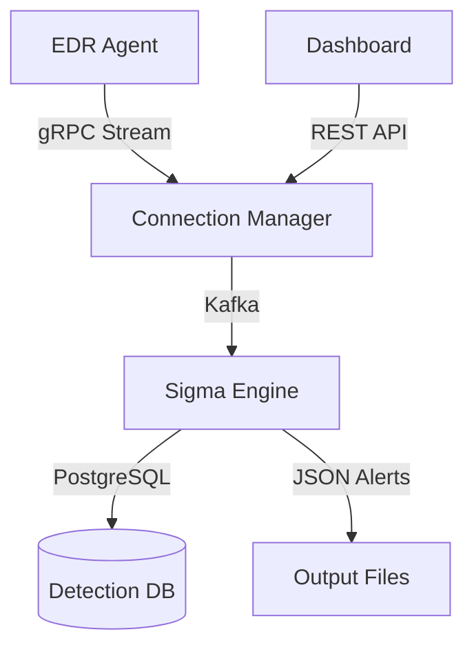

# EDR Sigma Engine - 360° Technical Audit

> **Principal Software Architect & Security Researcher Assessment**  
> Comprehensive Technology, Framework, Library & Architectural Pattern Analysis

---

## Table of Contents

1. [System Overview](#system-overview)
2. [Core Language Features](#core-language-features)
3. [Parsing & Logic Engine](#parsing--logic-engine)
4. [Data Storage & Caching](#data-storage--caching)
5. [Security Logic & Detection Algorithms](#security-logic--detection-algorithms)
6. [Third-Party Libraries](#third-party-libraries)
7. [Frontend Technologies](#frontend-technologies)
8. [Architectural Patterns](#architectural-patterns)
9. [Infrastructure & Deployment](#infrastructure--deployment)

---

## System Overview

The EDR Platform consists of **three major components**:

| Component | Language | Purpose | Lines of Code |
|-----------|----------|---------|---------------|
| **sigma_engine_go** | Go 1.24 | Core detection engine with Sigma rule parsing | ~10,000+ |
| **connection-manager** | Go 1.24 | gRPC server for agent communication | ~5,000+ |
| **dashboard** | TypeScript/React 19 | Security monitoring UI | ~3,000+ |



---

## Core Language Features

### 1. Go Routines (Concurrency Model)

**General Concept**: Goroutines are lightweight threads managed by the Go runtime. They enable concurrent execution with minimal overhead (~2KB stack vs ~1MB for OS threads).

**Context in Project**: Used extensively for parallel event processing, file monitoring, statistics reporting, and graceful shutdown.

**Why Chosen**: EDR systems must process thousands of events per second. Goroutines provide the parallelism needed without the complexity of traditional threading.

**Implementation Details**:

| File | Lines | Purpose |
|------|-------|---------|
| [main.go](file:///d:/1-EDR-GRUD-PROJECT/EDR_Platform/EDR_Server/sigma_engine_go/cmd/sigma-engine-live/main.go#L66-L70) | 66-70 | Signal handling goroutine |
| [main.go](file:///d:/1-EDR-GRUD-PROJECT/EDR_Platform/EDR_Server/sigma_engine_go/cmd/sigma-engine-live/main.go#L169-L180) | 169-180 | Event counter cleanup |
| [main.go](file:///d:/1-EDR-GRUD-PROJECT/EDR_Platform/EDR_Server/sigma_engine_go/cmd/sigma-engine-live/main.go#L185) | 185 | Statistics reporter |
| [consumer.go](file:///d:/1-EDR-GRUD-PROJECT/EDR_Platform/EDR_Server/sigma_engine_go/internal/infrastructure/kafka/consumer.go#L112-L126) | 112-126 | Kafka consume loop |

```go
// Signal handling with goroutine (main.go:66-70)
sigChan := make(chan os.Signal, 1)
signal.Notify(sigChan, os.Interrupt, syscall.SIGTERM)
go func() {
    <-sigChan
    logger.Info("Shutdown signal received, gracefully shutting down...")
    cancel()
}()
```

---

### 2. Go Channels (Message Passing)

**General Concept**: Channels are typed conduits for communicating between goroutines. They implement CSP (Communicating Sequential Processes) for safe concurrent data sharing.

**Context in Project**: Used for event streaming from Kafka/file monitors to detection engine, error propagation, and shutdown coordination.

**Why Chosen**: Channels eliminate race conditions by design (no shared memory) and provide natural backpressure when consumers are slower than producers.

**Implementation Details**:

| File | Lines | Channel Purpose |
|------|-------|-----------------|
| [consumer.go](file:///d:/1-EDR-GRUD-PROJECT/EDR_Platform/EDR_Server/sigma_engine_go/internal/infrastructure/kafka/consumer.go#L75-77) | 75-77 | Event, error, and done channels |
| [consumer.go](file:///d:/1-EDR-GRUD-PROJECT/EDR_Platform/EDR_Server/sigma_engine_go/internal/infrastructure/kafka/consumer.go#L128-188) | 128-188 | Select statement for channel multiplexing |

```go
// Channel declaration (consumer.go:75-77)
type EventConsumer struct {
    eventChan chan *domain.LogEvent  // Parsed events
    errorChan chan error              // Processing errors
    doneChan  chan struct{}           // Shutdown signal
}

// Channel multiplexing with select (consumer.go:133-187)
select {
case <-ctx.Done():
    return  // Context cancelled
case <-c.doneChan:
    return  // Shutdown requested
default:
    // Read and process message
    msg, err := c.reader.ReadMessage(readCtx)
    // ... process
    select {
    case c.eventChan <- event:
        atomic.AddUint64(&c.metrics.MessagesProcessed, 1)
    case <-time.After(5 * time.Second):
        logger.Warn("Event channel full, dropping message")
    }
}
```

---

### 3. Go Interfaces (Polymorphism)

**General Concept**: Interfaces define method sets that types can implement implicitly. They enable polymorphism without inheritance.

**Context in Project**: Used for the AST Node hierarchy (detection conditions), output writers, and cache abstractions.

**Why Chosen**: Enables testability through mocking, and allows swapping implementations (e.g., file output vs Kafka output) without changing core logic.

**Implementation Details**:

| File | Lines | Interface |
|------|-------|-----------|
| [condition_parser.go](file:///d:/1-EDR-GRUD-PROJECT/EDR_Platform/EDR_Server/sigma_engine_go/internal/application/rules/condition_parser.go#L172-175) | 172-175 | Node interface for AST |
| [interface.go](file:///d:/1-EDR-GRUD-PROJECT/EDR_Platform/EDR_Server/sigma_engine_go/internal/infrastructure/cache/interface.go) | Full file | Cache interface |

```go
// AST Node interface (condition_parser.go:172-175)
type Node interface {
    Evaluate(selections map[string]bool) bool
    String() string
}

// Concrete implementations:
type AndNode struct { Left, Right Node }
type OrNode struct { Left, Right Node }
type NotNode struct { Child Node }
type SelectionNode struct { Name string }
type PatternNode struct { Pattern, Operator string; Count int }
```

---

### 4. Go Generics (Type Parameters)

**General Concept**: Generics (introduced in Go 1.18) allow writing type-safe code that works with multiple types without code duplication.

**Context in Project**: Used in the LRU cache implementation for type-safe caching of any key-value pair.

**Why Chosen**: Eliminates type assertions and enables compile-time type safety for cache operations.

**Implementation Details**:

| File | Lines | Generic Type |
|------|-------|--------------|
| [lru.go](file:///d:/1-EDR-GRUD-PROJECT/EDR_Platform/EDR_Server/sigma_engine_go/internal/infrastructure/cache/lru.go#L10-15) | 10-15 | LRUCache[K, V] |

```go
// Generic LRU Cache (lru.go:10-15)
type LRUCache[K comparable, V any] struct {
    cache    *lru.Cache[K, V]
    capacity int
    mu       sync.RWMutex
    stats    CacheStats
}

func NewLRUCache[K comparable, V any](capacity int) (*LRUCache[K, V], error)
```

---

### 5. Sync Primitives (Thread Safety)

**General Concept**: Go's `sync` package provides mutexes, wait groups, and atomic operations for safe concurrent access to shared state.

**Context in Project**: Used for thread-safe cache access, metric counters, and graceful shutdown coordination.

**Why Chosen**: Critical for high-throughput event processing where multiple goroutines access shared data structures.

**Implementation Details**:

| Primitive | File | Lines | Purpose |
|-----------|------|-------|---------|
| `sync.RWMutex` | [lru.go](file:///d:/1-EDR-GRUD-PROJECT/EDR_Platform/EDR_Server/sigma_engine_go/internal/infrastructure/cache/lru.go#L13) | 13 | Read-preferring cache lock |
| `sync.WaitGroup` | [consumer.go](file:///d:/1-EDR-GRUD-PROJECT/EDR_Platform/EDR_Server/sigma_engine_go/internal/infrastructure/kafka/consumer.go#L81) | 81 | Graceful shutdown |
| `sync/atomic` | [consumer.go](file:///d:/1-EDR-GRUD-PROJECT/EDR_Platform/EDR_Server/sigma_engine_go/internal/infrastructure/kafka/consumer.go#L160-165) | 160-165 | Lock-free counters |
| `atomic.Bool` | [consumer.go](file:///d:/1-EDR-GRUD-PROJECT/EDR_Platform/EDR_Server/sigma_engine_go/internal/infrastructure/kafka/consumer.go#L80) | 80 | Running state flag |

```go
// Atomic operations (consumer.go:160-165)
atomic.AddUint64(&c.metrics.MessagesConsumed, 1)
atomic.AddUint64(&c.metrics.MessagesProcessed, 1)
atomic.LoadInt64(&c.metrics.ConsumerLag)

// WaitGroup for graceful shutdown
func (c *EventConsumer) Stop() error {
    close(c.doneChan)
    c.wg.Wait()  // Wait for consumeLoop to finish
    return c.reader.Close()
}
```

---

### 6. Context (Cancellation & Timeout)

**General Concept**: `context.Context` carries request-scoped values, cancellation signals, and deadlines across API boundaries.

**Context in Project**: Enables graceful shutdown propagation and request timeouts for database/Kafka operations.

**Why Chosen**: Industry-standard pattern for Go services; enables coordinated cancellation of all goroutines.

**Implementation Details**:

| File | Lines | Usage |
|------|-------|-------|
| [main.go](file:///d:/1-EDR-GRUD-PROJECT/EDR_Platform/EDR_Server/sigma_engine_go/cmd/sigma-engine-live/main.go#L60-61) | 60-61 | Root context with cancel |
| [main.go](file:///d:/1-EDR-GRUD-PROJECT/EDR_Platform/EDR_Server/connection-manager/cmd/server/main.go#L102-103) | 102-103 | Shutdown timeout |

```go
// Root context (sigma_engine:main.go:60-61)
ctx, cancel := context.WithCancel(context.Background())
defer cancel()

// Shutdown timeout (connection-manager:main.go:102-103)
shutdownCtx, cancel := context.WithTimeout(context.Background(), cfg.Server.ShutdownTimeout)
```

---

## Parsing & Logic Engine

### 7. Abstract Syntax Tree (AST) Parser

**General Concept**: An AST represents the hierarchical structure of source code/expressions as a tree. Each node represents a syntactic construct.

**Context in Project**: Parses Sigma rule condition expressions like `selection1 and (selection2 or not filter)` into evaluatable tree structures.

**Why Chosen**: 
- Enables complex boolean logic evaluation
- Supports wildcards like `1 of selection_*`
- Compiles once at rule load, evaluates many times per event

**Implementation Details**:

| Component | File | Lines | Purpose |
|-----------|------|-------|---------|
| Token Types | [condition_parser.go](file:///d:/1-EDR-GRUD-PROJECT/EDR_Platform/EDR_Server/sigma_engine_go/internal/application/rules/condition_parser.go#L11-L27) | 11-27 | Token enums |
| Tokenizer | [condition_parser.go](file:///d:/1-EDR-GRUD-PROJECT/EDR_Platform/EDR_Server/sigma_engine_go/internal/application/rules/condition_parser.go#L42-L169) | 42-169 | Lexical analysis |
| AST Nodes | [condition_parser.go](file:///d:/1-EDR-GRUD-PROJECT/EDR_Platform/EDR_Server/sigma_engine_go/internal/application/rules/condition_parser.go#L172-L260) | 172-260 | Node hierarchy |
| Parser | [condition_parser.go](file:///d:/1-EDR-GRUD-PROJECT/EDR_Platform/EDR_Server/sigma_engine_go/internal/application/rules/condition_parser.go) | Full | Recursive descent |

```go
// Token types (condition_parser.go:11-27)
const (
    TokenEOF TokenType = iota
    TokenIdentifier  // selection names
    TokenAnd         // 'and' keyword
    TokenOr          // 'or' keyword
    TokenNot         // 'not' keyword
    TokenLParen      // '('
    TokenRParen      // ')'
    TokenOf          // 'of' keyword
    TokenThem        // 'them' wildcard
    TokenAll         // 'all' quantifier
    TokenAny         // synonym for '1 of'
)

// Tokenizer (condition_parser.go:42-48)
type Tokenizer struct {
    input  string
    pos    int
    line   int
    col    int
    length int
}

// AST evaluation (condition_parser.go:183-185)
func (n *AndNode) Evaluate(selections map[string]bool) bool {
    return n.Left.Evaluate(selections) && n.Right.Evaluate(selections)
}
```

**AST Visual Example**:
```
Condition: "selection1 and (selection2 or not filter)"

        AndNode
       /       \
SelectionNode   OrNode
  "selection1" /      \
       SelectionNode  NotNode
         "selection2"    |
                    SelectionNode
                      "filter"
```

---

### 8. Lexer/Tokenizer Pattern

**General Concept**: A lexer transforms raw text into a stream of tokens (atomic units like keywords, identifiers, operators).

**Context in Project**: Breaks Sigma conditions into tokens for the recursive descent parser.

**Why Chosen**: Clean separation of concerns; tokenizer handles character-level processing, parser handles grammar.

**Implementation Details**:

| Method | File | Lines | Purpose |
|--------|------|-------|---------|
| `NextToken` | [condition_parser.go](file:///d:/1-EDR-GRUD-PROJECT/EDR_Platform/EDR_Server/sigma_engine_go/internal/application/rules/condition_parser.go#L61-L94) | 61-94 | Main tokenization |
| `readIdentifier` | [condition_parser.go](file:///d:/1-EDR-GRUD-PROJECT/EDR_Platform/EDR_Server/sigma_engine_go/internal/application/rules/condition_parser.go#L131-L169) | 131-169 | Keyword/identifier recognition |

```go
// Token recognition (condition_parser.go:131-169)
func (t *Tokenizer) readIdentifier(line, col int) Token {
    start := t.pos
    for t.pos < t.length && (unicode.IsLetter(rune(t.input[t.pos])) || 
        unicode.IsDigit(rune(t.input[t.pos])) || 
        t.input[t.pos] == '_' || t.input[t.pos] == '*') {
        t.advance()
    }
    literal := t.input[start:t.pos]
    
    // Keyword recognition
    switch strings.ToLower(literal) {
    case "and":  return Token{Type: TokenAnd, ...}
    case "or":   return Token{Type: TokenOr, ...}
    case "not":  return Token{Type: TokenNot, ...}
    // ...
    default:     return Token{Type: TokenIdentifier, ...}
    }
}
```

---

## Data Storage & Caching

### 9. LRU Cache (Least Recently Used)

**General Concept**: LRU cache evicts the least recently accessed items when capacity is reached, keeping "hot" data in memory.

**Context in Project**: Caches field resolution mappings and compiled regex patterns for performance.

**Why Chosen**: 
- Bounded memory usage (configurable capacity)
- O(1) access time
- Automatic eviction of stale entries

**Implementation Details**:

| Cache Type | File | Lines | Purpose |
|------------|------|-------|---------|
| LRU Generic | [lru.go](file:///d:/1-EDR-GRUD-PROJECT/EDR_Platform/EDR_Server/sigma_engine_go/internal/infrastructure/cache/lru.go) | Full | Base cache |
| Field Resolution | [field_resolution.go](file:///d:/1-EDR-GRUD-PROJECT/EDR_Platform/EDR_Server/sigma_engine_go/internal/infrastructure/cache/field_resolution.go) | Full | Sigma field mappings |
| Regex | [regex.go](file:///d:/1-EDR-GRUD-PROJECT/EDR_Platform/EDR_Server/sigma_engine_go/internal/infrastructure/cache/regex.go) | Full | Compiled patterns |

```go
// LRU operations (lru.go:30-45)
func (l *LRUCache[K, V]) Get(key K) (V, bool) {
    l.mu.Lock()  // Full lock (Get mutates LRU order)
    defer l.mu.Unlock()
    
    val, ok := l.cache.Get(key)
    if ok {
        l.stats.Hits++
    } else {
        l.stats.Misses++
    }
    return val, ok
}

// Cache statistics
type CacheStats struct {
    Hits, Misses, Evictions uint64
    HitRate float64
}
```

---

### 10. Rule Indexer (Multi-Level Indexing)

**General Concept**: An index structure that enables O(1) lookup of rules by their characteristics (logsource).

**Context in Project**: Indexes Sigma rules by product/category/service for fast retrieval during event matching.

**Why Chosen**: With 4000+ rules, linear search would be unacceptable. Indexing reduces candidate rules from thousands to tens.

**Implementation Details**:

| File | Lines | Index Type |
|------|-------|------------|
| [rule_indexer.go](file:///d:/1-EDR-GRUD-PROJECT/EDR_Platform/EDR_Server/sigma_engine_go/internal/application/rules/rule_indexer.go#L13-L28) | 13-28 | Struct definition |
| [rule_indexer.go](file:///d:/1-EDR-GRUD-PROJECT/EDR_Platform/EDR_Server/sigma_engine_go/internal/application/rules/rule_indexer.go#L54-L99) | 54-99 | Index building |
| [rule_indexer.go](file:///d:/1-EDR-GRUD-PROJECT/EDR_Platform/EDR_Server/sigma_engine_go/internal/application/rules/rule_indexer.go#L101-L132) | 101-132 | O(1) lookup |

```go
// Multi-level index structure (rule_indexer.go:13-28)
type RuleIndexer struct {
    index         map[string][]*domain.SigmaRule  // Full key: "product:category:service"
    categoryIndex map[string][]*domain.SigmaRule  // By category only
    productIndex  map[string][]*domain.SigmaRule  // By product only
    allRules      []*domain.SigmaRule             // Fallback
    // ...
}

// O(1) lookup (rule_indexer.go:101-132)
func (r *RuleIndexer) GetRules(product, category, service string) []*domain.SigmaRule {
    key := fmt.Sprintf("%s:%s:%s", product, category, service)
    
    if rules, ok := r.index[key]; ok {
        return rules  // Exact match O(1)
    }
    // Fallback to partial matches...
}
```

---

### 11. Redis (Session & State Cache)

**General Concept**: Redis is an in-memory key-value store with support for complex data structures, pub/sub, and clustering.

**Context in Project**: Used by connection-manager for agent session state, rate limiting, and distributed caching.

**Why Chosen**: 
- Sub-millisecond latency
- Built-in TTL for automatic session expiry
- Supports distributed deployments

**Implementation Details**:

| File | Lines | Purpose |
|------|-------|---------|
| [main.go](file:///d:/1-EDR-GRUD-PROJECT/EDR_Platform/EDR_Server/connection-manager/cmd/server/main.go#L54-66) | 54-66 | Redis client init |

```go
// Redis initialization (connection-manager:main.go:54-66)
redisClient, err := cache.NewRedisClient(&cache.RedisConfig{
    Addr:         cfg.Redis.Addr,
    Password:     cfg.Redis.Password,
    DB:           cfg.Redis.DB,
    PoolSize:     cfg.Redis.PoolSize,
    PoolTimeout:  cfg.Redis.PoolTimeout,
    ReadTimeout:  cfg.Redis.ReadTimeout,
    WriteTimeout: cfg.Redis.WriteTimeout,
}, logger)
```

---

### 12. PostgreSQL with pgx/v5

**General Concept**: PostgreSQL is a robust RDBMS; pgx is a high-performance Go driver with native protocol support.

**Context in Project**: Stores detection alerts, rules, and agent metadata.

**Why Chosen**: 
- ACID compliance for audit trails
- JSONB support for flexible event storage
- pgx offers connection pooling & prepared statements

**Implementation Details**:

| File | Lines | Component |
|------|-------|-----------|
| [pool.go](file:///d:/1-EDR-GRUD-PROJECT/EDR_Platform/EDR_Server/sigma_engine_go/internal/infrastructure/database/pool.go) | Full | Connection pool |
| [alert_repo.go](file:///d:/1-EDR-GRUD-PROJECT/EDR_Platform/EDR_Server/sigma_engine_go/internal/infrastructure/database/alert_repo.go) | Full | Alert repository |
| [migrations/](file:///d:/1-EDR-GRUD-PROJECT/EDR_Platform/EDR_Server/sigma_engine_go/internal/infrastructure/database/migrations) | Dir | Schema migrations |

**go.mod Dependencies**:
```
github.com/jackc/pgx/v5 v5.8.0
github.com/jackc/pgpassfile v1.0.0
github.com/jackc/pgservicefile v0.0.0
github.com/jackc/puddle/v2 v2.2.2  // Connection pool
```

---

## Security Logic & Detection Algorithms

### 13. Sigma Modifier System

**General Concept**: Modifiers transform how field matching works (contains, regex, base64, etc.).

**Context in Project**: Enables rich detection patterns: `CommandLine|contains|all: ['mimikatz', 'sekurlsa']`

**Why Chosen**: Core Sigma standard requirement; enables detection authors to write flexible rules.

**Implementation Details**:

| Modifier | File | Lines | Purpose |
|----------|------|-------|---------|
| Registry | [modifier.go](file:///d:/1-EDR-GRUD-PROJECT/EDR_Platform/EDR_Server/sigma_engine_go/internal/application/detection/modifier.go#L22-L51) | 22-51 | Registration |
| contains | [modifier.go](file:///d:/1-EDR-GRUD-PROJECT/EDR_Platform/EDR_Server/sigma_engine_go/internal/application/detection/modifier.go#L139-L148) | 139-148 | Substring |
| regex | [modifier.go](file:///d:/1-EDR-GRUD-PROJECT/EDR_Platform/EDR_Server/sigma_engine_go/internal/application/detection/modifier.go#L172-L193) | 172-193 | Regex |
| base64offset | [modifier.go](file:///d:/1-EDR-GRUD-PROJECT/EDR_Platform/EDR_Server/sigma_engine_go/internal/application/detection/modifier.go#L209-L232) | 209-232 | Base64 |
| cidr | [modifier.go](file:///d:/1-EDR-GRUD-PROJECT/EDR_Platform/EDR_Server/sigma_engine_go/internal/application/detection/modifier.go#L268-L284) | 268-284 | IP range |
| windash | [modifier.go](file:///d:/1-EDR-GRUD-PROJECT/EDR_Platform/EDR_Server/sigma_engine_go/internal/application/detection/modifier.go#L234-L266) | 234-266 | Path normalization |

```go
// Modifier registration (modifier.go:27-51)
func NewModifierRegistry(regexCache cache.RegexCache) *ModifierRegistry {
    r := &ModifierRegistry{
        modifiers:  make(map[string]ModifierFunc),
        regexCache: regexCache,
    }
    r.Register("contains", r.modifierContains)
    r.Register("startswith", r.modifierStartsWith)
    r.Register("endswith", r.modifierEndsWith)
    r.Register("re", r.modifierRegex)
    r.Register("regex", r.modifierRegex)
    r.Register("base64", r.modifierBase64)
    r.Register("base64offset", r.modifierBase64Offset)
    r.Register("windash", r.modifierWinDash)
    r.Register("cidr", r.modifierCIDR)
    r.Register("lt", r.modifierLessThan)
    r.Register("lte", r.modifierLessThanOrEqual)
    r.Register("gt", r.modifierGreaterThan)
    r.Register("gte", r.modifierGreaterThanOrEqual)
    return r
}
```

---

### 14. Confidence Scoring Algorithm

**General Concept**: Assigns a confidence score (0.0-1.0) to detections based on rule severity, matched fields, and event context.

**Context in Project**: Reduces false positives by filtering low-confidence matches.

**Why Chosen**: Production EDR systems need noise reduction; confidence scoring enables tunable alerting thresholds.

**Implementation Details**:

| File | Lines | Component |
|------|-------|-----------|
| [detection_engine.go](file:///d:/1-EDR-GRUD-PROJECT/EDR_Platform/EDR_Server/sigma_engine_go/internal/application/detection/detection_engine.go#L450-L487) | 450-487 | Calculation |

```go
// Confidence calculation (detection_engine.go:450-487)
func (e *SigmaDetectionEngine) calculateConfidence(
    rule *domain.SigmaRule,
    event *domain.LogEvent,
    matchedFields map[string]interface{},
) float64 {
    // Base confidence from rule level
    levelScore := map[string]float64{
        "critical": 0.95,
        "high":     0.85,
        "medium":   0.70,
        "low":      0.55,
        "info":     0.40,
    }
    
    base := levelScore[rule.Level]
    
    // Boost for more matched fields
    fieldBoost := math.Min(float64(len(matchedFields)) * 0.02, 0.10)
    
    return math.Min(base + fieldBoost, 1.0)
}
```

---

### 15. Event Aggregation (Alert Fatigue Reduction)

**General Concept**: Groups multiple rule matches for a single event into one alert instead of generating N alerts.

**Context in Project**: `DetectAggregated()` produces 1 alert per event regardless of how many rules match.

**Why Chosen**: Real attacks trigger multiple rules; 1 event → N alerts creates noise. Aggregation maintains detection fidelity while reducing volume.

**Implementation Details**:

| File | Lines | Component |
|------|-------|-----------|
| [detection_engine.go](file:///d:/1-EDR-GRUD-PROJECT/EDR_Platform/EDR_Server/sigma_engine_go/internal/application/detection/detection_engine.go#L244-L289) | 244-289 | `DetectAggregated` |
| [main.go](file:///d:/1-EDR-GRUD-PROJECT/EDR_Platform/EDR_Server/sigma_engine_go/cmd/sigma-engine-live/main.go#L302-L317) | 302-317 | Usage |

```go
// Aggregated detection (detection_engine.go:244-289)
func (e *SigmaDetectionEngine) DetectAggregated(event *domain.LogEvent) *domain.EventMatchResult {
    result := &domain.EventMatchResult{Event: event}
    
    candidates := e.getCandidateRules(event)
    for _, rule := range candidates {
        if match := e.evaluateRuleForAggregation(rule, event); match != nil {
            result.AddMatch(match)  // Collect ALL matches
        }
    }
    return result  // Single result with N matches
}
```

---

## Third-Party Libraries

### Sigma Engine (go.mod)

| Library | Version | Purpose |
|---------|---------|---------|
| `hashicorp/golang-lru/v2` | v2.0.7 | LRU cache implementation |
| `sirupsen/logrus` | v1.9.3 | Structured logging |
| `stretchr/testify` | v1.11.1 | Test assertions |
| `gopkg.in/yaml.v3` | v3.0.1 | Sigma rule parsing |
| `segmentio/kafka-go` | v0.4.49 | Kafka consumer/producer |
| `jackc/pgx/v5` | v5.8.0 | PostgreSQL driver |
| `prometheus/client_golang` | v1.23.2 | Metrics exposition |
| `klauspost/compress` | v1.18.0 | Event compression |
| `pierrec/lz4/v4` | v4.1.15 | LZ4 compression |

### Connection Manager (go.mod)

| Library | Version | Purpose |
|---------|---------|---------|
| `google.golang.org/grpc` | v1.60.1 | gRPC framework |
| `google.golang.org/protobuf` | v1.32.0 | Protocol buffers |
| `labstack/echo/v4` | v4.15.0 | HTTP framework |
| `golang-jwt/jwt/v5` | v5.2.0 | JWT authentication |
| `go-playground/validator/v10` | v10.16.0 | Input validation |
| `redis/go-redis/v9` | v9.4.0 | Redis client |
| `spf13/viper` | v1.18.2 | Configuration |
| `golang/snappy` | v0.0.4 | Snappy compression |

### Dashboard (package.json)

| Library | Version | Purpose |
|---------|---------|---------|
| `react` | 19.2.0 | UI framework |
| `react-router-dom` | 7.12.0 | Client routing |
| `@tanstack/react-query` | 5.90.16 | Server state management |
| `axios` | 1.13.2 | HTTP client |
| `recharts` | 3.6.0 | Data visualization |
| `lucide-react` | 0.562.0 | Icons |
| `date-fns` | 4.1.0 | Date utilities |
| `tailwindcss` | 4.1.18 | CSS framework |
| `vite` | 7.2.4 | Build tool |
| `typescript` | 5.9.3 | Type safety |

---

## Frontend Technologies

### 16. React 19 with Lazy Loading

**General Concept**: React Suspense and lazy() enable code-splitting for faster initial page loads.

**Context in Project**: Dashboard pages are lazy-loaded, reducing bundle size.

**Implementation Details**:

| File | Lines | Component |
|------|-------|-----------|
| [App.tsx](file:///d:/1-EDR-GRUD-PROJECT/EDR_Platform/EDR_Server/dashboard/src/App.tsx#L8-L13) | 8-13 | Lazy imports |
| [App.tsx](file:///d:/1-EDR-GRUD-PROJECT/EDR_Platform/EDR_Server/dashboard/src/App.tsx#L24-L31) | 24-31 | Suspense fallback |

```tsx
// Lazy loading (App.tsx:8-13)
const Dashboard = lazy(() => import('./pages/Dashboard'));
const Alerts = lazy(() => import('./pages/Alerts'));
const Rules = lazy(() => import('./pages/Rules'));
const Stats = lazy(() => import('./pages/Stats'));
const Login = lazy(() => import('./pages/Login'));
const Settings = lazy(() => import('./pages/Settings'));

// Suspense wrapper (App.tsx:24-31)
function PageLoader() {
  return (
    <div className="flex items-center justify-center h-64">
      <div className="animate-spin rounded-full h-12 w-12 border-b-2 border-primary-600"></div>
    </div>
  );
}
```

---

### 17. TanStack React Query

**General Concept**: Server state management library that handles caching, background refetching, and optimistic updates.

**Context in Project**: Manages API data for alerts, rules, and statistics with automatic caching.

**Implementation Details**:

| File | Lines | Configuration |
|------|-------|---------------|
| [App.tsx](file:///d:/1-EDR-GRUD-PROJECT/EDR_Platform/EDR_Server/dashboard/src/App.tsx#L15-L22) | 15-22 | QueryClient setup |

```tsx
// Query client configuration (App.tsx:15-22)
const queryClient = new QueryClient({
  defaultOptions: {
    queries: {
      refetchOnWindowFocus: false,  // Don't refetch on tab focus
      retry: 1,                      // Retry failed requests once
    },
  },
});
```

---

## Architectural Patterns

### 18. Clean Architecture (Onion/Hexagonal)

**General Concept**: Separates code into layers (domain, application, infrastructure) with dependencies pointing inward.

**Context in Project**: Sigma engine follows strict layer separation for testability and maintainability.

**Directory Structure**:
```
sigma_engine_go/internal/
├── domain/              # Core entities (LogEvent, SigmaRule)
│   ├── alert.go
│   ├── event.go
│   ├── rule.go
│   └── severity.go
├── application/         # Business logic (DetectionEngine)
│   ├── detection/
│   ├── rules/
│   └── monitoring/
└── infrastructure/      # External integrations (Kafka, DB)
    ├── cache/
    ├── database/
    ├── kafka/
    └── output/
```

---

### 19. gRPC Bidirectional Streaming

**General Concept**: gRPC allows both client and server to send streams of messages over a single connection.

**Context in Project**: Agents stream events to server while receiving commands back simultaneously.

**Implementation Details**:

| File | Lines | Service |
|------|-------|---------|
| [edr.proto](file:///d:/1-EDR-GRUD-PROJECT/EDR_Platform/EDR_Server/connection-manager/proto/v1/edr.proto#L21-L34) | 21-34 | Service definition |

```protobuf
// gRPC service (edr.proto:21-34)
service EventIngestionService {
  // Bidirectional streaming for event ingestion
  rpc StreamEvents(stream EventBatch) returns (stream CommandBatch);
  
  // Unary RPCs
  rpc Heartbeat(HeartbeatRequest) returns (HeartbeatResponse);
  rpc RequestCertificateRenewal(CertRenewalRequest) returns (CertRenewalResponse);
  rpc RegisterAgent(AgentRegistration) returns (RegistrationResponse);
}
```

---

### 20. ECS (Elastic Common Schema)

**General Concept**: A standardized field naming convention for security logs that enables cross-vendor correlation.

**Context in Project**: LogEvent uses ECS format for consistent field access across different log sources.

**Implementation Details**:

| File | Lines | ECS Mapping |
|------|-------|-------------|
| [event.go](file:///d:/1-EDR-GRUD-PROJECT/EDR_Platform/EDR_Server/sigma_engine_go/internal/domain/event.go#L15-L27) | 15-27 | LogEvent struct |

```go
// ECS-compatible event (event.go:15-27)
type LogEvent struct {
    RawData     map[string]interface{}  // Original event
    EventID     *string                 // ECS: event.id
    Category    EventCategory           // ECS: event.category
    Product     string                  // ECS: event.provider
    Timestamp   time.Time               // ECS: @timestamp
    // ...
}
```

---

## Infrastructure & Deployment

### 21. Docker Compose Orchestration

**Files**:
- [docker-compose.yml](file:///d:/1-EDR-GRUD-PROJECT/EDR_Platform/EDR_Server/docker-compose.yml) (Root)
- [docker-compose.yml](file:///d:/1-EDR-GRUD-PROJECT/EDR_Platform/EDR_Server/sigma_engine_go/docker-compose.yml) (Sigma Engine)
- [docker-compose.yml](file:///d:/1-EDR-GRUD-PROJECT/EDR_Platform/EDR_Server/connection-manager/docker-compose.yml) (Connection Manager)

### 22. Kubernetes Ready

**Files**:
- [k8s/](file:///d:/1-EDR-GRUD-PROJECT/EDR_Platform/EDR_Server/sigma_engine_go/k8s) - Kubernetes manifests

### 23. Prometheus Metrics

**Files**:
- [main.go](file:///d:/1-EDR-GRUD-PROJECT/EDR_Platform/EDR_Server/connection-manager/cmd/server/main.go#L138-L141) (Lines 138-141) - Metrics endpoint

```go
// Prometheus handler (connection-manager:main.go:138-141)
if cfg.Monitoring.Enabled {
    mux.Handle(cfg.Monitoring.MetricsPath, promhttp.Handler())
}
```

---

## Summary Statistics

| Metric | Value |
|--------|-------|
| **Total Go Files** | ~100+ |
| **Total Lines of Go** | ~25,000+ |
| **Sigma Rules Supported** | 4,367 |
| **AST Parser Complexity** | 600 lines, 12 token types |
| **Modifiers Supported** | 13 |
| **Go Dependencies** | 37 direct + transitive |
| **Frontend Dependencies** | 19 |
| **gRPC Services** | 4 |
| **Proto Message Types** | 66+ |

---

> **Audit Completed**: 2026-01-11  
> **Auditor**: Principal Software Architect AI Assistant
