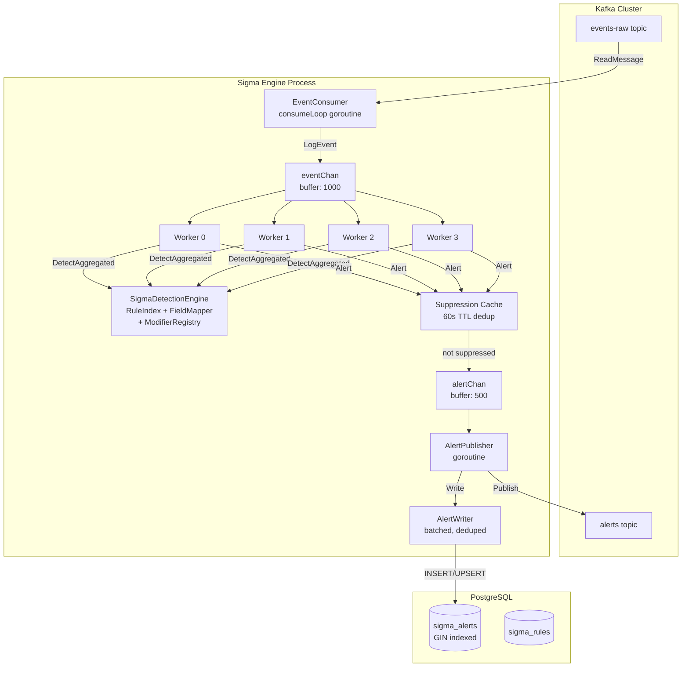

# The Sigma Detection Engine (`sigma_engine_go`)
## A Microscopic Deep-Dive — Graduation Defense Documentation

---

## 1. THE ASYNCHRONOUS INGESTION LAYER (Kafka Consumer & Workers)

### 1.1 Consumer Group Architecture

The Sigma Engine consumes from the `events-raw` Kafka topic using the `sigma-engine-group` consumer group. This is configured in [main.go](file:///d:/EDR_Platform/sigma_engine_go/cmd/sigma-engine-kafka/main.go):

```go
consumerConfig := infraKafka.ConsumerConfig{
    Brokers:        []string{"kafka:9092"},
    Topic:          "events-raw",
    GroupID:        "sigma-engine-group",
    MinBytes:       1,            // Fetch even a single byte (low latency)
    MaxBytes:       10e6,         // Up to 10MB per fetch (high throughput)
    MaxWait:        5 * time.Second,
    CommitInterval: 1 * time.Second,
    StartOffset:    kafka.LastOffset,  // -1 = only new messages
}
```

**Why `kafka.LastOffset` (Latest)?**

The engine processes events in real-time for live threat detection. Processing historical events on startup would cause a thundering herd of stale alerts. If replay is needed (post-incident forensics), the consumer group offset can be manually reset.

**Why `CommitInterval: 1s`?**

Kafka consumer groups track progress via **committed offsets**. Auto-committing every 1 second means that if the engine crashes, it will re-process at most **1 second of events**. Since the detection pipeline is idempotent (duplicate alerts are suppressed), this small overlap window is acceptable and prevents data loss.

### 1.2 The Consumer Loop ([consumeLoop](file:///d:/EDR_Platform/sigma_engine_go/internal/infrastructure/kafka/consumer.go#128-194))

The [consumer.go](file:///d:/EDR_Platform/sigma_engine_go/internal/infrastructure/kafka/consumer.go) implements a single goroutine that:

1. **Reads** a Kafka message with a per-read timeout (`MaxWait`)
2. **Deserializes** the JSON payload into a `map[string]interface{}`
3. **Injects Kafka metadata** (`_kafka_partition`, `_kafka_offset`, `_kafka_topic`, `_kafka_key`)
4. **Creates** a `domain.LogEvent` from the raw map
5. **Sends** the event to the buffered `eventChan`

```go
func (c *EventConsumer) parseMessage(msg kafka.Message) (*domain.LogEvent, error) {
    var rawData map[string]interface{}
    json.Unmarshal(msg.Value, &rawData)  // JSON → Go map

    // Inject Kafka metadata for audit trail
    rawData["_kafka_partition"] = msg.Partition
    rawData["_kafka_offset"]    = msg.Offset
    rawData["_kafka_topic"]     = msg.Topic
    rawData["_kafka_key"]       = string(msg.Key)  // = agent_id (partition key)

    return domain.NewLogEvent(rawData)
}
```

**Backpressure Handling:**

If `eventChan` is full (all workers are busy), the consumer waits up to **5 seconds** before dropping the message:

```go
select {
case c.eventChan <- event:
    // Delivered to workers
case <-time.After(5 * time.Second):
    logger.Warn("Event channel full, dropping message")
case <-ctx.Done():
    return  // Shutdown
}
```

### 1.3 The Concurrency Model: 4 Workers + Alert Publisher

The [EventLoop](file:///d:/EDR_Platform/sigma_engine_go/internal/infrastructure/kafka/event_loop.go) launches **7 concurrent goroutines** at startup:

| # | Goroutine | Purpose |
|---|---|---|
| 1-4 | [detectionWorker(ctx, i)](file:///d:/EDR_Platform/sigma_engine_go/internal/infrastructure/kafka/event_loop.go#227-246) | Drain `eventChan`, evaluate rules, produce alerts |
| 5 | [alertPublisher(ctx)](file:///d:/EDR_Platform/sigma_engine_go/internal/infrastructure/kafka/event_loop.go#295-325) | Drain `alertChan`, publish to Kafka + write to PostgreSQL |
| 6 | [statsReporter(ctx)](file:///d:/EDR_Platform/sigma_engine_go/internal/infrastructure/kafka/event_loop.go#326-379) | Log EPS, latency, alert counts every 30 seconds |
| 7 | [suppressionCleaner(ctx)](file:///d:/EDR_Platform/sigma_engine_go/internal/infrastructure/kafka/event_loop.go#380-403) | Purge expired entries from the dedup cache every 30 seconds |

```go
// Start 4 detection workers
for i := 0; i < el.config.Workers; i++ {
    el.wg.Add(1)
    go el.detectionWorker(ctx, i)
}

// Start single alert publisher
el.wg.Add(1)
go el.alertPublisher(ctx)
```

**Why 4 Workers?**

The worker count is a tunable parameter (CLI flag `--workers`). The default of 4 matches typical deployment scenarios:

- **CPU-bound workload**: Each worker performs regex matching, string comparisons, and JSON parsing. 4 workers saturate 4 CPU cores without context-switch overhead.
- **Shared-nothing between workers**: Workers read from the same `eventChan` (Go channels are thread-safe), produce to the same `alertChan`, but share **no mutable state** — each worker operates on independent events. The [SigmaDetectionEngine](file:///d:/EDR_Platform/sigma_engine_go/internal/application/detection/detection_engine.go#63-74) is protected by a `sync.RWMutex` (read-lock during detection, write-lock only during rule reload).

### 1.4 Buffer Size Rationale

| Buffer | Size | Reasoning |
|---|---|---|
| **EventBuffer** | 1,000 | At 500 EPS (typical production), this provides a **2-second burst buffer**. If all 4 workers are saturated processing complex rules, up to 1,000 events can queue before backpressure forces the consumer to wait. This handles short-lived CPU spikes without dropping events. |
| **AlertBuffer** | 500 | Alerts are much rarer than events (typical 0.1% alert rate). At 500 EPS, that's ~0.5 alerts/second — the 500-item buffer can absorb **1,000 seconds** of steady-state alerts. This generous buffer handles alert storms (e.g., during an active attack where many rules fire simultaneously). |

**Why not make the buffers larger?**

Unbounded buffers hide backpressure. If the engine cannot keep up with the event stream, it's better to **drop events with a visible warning** (tracked by [ProcessingErrors](file:///d:/EDR_Platform/sigma_engine_go/internal/infrastructure/kafka/event_loop.go#505-509) counter) than to silently accumulate a memory-consuming queue that may OOM-kill the process.

### 1.5 Alert Suppression Cache (Anti-Flooding)

Before an alert reaches `alertChan`, it passes through a **suppression cache** — a thread-safe, TTL-based deduplication layer:

```go
// Key format: "ruleID|agentID"
suppressKey := baseAlert.RuleID + "|" + agentStr

if el.suppression.shouldSuppress(suppressKey) {
    atomic.AddUint64(&el.metrics.AlertsSuppressed, 1)
    return  // Alert silently dropped
}
```

The cache uses a **double-checked locking pattern** (read lock → check → write lock → re-check → insert) for thread safety:

```go
func (sc *suppressionCache) shouldSuppress(key string) bool {
    sc.mu.RLock()                                    // Fast path: read-only check
    if ts, exists := sc.entries[key]; exists && now.Sub(ts) < sc.ttl {
        sc.mu.RUnlock()
        return true                                  // Already seen within TTL
    }
    sc.mu.RUnlock()

    sc.mu.Lock()                                     // Slow path: write lock
    defer sc.mu.Unlock()
    if ts, exists := sc.entries[key]; exists && now.Sub(ts) < sc.ttl {
        return true                                  // Double-check after lock promotion
    }
    sc.entries[key] = now                            // Record first occurrence
    return false
}
```

**Default TTL: 60 seconds**. This means the same rule + agent pair generates **at most 1 alert per minute**, even if the underlying malicious behavior produces hundreds of matching events per second (e.g., a process spawning repeatedly).

### 1.6 Graceful Shutdown Ordering

The shutdown sequence in [Stop()](file:///d:/EDR_Platform/sigma_engine_go/internal/infrastructure/kafka/event_loop.go#404-464) ensures **zero alert loss**:

```
1. consumer.Stop()     → closes eventChan
2. workers drain       → process remaining events in eventChan (range loop exits on close)
3. close(alertChan)    → signals alertPublisher to drain remaining alerts
4. close(doneChan)     → signals statsReporter to exit
5. wg.Wait()           → wait for all goroutines (with 30s timeout)
6. producer.Stop()     → flushes final Kafka writer batch
```

---

## 2. IN-MEMORY RULE COMPILATION (Parsing YAML)

### 2.1 Rule Loading Pipeline

At startup, the engine loads community Sigma YAML rules from a filesystem directory (default: `rules/sigma/`). The pipeline:

```
Filesystem (*.yml) → RuleLoader.LoadRules() → Quality Filter → RuleIndexer.BuildIndex()
                                                             → ConditionParser.Parse() (pre-parse)
                                                             → detectionEngine.LoadRules()
```

**Quality Filter:**

Not all community rules are production-quality. The engine applies a 5-stage filter during [LoadRules()](file:///d:/EDR_Platform/sigma_engine_go/internal/application/detection/detection_engine.go#100-170):

```go
// 1. Must have detection selections (skip empty rules)
if len(rule.Detection.Selections) == 0 { continue }

// 2. Must be documented (skip low-quality rules)
if rule.Title == "" || rule.Description == "" { continue }

// 3. Skip experimental rules (configurable)
if e.quality.RuleQuality.SkipExperimental && rule.Status == "experimental" { continue }

// 4. Allowed statuses only (e.g., ["stable", "test"])
if !allowedStatuses[rule.Status] { continue }

// 5. Minimum severity level (e.g., skip "informational" rules)
if levelRank(rule.Level) < levelRank(e.quality.RuleQuality.MinLevel) { continue }
```

### 2.2 Detection Block Parsing → In-Memory Structs

A Sigma rule's YAML [detection](file:///d:/EDR_Platform/sigma_engine_go/internal/infrastructure/kafka/event_loop.go#227-246) block is parsed into these domain structs:

```yaml
# Example Sigma YAML:
detection:
  selection:
    CommandLine|contains|all:
      - 'net '
      - 'user'
    Image|endswith: '\net.exe'
  filter:
    User: 'SYSTEM'
  condition: selection and not filter
```

Is parsed into:

```go
type Selection struct {
    Fields             []SelectionField
    Keywords           []string         // Keyword-based selections (full-text)
    IsKeywordSelection bool
}

type SelectionField struct {
    FieldName     string        // "CommandLine", "Image", "User"
    Modifiers     []string      // ["contains", "all"], ["endswith"], []
    Values        []interface{} // ["net ", "user"], ["\\net.exe"], ["SYSTEM"]
    IsNegated     bool          // true for filter selections with negation
    CompiledRegex []*regexp.Regexp  // Pre-compiled for |re modifier
}
```

**How Modifiers Are Parsed:**

The field name `CommandLine|contains|all` is split by `|`:
- `CommandLine` → `FieldName`
- `contains` → `Modifiers[0]` → tells the engine: use substring matching
- [all](file:///d:/EDR_Server/connection-manager/pkg/handlers/event_ingestion.go#484-524) → `Modifiers[1]` → tells the engine: ALL values must match (AND logic instead of default OR)

### 2.3 The Rule Indexer (O(1) Lookup)

After parsing, rules are organized into a **hash-map index** keyed by [(product, category, service)](file:///d:/EDR_Platform/sigma_engine_go/internal/application/detection/modifier.go#58-63):

```go
type RuleIndexer struct {
    index map[string][]*domain.SigmaRule  // key: "product|category|service"
}

func (ri *RuleIndexer) GetRules(product, category, service string) []*domain.SigmaRule {
    key := product + "|" + category + "|" + service
    return ri.index[key]  // O(1) lookup
}
```

This means when a `process_creation` event arrives from the `windows` product, the engine **only evaluates rules that match that logsource** — not all 2,000+ rules. This reduces the candidate set from thousands to typically **50-200 rules**.

### 2.4 Condition Pre-Parsing

All rule conditions are pre-parsed at load time into an **AST (Abstract Syntax Tree)**:

```go
for _, rule := range filtered {
    selectionNames := rule.GetSelectionNames()  // ["selection", "filter"]
    conditionAST, _ := e.conditionParser.Parse(rule.Detection.Condition, selectionNames)
    // Condition: "selection and not filter"
    // AST:  AND(selection=true, NOT(filter=true))
}
```

> **Academic Note**: Pre-parsing amortizes the parsing cost across all events. Without this, every event evaluation would re-parse the condition string — a significant overhead when processing 500+ EPS across 200+ rules.

---

## 3. THE MATCHING ALGORITHM (Detection Logic)

### 3.1 The [DetectAggregated](file:///d:/EDR_Platform/sigma_engine_go/internal/application/detection/detection_engine.go#244-302) Entry Point

This is the **primary detection method** called by each worker goroutine for every event:

```go
func (e *SigmaDetectionEngine) DetectAggregated(event *domain.LogEvent) *domain.EventMatchResult {
    result := domain.NewEventMatchResult(event)

    // Step 1: Global whitelist check (fast exit)
    if e.isWhitelistedEvent(event) { return result }

    // Step 2: O(1) logsource lookup → candidate rules
    candidates := e.getCandidateRules(event)  // e.g., 150 rules for windows/process_creation

    // Step 3: Evaluate EVERY candidate rule, collect ALL matches
    for _, rule := range candidates {
        match := e.evaluateRuleForAggregation(rule, event)
        if match != nil {
            result.AddMatch(match.Rule, match.Confidence, match.MatchedFields, match.MatchedSelections)
        }
    }
    return result  // Contains 0 or more RuleMatches
}
```

**Why "Aggregated" instead of separate alerts?**

- **Old behavior**: 1 event + 5 matching rules → 5 separate alerts → 5 Kafka messages → 5 DB rows → overwhelmed SOC team
- **New behavior**: 1 event + 5 matching rules → 1 aggregated alert with severity promotion + MITRE technique union → single, enriched, actionable alert

### 3.2 The 5-Step Rule Evaluation ([evaluateRuleForAggregation](file:///d:/EDR_Platform/sigma_engine_go/internal/application/detection/detection_engine.go#303-360))

For each candidate rule, the engine runs a **5-step evaluation pipeline**:

```
Step 1: EVALUATE SELECTIONS    → For each selection, check all fields against event
Step 2: EVALUATE CONDITION     → Parse AST: "selection and not filter" → bool
Step 3: APPLY FILTERS          → If EnableFilters: check filter* selections for suppression
Step 4: CALCULATE CONFIDENCE   → baseConf * fieldFactor * contextScore → float64
Step 5: BUILD RULEMATCH        → Return RuleMatch{rule, confidence, matchedFields}
```

```go
func (e *SigmaDetectionEngine) evaluateRuleForAggregation(rule, event) *domain.RuleMatch {
    // Step 1: Evaluate all selections
    selectionResults := make(map[string]bool)  // "selection" → true/false
    for selectionName, selection := range rule.Detection.Selections {
        matches := e.evaluateSelection(selection, event, matchedFields, trackFields)
        selectionResults[selectionName] = matches
    }

    // Step 2: Evaluate condition AST
    conditionAST, _ := e.conditionParser.Parse(rule.Detection.Condition, selectionNames)
    if !conditionAST.Evaluate(selectionResults) {
        return nil  // Condition not satisfied
    }

    // Step 3: Filter suppression (false positive prevention)
    if e.quality.EnableFilters {
        for name, sel := range rule.Detection.Selections {
            if isFilterSelection(name) && e.selectionEval.Evaluate(sel, event) {
                return nil  // Suppressed by filter
            }
        }
    }

    // Step 4: Confidence gating
    confidence := e.calculateConfidence(rule, event, matchedFields)
    if confidence < e.quality.MinConfidence {
        return nil  // Below threshold (default: 0.6)
    }

    // Step 5: Return match
    return &domain.RuleMatch{Rule: rule, Confidence: confidence, MatchedFields: matchedFields}
}
```

### 3.3 The Field Mapping Mechanism (7-Tier Resolution)

This is the **critical bridge** between agent telemetry and Sigma rule expectations. The [FieldMapper](file:///d:/EDR_Platform/sigma_engine_go/internal/application/mapping/field_mapper.go) resolves a Sigma field name (e.g., `CommandLine`) to its actual value in the agent's event data through a **7-tier fallback chain**:

```
Tier 1: Direct key lookup       → eventData["CommandLine"]
Tier 2: Nested dot notation     → eventData["process"]["command_line"]
Tier 3: Sigma → ECS mapping     → "CommandLine" → "process.command_line"
Tier 4: Alternative field names  → "ProcessCommandLine", "Command"
Tier 5: Agent data.* namespace   → "CommandLine" → "data.command_line"
Tier 6: Agent fallback chains    → try "data.command_line", then "data.executable", then "data.name"
Tier 7: Sysmon paths             → "Event.EventData.CommandLine"
```

```go
func (fm *FieldMapper) ResolveField(eventData map[string]interface{}, fieldName string) (interface{}, FieldType, error) {
    // Tier 1: Direct
    if val, ok := eventData[fieldName]; ok { return val, _, nil }

    // Tier 2: Nested (dot notation)
    if val := fm.getNested(eventData, fieldName); val != nil { return val, _, nil }

    // Tier 3: ECS mapping
    if ecsField, ok := fm.SigmaToECS(fieldName); ok {
        if val := fm.getNested(eventData, ecsField); val != nil { return val, _, nil }
    }

    // Tier 4: Alternatives
    if mapping, ok := fm.sigmaToECS[fieldName]; ok {
        for _, alt := range mapping.Alternatives { /* try each alternative */ }
    }

    // Tier 5: Agent data.* namespace
    if agentPath, ok := fm.sigmaToAgentData[fieldName]; ok {
        if val := fm.getNested(eventData, agentPath); val != nil { return val, _, nil }
    }

    // Tier 6: Fallback chains (e.g., Image: try data.executable → data.name)
    if chain, ok := fm.sigmaToAgentFallback[fieldName]; ok {
        for _, path := range chain {
            if val := fm.getNested(eventData, path); val != nil { return val, _, nil }
        }
    }

    // Tier 7: Sysmon paths
    for _, path := range []string{"Event.EventData." + fieldName, "EventData." + fieldName} { ... }

    return nil, FieldTypeString, nil  // Not found
}
```

**The 40+ Field Mappings cover:**

| Category | Examples (Sigma → Agent) |
|---|---|
| **Process** | [Image](file:///d:/EDR_Server/win_edrAgent/internal/collectors/etw.go#213-237) → `data.executable`, `CommandLine` → `data.command_line`, `ParentImage` → `data.parent_executable` |
| **User** | [User](file:///d:/EDR_Platform/connection-manager/pkg/api/middleware.go#61-66) → `data.user`, `TargetUserName` → `data.target_user_name` |
| **Network** | `DestinationIp` → `data.destination_ip`, `SourcePort` → `data.source_port` |
| **File** | `TargetFilename` → `data.target_filename`, `ImageLoaded` → `data.image_loaded` |
| **Registry** | `TargetObject` → `data.target_object`, `Details` → `data.details` |
| **DNS** | `QueryName` → `data.query_name`, `QueryResults` → `data.query_results` |

### 3.4 Selection Evaluation: AND Between Fields, OR Within Values

The [SelectionEvaluator](file:///d:/EDR_Platform/sigma_engine_go/internal/application/detection/selection_evaluator.go) implements Sigma's logic:

- **Between fields**: **AND** — ALL fields in a selection must match
- **Within a field's values**: **OR** — ANY value can match (unless `|all` modifier forces AND)

```go
func (se *SelectionEvaluator) Evaluate(selection, event) bool {
    // Keyword selection → full-text search across entire serialized event
    if selection.IsKeywordSelection {
        return se.evaluateKeywords(selection.Keywords, event)
    }

    // Field selection → ALL fields must match (AND)
    for _, field := range selection.Fields {
        if !se.EvaluateField(field, event) {
            return false  // Early exit on first mismatch → performance optimization
        }
    }
    return true
}
```

### 3.5 The Modifier System (13 Built-In Modifiers)

The [ModifierRegistry](file:///d:/EDR_Platform/sigma_engine_go/internal/application/detection/modifier.go) implements the full Sigma modifier specification:

| Modifier | Implementation | Example |
|---|---|---|
| `contains` | `strings.Contains(field, pattern)` | `CommandLine\|contains: 'mimikatz'` |
| `startswith` | `strings.HasPrefix(field, pattern)` | `Image\|startswith: 'C:\\Windows'` |
| `endswith` | `strings.HasSuffix(field, pattern)` | `Image\|endswith: '\\cmd.exe'` |
| [re](file:///d:/EDR_Platform/sigma_engine_go/internal/infrastructure/database/alert_repo.go#26-63) / `regex` | `regexp.MatchString(field)` with **LRU cache** | `CommandLine\|re: '.*-enc.*base64.*'` |
| `base64` | Encode pattern as base64, `strings.Contains` | Detect obfuscated PowerShell |
| `base64offset` | Try all 3 byte offsets (0, 1, 2) | Handle misaligned base64 fragments |
| `windash` | Generate `-`/`/` variations | `CommandLine\|windash: '-enc'` matches `/enc` too |
| `cidr` | `net.ParseCIDR` + `ipNet.Contains(ip)` | `DestinationIp\|cidr: '10.0.0.0/8'` |
| [lt](file:///d:/EDR_Platform/sigma_engine_go/internal/application/detection/detection_engine.go#939-952)/[lte](file:///d:/EDR_Platform/sigma_engine_go/internal/application/detection/detection_engine.go#46-53)/`gt`/`gte` | Numeric comparison | `DestinationPort\|lt: 1024` |
| [all](file:///d:/EDR_Server/connection-manager/pkg/handlers/event_ingestion.go#484-524) | Forces AND logic across values | ALL values must match |

**Regex Caching:**

Compiled `*regexp.Regexp` objects are stored in an LRU cache (`cache.RegexCache`). Since many rules share similar patterns, caching avoids redundant `regexp.Compile()` calls — a significant performance win at 500+ EPS.

### 3.6 Condition AST Evaluation

The `ConditionParser` transforms the condition string into an evaluable AST:

```
"selection and not filter"
  → AND(
        Ref("selection"),
        NOT(Ref("filter"))
    )
```

Evaluation is recursive — `AND.Evaluate(selectionResults)` calls each child, `NOT` inverts its child, `OR` short-circuits on first true. The parser supports arbitrary nesting: `"(selection1 or selection2) and not (filter1 or filter2)"`.

### 3.7 Confidence Calculation

```go
confidence = baseConf × fieldFactor × contextScore
```

| Component | Formula | Purpose |
|---|---|---|
| **baseConf** | `critical=1.0, high=0.8, medium=0.6, low=0.4, info=0.2` | Rule author's severity assessment |
| **fieldFactor** | `matchedFields / totalFields` | Partial matches score lower |
| **contextScore** | `1.0 × (0.8 if missing ParentImage) × (0.85 if missing CommandLine)` | Missing context reduces confidence |

If `confidence < MinConfidence` (default: 0.6), the detection is **silently discarded**. This prevents low-quality partial matches from flooding the alert queue.

---

## 4. DEFENSIVE PROGRAMMING (Memory & Type Safety)

### 4.1 Nil Pointer Guards

The Sigma Engine processes arbitrary telemetry. Events may have missing fields, null values, or unexpected types. Without guards, a single malformed event would crash the entire engine via a Go **nil pointer dereference panic**.

**Every detection worker has panic isolation:**

```go
func (el *EventLoop) processOneEvent(event *domain.LogEvent) {
    defer func() {
        if r := recover(); r != nil {
            logger.Errorf("Panic recovered while processing event: %v", r)
            atomic.AddUint64(&el.metrics.ProcessingErrors, 1)
        }
    }()
    // ... detection logic that might panic
}
```

**Nil checks at every layer:**

```go
// In evaluateRuleForAggregation:
if rule == nil { return nil }
if selection == nil { continue }

// In compareValue:
if fieldValue == nil { return false }

// In resolveFieldValue:
if event == nil { return nil, false }
if event.RawData == nil { return nil, false }

// In toString (used by every modifier):
func toString(v interface{}) string {
    if v == nil { return "" }  // Never dereference nil
    return fmt.Sprintf("%v", v)
}
```

**The [GetField()](file:///d:/EDR_Platform/sigma_engine_go/internal/application/mapping/field_mapper.go#463-483) Pattern:**

Domain model methods like `event.GetField("CommandLine")` use Go's **comma-ok idiom** to safely return [(value, ok)](file:///d:/EDR_Platform/sigma_engine_go/internal/application/detection/modifier.go#58-63), preventing nil dereference:

```go
func (e *LogEvent) GetField(name string) (interface{}, bool) {
    if e == nil || e.RawData == nil { return nil, false }
    val, exists := e.RawData[name]
    return val, exists
}
```

### 4.2 Database Type Safety (`*string` Pointers for Nullable Columns)

PostgreSQL columns that allow `NULL` cannot be scanned directly into Go's non-pointer types (a `string` cannot hold `NULL`). The repository uses **pointer types** as null-value receivers:

```go
func (r *PostgresAlertRepository) scanAlert(row pgx.Row) (*Alert, error) {
    var assignedTo, resolutionNotes, originalSeverity *string  // Pointers for nullable columns

    err := row.Scan(
        &alert.ID, &alert.Timestamp, /* ... */
        &assignedTo,         // NULL → nil (*string), "admin" → &"admin"
        &resolutionNotes,    // NULL → nil
        &originalSeverity,   // NULL → nil
    )

    // Safe dereference after scan:
    if assignedTo != nil {
        alert.AssignedTo = *assignedTo  // Only dereference if not NULL
    }
}
```

> **Academic Note**: Go's `database/sql` package provides `sql.NullString`, `sql.NullInt64`, etc. for this exact purpose. The `pgx` driver used here supports Go pointer types natively — `*string` is the idiomatic pgx equivalent of `sql.NullString`. Using raw `string` for a nullable column would cause `pgx.Scan()` to return an error: *"cannot scan NULL into *string"*.

### 4.3 Type-Safe Value Comparison

The [directCompare](file:///d:/EDR_Platform/sigma_engine_go/internal/application/detection/selection_evaluator.go#180-237) function in [SelectionEvaluator](file:///d:/EDR_Platform/sigma_engine_go/internal/application/detection/selection_evaluator.go#17-22) handles Go's **type diversity** from `json.Unmarshal` — JSON numbers become `float64`, not [int](file:///d:/EDR_Server/dashboard/src/pages/Endpoints.tsx#511-738):

```go
func (se *SelectionEvaluator) directCompare(fieldValue, expectedValue interface{}) bool {
    switch fv := fieldValue.(type) {
    case string:
        return strings.EqualFold(fv, toString(expectedValue))
    case int, int8, int16, int32, int64:
        return convertToFloat64(fieldValue) == convertToFloat64(expectedValue)
    case float32, float64:
        return convertToFloat64(fieldValue) == convertToFloat64(expectedValue)
    case bool:
        return fv == convertToBool(expectedValue)
    case []interface{}:
        return se.compareArray(fv, expectedValue)  // Any element matches
    default:
        return strings.EqualFold(fmt.Sprintf("%v", fieldValue), fmt.Sprintf("%v", expectedValue))
    }
}
```

**[convertToFloat64](file:///d:/EDR_Platform/sigma_engine_go/internal/application/detection/selection_evaluator.go#275-319) with Reflection Fallback:**

```go
func convertToFloat64(v interface{}) float64 {
    switch n := v.(type) {
    case float64: return n
    case int:     return float64(n)
    // ... 10 more numeric type cases ...
    default:
        rv := reflect.ValueOf(v)
        switch rv.Kind() {
        case reflect.Int, reflect.Int64:  return float64(rv.Int())
        case reflect.Uint, reflect.Uint64: return float64(rv.Uint())
        case reflect.Float64:             return rv.Float()
        }
        return 0
    }
}
```

---

## 5. ALERT PIPELINE & PERSISTENCE

### 5.1 Alert Construction (The Millisecond After a Match)

When [evaluateRuleForAggregation](file:///d:/EDR_Platform/sigma_engine_go/internal/application/detection/detection_engine.go#303-360) returns a non-nil `RuleMatch`, the [processOneEvent](file:///d:/EDR_Platform/sigma_engine_go/internal/infrastructure/kafka/event_loop.go#247-294) function calls `alertGenerator.GenerateAggregatedAlert()`:

```go
matchResult := el.detectionEngine.DetectAggregated(event)
if matchResult != nil && matchResult.HasMatches() {
    baseAlert := el.alertGenerator.GenerateAggregatedAlert(matchResult)
    // → Suppression check → alertChan → alertPublisher
}
```

The [AlertGenerator](file:///d:/EDR_Platform/sigma_engine_go/internal/application/alert/alert_generator.go) performs a **6-step alert construction**:

```
Step 1: PRIMARY RULE SELECTION    → Choose highest-severity rule from all matches
Step 2: MITRE EXTRACTION          → Collect ALL techniques from ALL matched rules (union)
Step 3: ORIGINAL SEVERITY         → Record the rule's declared severity
Step 4: SEVERITY PROMOTION        → If matchCount > 3 → promote to High; if > 5 + conf > 0.8 → Critical
Step 5: ALERT CONSTRUCTION        → UUID, timestamp, merged matched fields, sanitized event data
Step 6: EVENT ENRICHMENT          → Inject parent_process, user, command_line, process_id
```

**Severity Promotion Algorithm:**

```go
func (ag *AlertGenerator) calculateAggregatedSeverity(baseSeverity, matchCount, combinedConfidence) (Severity, bool) {
    finalSeverity := baseSeverity

    // Rule 1: Many rules matched → correlated attack indicator
    if matchCount > 3 && baseSeverity < SeverityHigh {
        finalSeverity = SeverityHigh  // Low/Medium → High
    }

    // Rule 2: Strong correlation + high confidence → critical threat
    if matchCount > 5 && combinedConfidence > 0.8 && baseSeverity < SeverityCritical {
        finalSeverity = SeverityCritical
    }

    // Rule 3: Confidence boost
    if combinedConfidence > 0.9 && finalSeverity < SeverityCritical {
        finalSeverity++  // One level up
    }

    return finalSeverity, promoted
}
```

> **Academic Note**: This severity promotion addresses a fundamental issue in Sigma-based detection: individual rules may be "medium" severity, but when **5+ medium rules all match the same event**, the combined signal is far more significant than any individual rule. This is analogous to ensemble learning in ML — multiple weak classifiers produce a strong classifier.

**Data Sanitization:**

Sensitive fields are redacted before storage:

```go
sensitiveFields := map[string]bool{
    "password": true, "secret": true, "token": true, "api_key": true,
}
for k, v := range rawData {
    if sensitiveFields[strings.ToLower(k)] {
        sanitized[k] = "[REDACTED]"
    }
}
```

### 5.2 Dual-Routing Output: Kafka + PostgreSQL

The [alertPublisher](file:///d:/EDR_Platform/sigma_engine_go/internal/infrastructure/kafka/event_loop.go#295-325) goroutine receives alerts from `alertChan` and routes them to **both** destinations:

```go
func (el *EventLoop) alertPublisher(ctx context.Context) {
    for alert := range el.alertChan {
        // Route 1: Kafka (real-time downstream consumers)
        el.producer.Publish(alert)

        // Route 2: PostgreSQL (persistent storage for dashboard queries)
        if el.alertWriter != nil {
            el.alertWriter.Write(alert)
        }
    }
}
```

**Route 1 — Kafka `alerts` Topic:**

Alerts are published to the `alerts` Kafka topic using the same `segmentio/kafka-go` library, with `RequiredAcks: All` (ISR replication), Snappy compression, and batch writes (50 messages per batch, 100ms flush timeout).

**Route 2 — PostgreSQL via AlertWriter:**

The [AlertWriter](file:///d:/EDR_Platform/sigma_engine_go/internal/infrastructure/database/alert_writer.go) provides a **batched, background, deduplicating** write pipeline:

```go
type AlertWriter struct {
    repo      AlertRepository
    config    AlertWriterConfig  // BatchSize=100, FlushInterval=1s, MaxQueueSize=10000
    alertChan chan *domain.Alert // Internal queue (cap: 10,000)
}
```

**Batched Writes:**

The writer accumulates alerts in a slice and flushes either when:
- Batch reaches 100 alerts (`config.BatchSize`)
- 1 second elapses since last flush (`config.FlushInterval`)
- Shutdown signal received

**Database-Level Deduplication:**

```go
func (w *AlertWriter) writeWithDedup(ctx, domainAlert) error {
    // Check for recent similar alert (same agent + same rule within 5 minutes)
    existing, _ := w.repo.FindRecent(ctx, agentID, ruleID, since)

    if existing != nil {
        // Deduplicate: increment event count instead of creating new row
        w.repo.IncrementEventCount(ctx, existing.ID, eventIDs)
        return nil
    }

    // No duplicate → create new alert
    w.repo.Create(ctx, dbAlert)
}
```

This ensures that even if the in-memory suppression cache misses a duplicate (e.g., after a restart), the database layer catches it.

### 5.3 PostgreSQL Schema: The `sigma_alerts` Table

The alert is persisted to `sigma_alerts` with 21+ columns:

```sql
INSERT INTO sigma_alerts (
    timestamp, agent_id, rule_id, rule_title, severity, category,
    event_count, event_ids, mitre_tactics, mitre_techniques,
    matched_fields,      -- JSONB (GIN-indexed for field-level queries)
    matched_selections,  -- TEXT[] (PostgreSQL array)
    context_data,        -- JSONB (full sanitized event snapshot)
    status,              -- 'open', 'investigating', 'resolved', 'false_positive'
    confidence, false_positive_risk,
    match_count, related_rules, combined_confidence,
    severity_promoted, original_severity
) RETURNING id, created_at, updated_at
```

**GIN Full-Text Search Index:**

The `matched_fields` and `context_data` columns use **JSONB** with **GIN (Generalized Inverted Index)** indexes. This enables:

```sql
-- Find all alerts where "mimikatz" appears in any matched field
SELECT * FROM sigma_alerts WHERE matched_fields @> '{"CommandLine": "mimikatz"}';

-- Full-text search across context data (sub-millisecond on millions of rows)
SELECT * FROM sigma_alerts WHERE context_data @> '{"command_line": "powershell"}';
```

> **Academic Note**: GIN indexes decompose JSONB documents into individual key-value pairs and index each pair separately. This enables **O(log n)** lookups on arbitrary JSON paths without requiring predefined columns — essential for security data where the schema of event payloads varies across event types.

**Alert Lifecycle (SOC Workflow):**

```
open → investigating → resolved / false_positive
```

Analysts can update status, assign alerts to team members, and add resolution notes via the dashboard's REST API (`PATCH /api/v1/sigma/alerts/:id`).

---

## Architectural Summary


