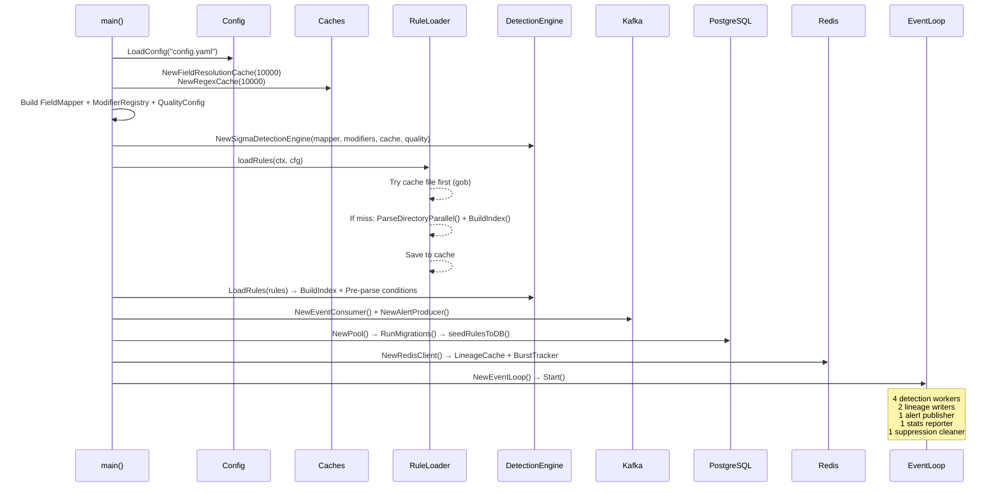
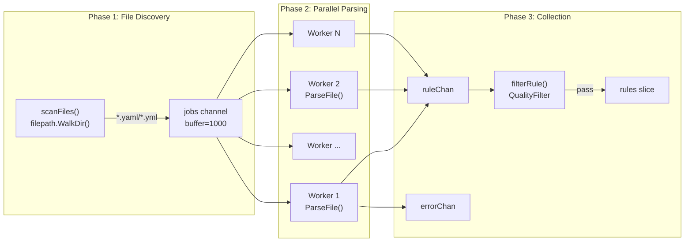
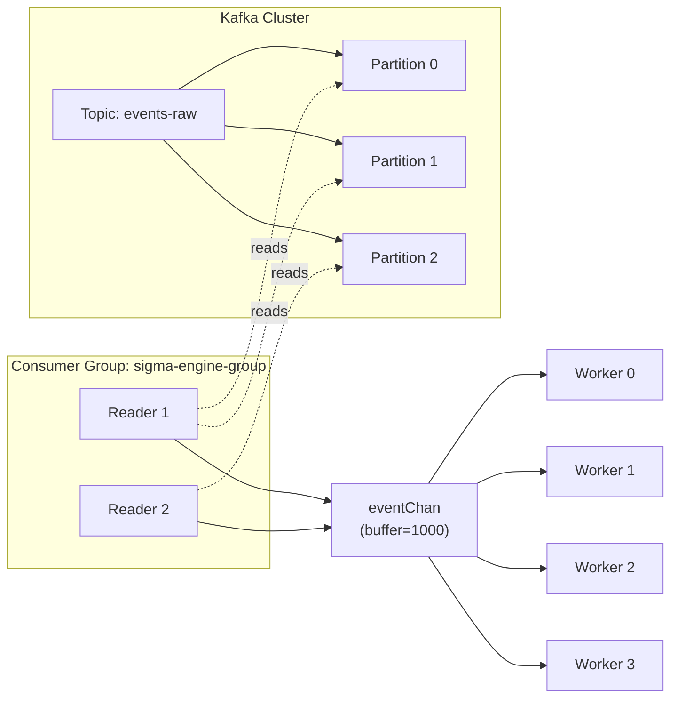

# الجزء الأول: الهندسة المعمارية + تحميل وفهرسة القواعد

---

## 1. الهندسة المعمارية (Architecture)

### 1.1 لماذا Hexagonal Architecture؟

**المشكلة:** محرك الكشف يتعامل مع مصادر بيانات متعددة (Kafka, ملفات, API) ومخرجات متعددة (Kafka, PostgreSQL, ملفات). إذا ربطنا المنطق بالبنية التحتية مباشرة، أي تغيير في Kafka مثلاً سيكسر كل شيء.

**الحل:** Hexagonal Architecture (المعروفة أيضاً بـ Ports & Adapters) تفصل بين:

```
┌─────────────────────────────────────────────────────────┐
│                    cmd/ (Entry Points)                    │
│         sigma-engine-kafka/main.go                       │
│         sigma-engine-live/main.go                        │
├─────────────────────────────────────────────────────────┤
│              internal/domain/ (النواة)                    │
│   SigmaRule, LogEvent, Alert, DetectionResult            │
│   ← لا تعتمد على أي شيء خارجي                          │
├─────────────────────────────────────────────────────────┤
│           internal/application/ (المنطق)                 │
│   detection/  → محرك الكشف                               │
│   mapping/    → ربط الحقول                                │
│   rules/      → تحميل وفهرسة القواعد                     │
│   alert/      → توليد التنبيهات                          │
│   scoring/    → حساب المخاطر                             │
│   ← تعتمد على domain فقط                                │
├─────────────────────────────────────────────────────────┤
│         internal/infrastructure/ (البنية التحتية)         │
│   kafka/      → Consumer + Producer                       │
│   database/   → PostgreSQL                                │
│   cache/      → Redis + LRU                               │
│   config/     → تحميل الإعدادات                          │
│   ← تعتمد على domain + application                      │
└─────────────────────────────────────────────────────────┘
```

**لماذا وليس Clean Architecture؟**

| المعيار | Hexagonal | Clean Architecture |
|---------|-----------|-------------------|
| عدد الطبقات | 3 (domain, application, infrastructure) | 4+ (entities, use cases, interface adapters, frameworks) |
| التعقيد | أبسط — مناسب لمحرك كشف | أكثر تعقيداً — مناسب لتطبيقات enterprise |
| الـ Ports | واضحة عبر interfaces في `pkg/ports/` | implicit في طبقة Interface Adapters |

**التبرير:** محركنا له دور واحد واضح (كشف التهديدات)، لذلك Hexagonal أبسط وأنسب. Clean Architecture ستضيف طبقات لا نحتاجها.

### 1.2 الطبقات بالتفصيل

**Domain Layer** — [internal/domain/](file:///d:/EDR_Platform/sigma_engine_go/internal/domain/)

هذه النواة التي لا تعتمد على أي مكتبة خارجية. تحتوي على:

| الملف | الدور | لماذا هنا؟ |
|-------|-------|-----------|
| [rule.go](file:///d:/EDR_Platform/sigma_engine_go/internal/domain/rule.go) | `SigmaRule`, `LogSource`, `Selection`, `SelectionField`, `Detection` | تمثيل القاعدة بغض النظر عن مصدرها |
| [event.go](file:///d:/EDR_Platform/sigma_engine_go/internal/domain/event.go) | `LogEvent` مع field cache و category inference | تمثيل الحدث بغض النظر عن مصدره |
| [alert.go](file:///d:/EDR_Platform/sigma_engine_go/internal/domain/alert.go) | `Alert` مع aggregation و risk scoring fields | تمثيل التنبيه |
| [detection_result.go](file:///d:/EDR_Platform/sigma_engine_go/internal/domain/detection_result.go) | `DetectionResult`, `EventMatchResult`, `RuleMatch` | نتائج المطابقة |
| [severity.go](file:///d:/EDR_Platform/sigma_engine_go/internal/domain/severity.go) | `Severity` enum (1=informational → 5=critical) | تصنيف الخطورة |
| [event_category.go](file:///d:/EDR_Platform/sigma_engine_go/internal/domain/event_category.go) | `EventCategory` + `EventIDToCategory` map | 34 فئة حدث + ربط Sysmon EventIDs |

**Application Layer** — [internal/application/](file:///d:/EDR_Platform/sigma_engine_go/internal/application/)

المنطق الذي لا يعرف شيء عن Kafka أو PostgreSQL:

| المجلد | الملفات | الدور |
|--------|---------|-------|
| `detection/` | `detection_engine.go`, `selection_evaluator.go`, `modifier.go` | المحرك الأساسي |
| `mapping/` | `field_mapper.go` | ربط 40+ حقل بين Sigma/ECS/Sysmon/Agent |
| `rules/` | `loader.go`, `parser.go`, `rule_indexer.go`, `condition_parser.go` | تحميل وفهرسة وتفسير القواعد |
| `alert/` | `alert_generator.go`, `deduplicator.go` | توليد التنبيهات |
| `scoring/` | risk scorer + burst tracker | حساب المخاطر |

**Infrastructure Layer** — [internal/infrastructure/](file:///d:/EDR_Platform/sigma_engine_go/internal/infrastructure/)

| المجلد | الدور | قابل للاستبدال؟ |
|--------|-------|----------------|
| `kafka/` | Consumer + Producer + EventLoop | نعم — يمكن استبداله بـ RabbitMQ |
| `database/` | PostgreSQL repositories + migrations | نعم — يمكن استبداله بـ MongoDB |
| `cache/` | Redis + LRU in-memory | نعم — يمكن استبداله بـ Memcached |

---

## 2. تسلسل الإقلاع (Startup Sequence)

> المرجع: [main.go](file:///d:/EDR_Platform/sigma_engine_go/cmd/sigma-engine-kafka/main.go)



**كل خطوة بالتفصيل:**

### الخطوة 1: تحميل الإعدادات (سطر 60)
```go
cfg, err := config.LoadConfig(*configPath)
```
يقرأ `config/config.yaml` ويدعم override من environment variables لـ Docker.

### الخطوة 2: تهيئة الكاش (سطر 88-96)
```go
fieldCache, _ := cache.NewFieldResolutionCache(cfg.Detection.CacheSize)  // 10,000 entries
regexCache, _ := cache.NewRegexCache(cfg.Detection.CacheSize)            // 10,000 patterns
```
**لماذا 10,000؟** كل حدث يحتاج ~5-10 field lookups. مع 1000 event/sec = 10,000 lookup/sec. الكاش يمنع إعادة الحساب.

### الخطوة 3: بناء المكونات (سطر 99-117)
```go
fieldMapper := mapping.NewFieldMapper(fieldCache)        // 40+ field mapping
modifierEngine := detection.NewModifierRegistry(regexCache) // 12 modifiers
quality := QualityConfig{MinConfidence: 0.6, ...}
detectionEngine := detection.NewSigmaDetectionEngine(fieldMapper, modifierEngine, fieldCache, quality)
```

### الخطوة 4: تحميل القواعد (سطر 121)
```go
ruleIndex, err := loadRules(ctx, cfg)
detectionEngine.LoadRules(ruleIndex.Rules)
```
هذه أهم خطوة — مشروحة بالتفصيل في القسم التالي.

---

## 3. تحميل القواعد بالتفصيل

### 3.1 المسح المتوازي للمجلدات

> المرجع: [parser.go سطر 159-217](file:///d:/EDR_Platform/sigma_engine_go/internal/application/rules/parser.go#L159-L217)



**لماذا parallel workers؟**

مجلد `sigma_rules/rules` يحتوي آلاف ملفات YAML (SigmaHQ = ~3000+ قاعدة). قراءة كل ملف + YAML parsing هي عملية I/O-bound. بدون توازي:
```
3000 file × ~2ms per file = 6 ثوان
مع 32 worker: 6000ms / 32 ≈ 190ms
```

**كم عدد العمال ولماذا؟**

```go
// parser.go سطر 62
maxWorkers := runtime.NumCPU() * 4  // I/O bound → أكثر من CPU count
if maxWorkers < 4  { maxWorkers = 4 }
if maxWorkers > 32 { maxWorkers = 32 }
```

**التبرير:** العملية I/O-bound (قراءة ملفات)، لذلك نستخدم `CPU × 4` وليس `CPU × 1`. الحد الأقصى 32 يمنع إنشاء goroutines كثيرة جداً تتنافس على filesystem locks.

### 3.2 تحليل ملف YAML خطوة بخطوة

> المرجع: [parser.go سطر 103-157](file:///d:/EDR_Platform/sigma_engine_go/internal/application/rules/parser.go#L103-L157)

**مثال حقيقي — ملف `proc_creation_win_susp_powershell_enc.yml`:**

```yaml
title: Suspicious PowerShell Encoded Command
id: ca2092a1-c273-4571-8800-4d2168035e5c
status: test
description: Detects suspicious encoded PowerShell command line
logsource:
    product: windows
    category: process_creation
detection:
    selection_img:
        Image|endswith:
            - '\powershell.exe'
            - '\pwsh.exe'
    selection_cli:
        CommandLine|contains|all:
            - '-nop'
            - '-w hidden'
            - '-enc'
    condition: selection_img and selection_cli
level: high
tags:
    - attack.execution
    - attack.t1059.001
```

**خطوات `ParseFile(path)`:**

```
الخطوة 1: فتح الملف بـ buffered I/O (64KB buffer)
  file, _ := os.Open(path)
  reader := bufio.NewReaderSize(file, 64*1024)

الخطوة 2: التحقق من الحجم (< 10MB)
  fileInfo.Size() > 10MB → error

الخطوة 3: YAML parsing → yamlRule struct
  yaml.NewDecoder(reader).Decode(&yamlRule)
  
  yamlRule = {
    Title: "Suspicious PowerShell Encoded Command"
    ID: "ca2092a1-c273-4571-8800-4d2168035e5c"
    Status: "test"
    LogSource: {Product: "windows", Category: "process_creation"}
    Detection: map[string]interface{}{
      "selection_img": {"Image|endswith": ["\powershell.exe", "\pwsh.exe"]},
      "selection_cli": {"CommandLine|contains|all": ["-nop", "-w hidden", "-enc"]},
      "condition": "selection_img and selection_cli"
    }
    Level: "high"
    Tags: ["attack.execution", "attack.t1059.001"]
  }

الخطوة 4: yamlRule.validate()
  - title ≥ 5 أحرف ✓
  - detection != nil ✓
  - "condition" key موجود ✓
  - level ∈ {informational,low,medium,high,critical} ✓
  - status ∈ {stable,test,experimental,deprecated,unsupported} ✓

الخطوة 5: yamlRule.toSigmaRule() → parseDetection()
  (مشروح بالتفصيل أدناه)

الخطوة 6: Product whitelist check
  product = "windows", whitelist = ["windows"] → ✓ pass

الخطوة 7: rule.Validate()
  - title ≠ "" ✓
  - condition ≠ "" ✓
  - selections > 0 ✓
  - logsource valid ✓
```

### 3.3 تحليل Detection Section بالتفصيل

> المرجع: [parser.go سطر 477-597](file:///d:/EDR_Platform/sigma_engine_go/internal/application/rules/parser.go#L477-L597)

**`parseDetection(detectionData)` يحول الـ map إلى `domain.Detection`:**

```
المدخل (من YAML):
{
  "selection_img": {"Image|endswith": ["\powershell.exe", "\pwsh.exe"]},
  "selection_cli": {"CommandLine|contains|all": ["-nop", "-w hidden", "-enc"]},
  "condition": "selection_img and selection_cli"
}

الخطوة 1: استخراج condition
  detection.Condition = "selection_img and selection_cli"

الخطوة 2: لكل مفتاح ≠ condition,timeframe → parseSelection()
```

**`parseSelection("selection_img", data)`:**

```
data = {"Image|endswith": ["\powershell.exe", "\pwsh.exe"]}
هذا map → field-based selection (وليس keyword)

لكل key:value في الـ map:
  parseSelectionField("Image|endswith", ["\powershell.exe", "\pwsh.exe"])
```

**`parseSelectionField("Image|endswith", values)` — أهم دالة:**

```go
// parser.go سطر 547-597
parts := strings.Split("Image|endswith", "|")
// parts = ["Image", "endswith"]

fieldName = "Image"
modifiers = ["endswith"]

valueList = ["\powershell.exe", "\pwsh.exe"]  // تم تحويلها من interface{}

field = SelectionField{
    FieldName: "Image",
    Values:    ["\powershell.exe", "\pwsh.exe"],
    Modifiers: ["endswith"],
    IsNegated: false,
}
```

**مثال أكثر تعقيداً — `"CommandLine|contains|all"`:**

```go
parts = ["CommandLine", "contains", "all"]
fieldName = "CommandLine"
modifiers = ["contains", "all"]

field = SelectionField{
    FieldName: "CommandLine",
    Values:    ["-nop", "-w hidden", "-enc"],
    Modifiers: ["contains", "all"],  // ← "all" يعني AND بين القيم
}
```

**لماذا pre-compile regex أثناء التحميل؟**

```go
// parser.go سطر 580-594
if hasRegexModifier {
    compiledRegex := make([]*regexp.Regexp, 0)
    for _, val := range valueList {
        re, err := regexp.Compile(patternStr)
        compiledRegex = append(compiledRegex, re)
    }
    field.CompiledRegex = compiledRegex
}
```

**التبرير:** `regexp.Compile()` عملية مكلفة (~microseconds). لو فعلناها أثناء المطابقة:
```
1000 event/sec × 100 regex rule × regexp.Compile = 100,000 compile/sec ← كارثة
```
بالـ pre-compile: `regexp.MatchString()` فقط = O(n) على طول النص.

### 3.4 QualityFilter — لماذا نرفض بعض القواعد؟

> المرجع: [loader.go سطر 118-170](file:///d:/EDR_Platform/sigma_engine_go/internal/application/rules/loader.go#L118-L170)

```
الإعدادات الافتراضية (من config.yaml):
  min_level: "medium"
  allowed_status: ["stable", "test"]
  skip_experimental: true
```

**خوارزمية `filterRule(rule)`:**

```
1. min_level check:
   levelRank(rule.Level) < levelRank("medium")
   
   الترتيب: informational=0, low=1, medium=2, high=3, critical=4
   
   → قاعدة بمستوى "low" → rank=1 < 2 → SKIP
   → قاعدة بمستوى "high" → rank=3 ≥ 2 → PASS

2. skip_experimental:
   rule.Status == "experimental" → SKIP
   
3. allowed_status:
   rule.Status ∈ ["stable", "test"] → PASS
   rule.Status = "deprecated" → SKIP
   
4. deprecated:
   → SKIP دائماً (حتى بدون allowed_status list)
```

**لماذا هذه القيم؟**

| القرار | السبب |
|--------|-------|
| `min_level: medium` | القواعد `informational` و `low` تولّد آلاف التنبيهات على أنشطة عادية. في بيئة إنتاج، فقط `medium+` تستحق التنبيه |
| `skip_experimental: true` | القواعد التجريبية في SigmaHQ لم تُختبر كفاية — نسبة false positive عالية |
| `allowed_status: [stable, test]` | `stable` = مُختبرة جيداً، `test` = قيد الاختبار لكن معقولة |

### 3.5 نظام كاش القواعد

> المرجع: [main.go سطر 362-387](file:///d:/EDR_Platform/sigma_engine_go/cmd/sigma-engine-kafka/main.go#L362-L387)

```go
// Try cache first
if cfg.Rules.CacheFile != "" {
    maxAge := time.Duration(cfg.Rules.CacheMaxAgeHours) * time.Hour  // 24h
    if cached, err := rulecache.LoadRulesFromCache(cacheFile, maxAge, ""); err == nil {
        // استخدم القواعد من الكاش
        indexer.BuildIndex(cached)
        return &RuleIndex{Rules: cached, Indexer: indexer}
    }
}
// Cache miss → تحميل من المجلد
ruleIndex, err := loader.LoadRules(ctx, cfg.Rules.RulesDirectory)
// Save to cache
rulecache.SaveRulesToCache(ruleIndex.Rules, cacheFile, "")
```

**لماذا؟** تحميل 2000+ قاعدة YAML = ~2-5 ثوان. بالكاش (gob serialization) = ~200ms.

**متى يُتجاوز الكاش؟** إذا عمره > 24 ساعة، أو الملف غير موجود، أو فشل القراءة.

---

## 4. فهرسة القواعد (Rule Indexing) — خوارزمية البحث O(1)

> المرجع: [rule_indexer.go](file:///d:/EDR_Platform/sigma_engine_go/internal/application/rules/rule_indexer.go)

### 4.1 بنية البيانات — HashMap ثلاثي الطبقات

```go
type RuleIndexer struct {
    index         map[string][]*SigmaRule   // exact: "windows:process_creation:sysmon"
    categoryIndex map[string][]*SigmaRule   // partial: "windows:process_creation"
    productIndex  map[string][]*SigmaRule   // broad: "windows"
    allRules      []*SigmaRule              // fallback
}
```

**مثال عملي — بناء الفهرس لـ 3 قواعد:**

```
قاعدة 1: LogSource{Product:"windows", Category:"process_creation", Service:nil}
  → index["windows:process_creation:*"] += rule1
  → categoryIndex["windows:process_creation"] += rule1
  → productIndex["windows"] += rule1

قاعدة 2: LogSource{Product:"windows", Category:"process_creation", Service:"sysmon"}
  → index["windows:process_creation:sysmon"] += rule2
  → categoryIndex["windows:process_creation"] += rule2
  → productIndex["windows"] += rule2

قاعدة 3: LogSource{Product:"windows", Category:"dns_query", Service:nil}
  → index["windows:dns_query:*"] += rule3
  → categoryIndex["windows:dns_query"] += rule3
  → productIndex["windows"] += rule3
```

### 4.2 خوارزمية البحث `GetRules()`

```go
// rule_indexer.go سطر 107-136
func (ri *RuleIndexer) GetRules(product, category, service string) []*SigmaRule {
    // محاولة 1: exact match — O(1) HashMap lookup
    key := fmt.Sprintf("%s:%s:%s", product, category, service)
    if rules, ok := ri.index[key]; ok {
        return rules  // ← الأسرع
    }

    // محاولة 2: category match — O(1)
    catKey := fmt.Sprintf("%s:%s", product, category)
    if rules, ok := ri.categoryIndex[catKey]; ok {
        return rules
    }

    // محاولة 3: product match — O(1)
    if rules, ok := ri.productIndex[product]; ok {
        return rules
    }

    // محاولة 4: fallback — كل القواعد
    return ri.allRules
}
```

**مثال: حدث process_creation من Windows:**
```
GetRules("windows", "process_creation", "")
  → index["windows:process_creation:"] → miss
  → categoryIndex["windows:process_creation"] → HIT! → 150 قاعدة
  (بدل 2000+ قاعدة)
```

### 4.3 لماذا ثلاث طبقات وليس واحدة؟

| السيناريو | طبقة واحدة | ثلاث طبقات |
|-----------|-----------|------------|
| قاعدة تحدد product+category+service | ✅ exact match | ✅ exact match |
| قاعدة تحدد product+category (الغالبية) | ❌ miss → fallback لكل القواعد | ✅ categoryIndex match |
| قاعدة تحدد product فقط | ❌ miss → fallback | ✅ productIndex match |

**بدون الطبقات،** كل حدث DNS مثلاً سيُقيَّم مقابل كل قواعد process_creation → هدر 95% من الوقت.

### 4.4 حساب الأداء

```
بدون فهرسة (Brute Force):
  2000 قاعدة × 1000 event/sec = 2,000,000 rule evaluation/sec
  كل evaluation = ~50μs → 100 ثانية CPU/sec ← مستحيل

مع فهرسة:
  150 قاعدة مرشحة (process_creation) × 1000 event/sec = 150,000 eval/sec
  150,000 × 50μs = 7.5 ثانية CPU/sec ← ممكن مع 4 workers

  تحسين = 2000/150 = 13.3x أسرع
```

---

## 5. استهلاك الأحداث من Kafka

### 5.1 لماذا Kafka وليس بديل آخر؟

| المعيار | Kafka | RabbitMQ | Redis Streams |
|---------|-------|----------|---------------|
| الثبات (Durability) | ✅ يحفظ على القرص | ✅ بتفعيل persistence | ⚠️ in-memory أولاً |
| الإنتاجية | 100K+ msg/sec | 10-50K msg/sec | 50-100K msg/sec |
| Replay | ✅ يمكن إعادة القراءة | ❌ بعد الـ ack يضيع | ⚠️ محدود |
| Consumer Groups | ✅ native | ✅ مع إعداد | ✅ native |
| النضج في SOC/SIEM | ✅ المعيار الصناعي | ❌ | ❌ |

**التبرير الأهم:** Kafka هو **المعيار الصناعي** في أنظمة SIEM/EDR (Splunk, Elastic Security, CrowdStrike كلهم يستخدمون Kafka). كما يدعم **replay** — إذا المحرك توقف، يمكنه إعادة معالجة الأحداث الفائتة.

### 5.2 Consumer Group و Partition



**Consumer Group** يضمن أن كل رسالة تُقرأ **مرة واحدة فقط** بواسطة عضو واحد في المجموعة. Kafka يوزع الـ partitions بين الـ readers تلقائياً.

### 5.3 لماذا 2 readers و 4 workers؟

```
2 Kafka Readers: I/O bound (waiting for network from Kafka)
  → يقرأون الرسائل ويضعونها في eventChan

4 Detection Workers: CPU bound (rule matching)
  → يسحبون من eventChan ويطابقون مع القواعد

العلاقة: Readers تملأ الـ buffer, Workers تفرّغه
  → 2 readers كافية لإشباع 4 workers بالعمل
  → لو 1 reader: العمال يجلسون idle بانتظار الأحداث
  → لو 8 readers: eventChan ممتلئ والقراءة مهدورة
```

### 5.4 تحويل رسالة Kafka إلى LogEvent

> المرجع: [consumer.go سطر 214-231](file:///d:/EDR_Platform/sigma_engine_go/internal/infrastructure/kafka/consumer.go#L214-L231)

```go
func (c *EventConsumer) parseMessage(msg kafka.Message) (*domain.LogEvent, error) {
    // 1. JSON → map
    var rawData map[string]interface{}
    json.Unmarshal(msg.Value, &rawData)

    // 2. إضافة metadata
    rawData["_kafka_partition"] = msg.Partition
    rawData["_kafka_offset"] = msg.Offset
    rawData["_kafka_topic"] = msg.Topic

    // 3. إنشاء LogEvent (يستنتج category + product + timestamp)
    return domain.NewLogEvent(rawData)
}
```

### 5.5 آلية Backpressure (500ms timeout)

```go
// consumer.go سطر 201-209
select {
case c.eventChan <- event:                    // حاول الإرسال
case <-time.After(500 * time.Millisecond):    // إذا eventChan ممتلئ لـ 500ms
    logger.Warn("Event channel full, dropping message")  // ← أسقط الرسالة
case <-ctx.Done():
    return
}
```

**لماذا 500ms وليس 5s؟**

في النسخة القديمة كان 5s. المشكلة: إذا الـ workers بطيئة، كل رسالة مُسقطة تأخذ 5s، مما يُراكم consumer lag بشكل لا يمكن التعافي منه. 500ms يسمح بإسقاط سريع والانتقال للرسالة التالية — **S8 FIX** كما مذكور في الكود.

---

## 6. تطبيع الأحداث (Event Normalization)

### 6.1 `NewLogEvent(rawData)` خطوة بخطوة

> المرجع: [event.go سطر 32-51](file:///d:/EDR_Platform/sigma_engine_go/internal/domain/event.go#L32-L51)

```go
event := &LogEvent{
    RawData:    rawData,
    Category:   EventCategoryUnknown,
    Product:    "windows",           // ← default
    Timestamp:  time.Now(),
    fieldCache: make(map[string]interface{}),
}
event.EventID  = event.extractEventID()    // الخطوة 1
event.Category = event.inferCategory()      // الخطوة 2
event.Product  = event.extractProduct()     // الخطوة 3
event.Timestamp = event.extractTimestamp()  // الخطوة 4
```

### 6.2 استنتاج EventCategory — الأولوية بالترتيب

> المرجع: [event.go سطر 257-358](file:///d:/EDR_Platform/sigma_engine_go/internal/domain/event.go#L257-L358)

```
الأولوية 1: حقل event_type من الـ Agent (الأكثر دقة)
  event_type = "process"  → process_creation
  event_type = "network"  → network_connection
  event_type = "file"     → file_event
  event_type = "registry" → registry_event
  event_type = "dns"      → dns_query
  ... (12 نوع)

الأولوية 2: EventID (Sysmon/Windows)
  EventID = 1  → process_creation (Sysmon Process Create)
  EventID = 3  → network_connection (Sysmon Network)
  EventID = 11 → file_event (Sysmon FileCreate)
  EventID = 22 → dns_query (Sysmon DNSQuery)
  EventID = 4688 → process_creation (Windows Security)
  ... (30+ mapping)

الأولوية 3: event.action string parsing
  contains "exec"/"create"/"start" → process_creation
  contains "connect"/"network"     → network_connection

الأولوية 4: event.category string parsing
  contains "process" → process_creation

الأولوية 5: وجود حقول مميزة (heuristic)
  Image + CommandLine → process_creation
  DestinationIp      → network_connection
  TargetFilename     → file_event
  TargetObject       → registry_event

الأولوية 6: fallback → "unknown"
```

**لماذا هذا الترتيب؟** Agent الخاص بنا يرسل `event_type` دائماً → الأكثر موثوقية. EventID ثانياً لأنه معياري. الـ heuristics أخيراً لأنها تخمينية.

### 6.3 Field Cache مع Double-Check Locking

> المرجع: [event.go سطر 56-94](file:///d:/EDR_Platform/sigma_engine_go/internal/domain/event.go#L56-L94)

```go
func (e *LogEvent) GetField(fieldPath string) (interface{}, bool) {
    // Read lock أولاً (fast path)
    e.cacheMu.RLock()
    if cached, ok := e.fieldCache[fieldPath]; ok {
        e.cacheMu.RUnlock()
        return cached, true        // ← 90% من الحالات تنتهي هنا
    }
    e.cacheMu.RUnlock()

    // Write lock فقط عند الحاجة (slow path)
    e.cacheMu.Lock()
    defer e.cacheMu.Unlock()

    // Double-check بعد الحصول على write lock
    if cached, ok := e.fieldCache[fieldPath]; ok {
        return cached, true        // ← goroutine آخر ملأها أثناء انتظارنا
    }

    // البحث الفعلي...
    if val, ok := e.RawData[fieldPath]; ok && val != nil {
        e.fieldCache[fieldPath] = val
        return val, true
    }
    // ... fallback إلى data sub-map, nested path, etc.
}
```

**لماذا Double-Check Locking وليس mutex عادي؟**

| النمط | أداء القراءة | أداء الكتابة |
|-------|-------------|-------------|
| `sync.Mutex` فقط | بطيء — كل قراءة تحجز lock حصري | عادي |
| `sync.RWMutex` + double-check | سريع — قراءات متوازية بـ RLock | أبطأ قليلاً عند أول كتابة |

بما أن الحقل يُقرأ عشرات المرات بعد أول وصول، RWMutex يوفر concurrency أفضل بكثير.
