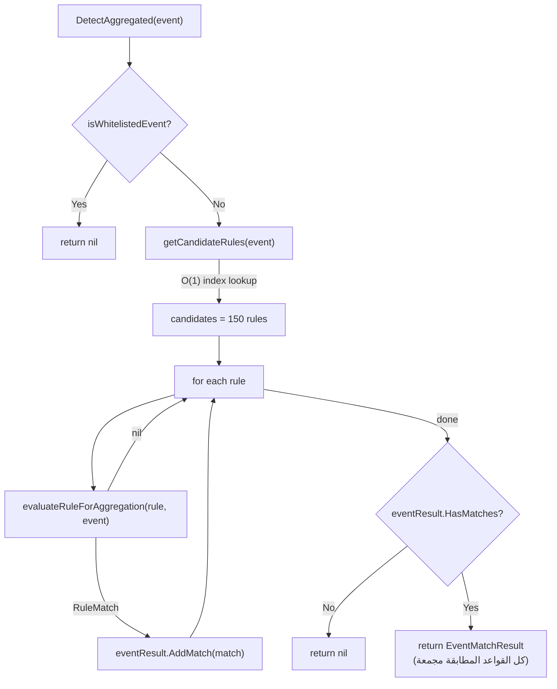

# الجزء الثاني: Field Mapping + المطابقة + Condition Parser + Modifiers

---

## 7. خوارزمية Field Mapping — أهم مكون في المحرك

> المرجع: [field_mapper.go](file:///d:/EDR_Platform/sigma_engine_go/internal/application/mapping/field_mapper.go)

### 7.1 المشكلة الجوهرية

قواعد Sigma تكتب: `Image|endswith: '\powershell.exe'`

لكن الحدث الفعلي من Agent يأتي بهذا الشكل:
```json
{"data": {"executable": "C:\\Windows\\...\\powershell.exe"}}
```

لا يوجد حقل `Image`! يجب تحويل أسماء الحقول بين **4 أنظمة تسمية مختلفة:**

| النظام | مثال لاسم العملية | من يستخدمه |
|--------|-------------------|-----------|
| Sigma/Sysmon | `Image` | قواعد Sigma الرسمية |
| ECS (Elastic) | `process.name` أو `process.executable` | ElasticSearch |
| Agent (data.*) | `data.executable` أو `data.name` | الـ Agent الخاص بنا |
| Sysmon JSON | `Event.EventData.Image` | Sysmon raw output |

### 7.2 بنية FieldMapper

```go
type FieldMapper struct {
    ecsToSigma           map[string]*FieldMapping      // "process.name" → Sigma
    sigmaToECS           map[string]*FieldMapping      // "Image" → ECS
    alternatives         map[string]*FieldMapping      // "TargetImage" → primary
    sigmaToAgentData     map[string]string             // "Image" → "data.executable"
    sigmaToAgentFallback map[string][]string           // "Image" → ["data.executable","data.name"]
    fieldCache           *cache.FieldResolutionCache
}
```

**`initializeMappings()` تسجّل 40+ حقل:**

```go
// field_mapper.go سطر 60-118 — أمثلة:
{"Image",     "process.name",    ["process.executable","TargetImage","SourceImage","NewProcessName"], String, false}
{"CommandLine","process.command_line", ["process.args","ProcessCommandLine","Command"], String, false}
{"User",      "user.name",       ["UserName","SubjectUserName","AccountName"], String, false}
{"DestinationIp","destination.ip",["DestinationHostname"], String, false}
{"TargetObject","registry.path", ["registry.key","ObjectName","RegistryKey"], String, true}
{"EventID",   "event.code",      ["event_id","EventCode","winlog.event_id"], Int, false}
```

### 7.3 `ResolveField()` — 7 مراحل بالترتيب (مع مثال حقيقي)

**سيناريو:** القاعدة تبحث عن `Image`, والحدث هو:
```json
{
  "agent_id": "abc123",
  "event_type": "process",
  "data": {
    "executable": "C:\\Windows\\System32\\WindowsPowerShell\\v1.0\\powershell.exe",
    "name": "powershell.exe",
    "command_line": "powershell.exe -enc ..."
  }
}
```

```
المرحلة 1 — Direct Access (سطر 305):
  eventData["Image"] → nil ❌ (الحقل غير موجود بهذا الاسم)

المرحلة 2 — Nested Access (سطر 310):
  getNested(eventData, "Image") → nil ❌ ("Image" لا يحتوي نقطة)

المرحلة 3 — Sigma→ECS mapping (سطر 315):
  SigmaToECS("Image") → "process.name"
  getNested(eventData, "process.name") → nil ❌ (لا يوجد process.name في الحدث)

المرحلة 4 — Alternative Fields (سطر 322):
  mapping.Alternatives = ["process.executable", "TargetImage", "SourceImage"]
  eventData["process.executable"] → nil ❌
  getNested("process.executable") → nil ❌
  eventData["TargetImage"] → nil ❌
  ... كلها nil ❌

المرحلة 5 — Agent data.* (سطر 336):
  sigmaToAgentData["Image"] → "data.executable"
  getNested(eventData, "data.executable") →
    eventData["data"]["executable"] → "C:\...\powershell.exe" ✅ وجدناه!
  return "C:\...\powershell.exe"
```

**لو لم يوجد `data.executable` (مثلاً في snapshot mode):**

```
المرحلة 5b — Fallback Chain (سطر 348):
  sigmaToAgentFallback["Image"] = ["data.executable", "data.name"]
  "data.executable" → nil ❌
  "data.name" → "powershell.exe" ✅ وجدناه!
```

**لو لم يوجد شيء في data.*:**

```
المرحلة 6 — Sysmon Paths (سطر 371):
  "Event.EventData.Image" → nil ❌
  "EventData.Image" → nil ❌

المرحلة 7 — Broad Variant Search (سطر 383):
  getAllFieldVariants("Image") →
    ["Image", "process.name", "process.executable", "TargetImage", "SourceImage", "NewProcessName"]
  لكل variant: try direct + nested → nil ❌

النتيجة النهائية: nil (الحقل غير موجود في الحدث)
```

### 7.4 لماذا لا نكاش القيم في ResolveField؟

```go
// field_mapper.go سطر 288-294 — التعليق الحرج:
// IMPORTANT (production correctness):
// Do NOT cache resolved *values* here. This method is called per-event,
// and caching by field name alone would mix values across different events,
// causing catastrophic false positives / false negatives.
```

**الخطأ الكارثي:** لو كاشنا `"Image" → "powershell.exe"`, فالحدث التالي (مثلاً `cmd.exe`) سيُعطى نفس القيمة = **false positive كارثي**.

الكاش الصحيح يكون **في `SelectionEvaluator`** حيث المفتاح يتضمن `event.ComputeHash()` + `fieldName`.

### 7.5 `getNested()` — قراءة الحقول المتداخلة

```go
// field_mapper.go سطر 442-471
func getNested(data map[string]interface{}, path string) interface{} {
    parts := strings.Split(path, ".")    // "data.executable" → ["data","executable"]
    current := data
    for _, part := range parts {
        if m, ok := current.(map[string]interface{}); ok {
            if val, exists := m[part]; exists {
                current = val    // تقدّم للمستوى التالي
            } else {
                // Case-insensitive fallback
                for key, val := range m {
                    if strings.EqualFold(key, part) {
                        current = val
                        goto next
                    }
                }
                return nil
            }
        }
    }
    return current
}
```

### 7.6 `unescapeString` — لماذا؟

```go
unescapeString := func(v interface{}) interface{} {
    if s, ok := v.(string); ok && strings.Contains(s, "\\\\") {
        return strings.ReplaceAll(s, "\\\\", "\\")
    }
    return v
}
```

**السبب:** JSON serialization يحوّل `\` إلى `\\`. قاعدة Sigma تكتب `\powershell.exe` لكن القيمة المخزنة قد تكون `\\powershell.exe`. بدون unescape، المطابقة ستفشل.

---

## 8. خوارزمية المطابقة (Core Matching)

### 8.1 `DetectAggregated(event)` — التدفق الرئيسي

> المرجع: [detection_engine.go](file:///d:/EDR_Platform/sigma_engine_go/internal/application/detection/detection_engine.go)



### 8.2 `isWhitelistedEvent()` — 4 أنماط مطابقة

```go
func matchPattern(value, pattern string) bool {
    if strings.HasPrefix(pattern, "*") && strings.HasSuffix(pattern, "*") {
        return strings.Contains(lower(value), lower(pattern[1:len-1]))  // contains
    }
    if strings.HasPrefix(pattern, "*") {
        return strings.HasSuffix(lower(value), lower(pattern[1:]))      // suffix
    }
    if strings.HasSuffix(pattern, "*") {
        return strings.HasPrefix(lower(value), lower(pattern[:len-1]))  // prefix
    }
    return strings.EqualFold(value, pattern)                            // exact
}
```

**Config المُستخدم:**
```yaml
whitelisted_processes:
  - 'C:\Windows\System32\svchost.exe'      # exact
  - 'C:\Program Files\Microsoft*'           # prefix
  - '*\vscode.exe'                          # suffix
  - '*\Code.exe'                            # suffix
```

**لماذا أزلنا whitelist لـ User و ParentProcess؟ (RC-2 FIX)**

```yaml
# قبل RC-2:
whitelisted_users: ['NT AUTHORITY\SYSTEM']
whitelisted_parent_processes: ['C:\Windows\explorer.exe']

# بعد RC-2:
whitelisted_users: []
whitelisted_parent_processes: []
```

**السبب:** `NT AUTHORITY\SYSTEM` يمثل 80%+ من الأحداث في Windows. كان يُسقط كل الأحداث قبل أن تصل للقواعد — **blind spot كارثي**. و `explorer.exe` هو parent شرعي لكنه أيضاً parent لأدوات المهاجمين (المستخدم يفتح malware من Desktop).

### 8.3 `evaluateRuleForAggregation()` — 5 خطوات بالتفصيل

```
═══════════════════════════════════════════════
الخطوة 1: تقييم كل Selection
═══════════════════════════════════════════════

لكل selection في rule.Detection.Selections:
  result = selectionEvaluator.Evaluate(selection, event)
  selectionResults[selection.Name] = result

  إذا result == true و الاسم لا يبدأ بـ "filter":
    → سجّل الحقول المطابقة في matchedFields

مثال:
  selectionResults = {
    "selection_img": true,     ← Image طابق
    "selection_cli": true,     ← CommandLine طابق
  }
  matchedFields = {"Image": "...\powershell.exe", "CommandLine": "... -enc ..."}

═══════════════════════════════════════════════
الخطوة 2: تقييم Condition
═══════════════════════════════════════════════

condition = "selection_img and selection_cli"
AST = Parse(condition) → AndNode(SelectionNode("selection_img"), SelectionNode("selection_cli"))
AST.Evaluate(selectionResults) → true AND true = true ✓

═══════════════════════════════════════════════
الخطوة 3: فحص Filter Selections (إضافي)
═══════════════════════════════════════════════

إذا quality.EnableFilters == true:
  لكل selection اسمها يبدأ بـ "filter":
    إذا selectionResults["filter_xxx"] == true:
      → ارجع nil  (الحدث مُستبعد كـ false positive)

هذا يعمل حتى لو condition لم يذكر "and not filter" صراحة!

═══════════════════════════════════════════════
الخطوة 4: حساب الثقة (Confidence)
═══════════════════════════════════════════════

confidence = calculateConfidence(rule, event, matchedFields)
إذا confidence < MinConfidence (0.6):
  → ارجع nil (ثقة منخفضة)

═══════════════════════════════════════════════
الخطوة 5: إنشاء RuleMatch
═══════════════════════════════════════════════

return &RuleMatch{
    Rule:              rule,
    Confidence:        confidence,
    MatchedFields:     matchedFields,
    MatchedSelections: ["selection_img", "selection_cli"],
    MITRETechniques:   extractTechniques(rule.Tags),
}
```

### 8.4 `evaluateSelection()` — AND بين الحقول مع Early Exit

```go
// لكل حقل في selection → AND logic
for _, field := range selection.Fields {
    if !evaluateField(field, event) {
        return false    // ← EARLY EXIT — لا حاجة لفحص باقي الحقول
    }
}
return true
```

**لماذا Early Exit مهم؟** إذا Selection تحتوي 5 حقول والأول لم يطابق، لا حاجة لفحص الباقي. يوفر ~80% من العمل الحسابي.

### 8.5 `EvaluateField()` — OR بين القيم والأهمية الحاسمة لـ `all`

```
بدون modifier "all" (الافتراضي — OR logic):
  CommandLine|contains:
    - '-nop'
    - '-enc'
  → يكفي أن يحتوي CommandLine على '-nop' أو '-enc' (أي واحدة)

مع modifier "all" (AND logic):
  CommandLine|contains|all:
    - '-nop'
    - '-w hidden'
    - '-enc'
  → يجب أن يحتوي CommandLine على الثلاثة معاً
```

```go
// detection_engine.go — المنطق:
if hasAllModifier(field.Modifiers) {
    // AND: كل القيم يجب أن تطابق
    for _, value := range field.Values {
        if !applyModifiers(fieldValue, value, field.Modifiers) {
            return false
        }
    }
    return true
} else {
    // OR: أي قيمة تكفي
    for _, value := range field.Values {
        if applyModifiers(fieldValue, value, field.Modifiers) {
            return true  // ← وجدنا تطابق!
        }
    }
    return false
}
```

---

## 9. Condition Parser — بناء شجرة التعبيرات

> المرجع: [condition_parser.go](file:///d:/EDR_Platform/sigma_engine_go/internal/application/rules/condition_parser.go)

### 9.1 لماذا Recursive Descent Parser؟

| الخيار | المزايا | العيوب |
|--------|---------|--------|
| **Recursive Descent** ✅ | بسيط، سهل التنقيح، thread-safe بالتصميم | لا يدعم left-recursion مباشرة |
| Parser Generator (yacc) | قواعد نحوية مُثبتة | تبعيات خارجية، أصعب في التنقيح |
| Pratt Parser | يدعم operator precedence تلقائياً | أكثر تعقيداً للتنفيذ |

**التبرير:** شروط Sigma بسيطة (AND, OR, NOT, parentheses, pattern matching). Recursive Descent مثالي لهذا المستوى من التعقيد.

### 9.2 Tokenizer — التحليل اللغوي

```go
// 12 نوع token:
TokenEOF        // نهاية المدخل
TokenIdentifier // selection_img, filter_admin
TokenAnd        // and, AND
TokenOr         // or, OR
TokenNot        // not, NOT
TokenLParen     // (
TokenRParen     // )
TokenNumber     // 1, 2, 3 (في "1 of ...")
TokenOf         // of
TokenThem       // them
TokenAll        // all
TokenAny        // any
```

### 9.3 مثال كامل: من النص إلى التقييم

**Condition:** `(selection_img and selection_cli) or selection_encoded and not filter_admin`

**الخطوة 1 — Tokenization:**
```
[(, selection_img, and, selection_cli, ), or, selection_encoded, and, not, filter_admin, EOF]
```

**الخطوة 2 — Parsing (AST Construction):**
```
القواعد النحوية:
  Expression → Term { OR Term }
  Term       → Factor { AND Factor }
  Factor     → NOT Factor | ( Expression ) | Pattern | Identifier

Precedence: NOT > AND > OR
```

```
OrNode
├─ Left: AndNode
│         ├─ Left:  SelectionNode("selection_img")
│         └─ Right: SelectionNode("selection_cli")
└─ Right: AndNode
          ├─ Left:  SelectionNode("selection_encoded")
          └─ Right: NotNode
                    └─ Child: SelectionNode("filter_admin")
```

**الخطوة 3 — Evaluation:**
```
Input: {selection_img: true, selection_cli: true, selection_encoded: false, filter_admin: false}

OrNode:
  Left: AndNode(true, true) = true
  Right: AndNode(false, NOT(false)) = AndNode(false, true) = false
  
  true OR false = true ✓ → القاعدة طابقت
```

### 9.4 PatternNode — `"1 of selection_*"` و `"all of them"`

```go
// condition_parser.go سطر 236-292
type PatternNode struct {
    Pattern  string    // "selection_*" أو "*" (لـ them)
    Operator string    // "1 of", "all of", "any of"
    Count    int       // 1, 2, 3, ...
}

func (n *PatternNode) Evaluate(selections map[string]bool) bool {
    // 1. تحويل glob إلى regex
    regex = "^" + strings.ReplaceAll(pattern, "*", ".*") + "$"
    
    // 2. إيجاد كل selections المطابقة للنمط
    matchingKeys = []  // مثلاً: ["selection_img","selection_cli","selection_encoded"]
    for key := range selections {
        if regex.MatchString(key) { matchingKeys = append(matchingKeys, key) }
    }
    
    // 3. عدّ المطابقات
    matched = count of matchingKeys where selections[key] == true

    // 4. تقييم الشرط
    switch operator:
      "1 of" / "any of": return matched >= count
      "all of":          return matched == len(matchingKeys)
}
```

**مثال:** `"all of selection_*"` مع selections = {selection_img: true, selection_cli: true, filter: false}
- Pattern `"selection_*"` يطابق: [selection_img, selection_cli] (2 عنصر)
- matched = 2 (كلاهما true)
- `all of`: matched(2) == len(2) → **true**

### 9.5 Thread Safety

```go
type ConditionParser struct {
    // لا يوجد mutable state!
}

func (p *ConditionParser) Parse(condition string, selectionNames []string) (Node, error) {
    // كل parsing state محلي في هذا الـ method call
    state := &parserState{
        tokenizer:      NewTokenizer(condition),    // محلي
        selectionNames: map[string]bool{...},       // محلي
    }
    // ...
}
```

**التبرير:** كل `Parse()` ينشئ `parserState` جديد مع tokenizer جديد. يمكن لـ 4 workers استدعاء `Parse()` بالتوازي بأمان تام بدون أي lock لأنه لا يوجد shared mutable state.

---

## 10. نظام المعدّلات (Modifier System)

> المرجع: [modifier.go](file:///d:/EDR_Platform/sigma_engine_go/internal/application/detection/modifier.go)

### 10.1 جدول المعدّلات الكامل

| المعدّل | الخوارزمية | سيناريو أمني | مثال القاعدة |
|---------|-----------|-------------|-------------|
| `contains` | `strings.Contains(lower(field), lower(pattern))` | كشف أوامر مشبوهة في سطر الأوامر | `CommandLine\|contains: 'mimikatz'` |
| `startswith` | `strings.HasPrefix(lower(field), lower(pattern))` | كشف ملفات من مسارات مشبوهة | `Image\|startswith: 'C:\Users\Public'` |
| `endswith` | `strings.HasSuffix(lower(field), lower(pattern))` | كشف أنواع ملفات تنفيذية | `Image\|endswith: '\powershell.exe'` |
| `regex`/`re` | `regexp.MatchString(pattern, field)` | أنماط معقدة | `CommandLine\|re: '(?i)invoke-(web\|rest)request'` |
| `all` | AND logic بين كل القيم | كشف تركيبة أوامر | `CommandLine\|contains\|all: ['-nop','-enc']` |
| `base64` | `base64.StdEncoding.DecodeString()` ثم مقارنة | كشف أوامر مشفرة بـ base64 | `CommandLine\|base64: 'IEX'` |
| `base64offset` | فحص 3 offsets (0,1,2) لـ base64 alignment | نفس الأعلى مع alignment مختلف | — |
| `windash` | استبدال `-` بـ `/` والعكس | كشف تهرب عبر تغيير delimiter | `CommandLine\|windash\|contains: '-exec bypass'` → يطابق `/exec bypass` أيضاً |
| `cidr` | `net.ParseCIDR()` + `network.Contains(ip)` | كشف اتصالات لشبكات مشبوهة | `DestinationIp\|cidr: '10.0.0.0/8'` |
| `lt` | `fieldValue < pattern` (numerically) | قيم رقمية أقل من | `ProcessId\|lt: 100` |
| `lte` | `fieldValue <= pattern` | — | — |
| `gt` | `fieldValue > pattern` | منافذ عالية | `DestinationPort\|gt: 49152` |
| `gte` | `fieldValue >= pattern` | — | — |

### 10.2 `ApplyModifier` مع `all` — مثال مفصّل

```
القاعدة:
  CommandLine|contains|all:
    - '-nop'
    - '-w hidden'
    - '-enc'

الحدث:
  CommandLine = "powershell.exe -nop -w hidden -enc SQBFAFgA..."

المنطق:
  hasAll = true
  
  for values: ["-nop", "-w hidden", "-enc"]:
    contains("powershell.exe -nop -w hidden -enc ...", "-nop")     → true ✓
    contains("powershell.exe -nop -w hidden -enc ...", "-w hidden") → true ✓
    contains("powershell.exe -nop -w hidden -enc ...", "-enc")     → true ✓
  
  all matched → return true ✓

بدون "all" (OR logic):
  contains(cmdline, "-nop") → true → return true فوراً
  (لا يفحص الباقي — أقل دقة)
```

### 10.3 RegexCache — لماذا؟

```go
type RegexCache struct {
    cache map[string]*regexp.Regexp
    mu    sync.RWMutex
    maxSize int
}

func (rc *RegexCache) GetOrCompile(pattern string) (*regexp.Regexp, error) {
    // Read lock أولاً
    rc.mu.RLock()
    if re, ok := rc.cache[pattern]; ok {
        rc.mu.RUnlock()
        return re, nil    // ← cache hit: O(1)
    }
    rc.mu.RUnlock()

    // Compile + cache
    re, err := regexp.Compile(pattern)
    rc.mu.Lock()
    rc.cache[pattern] = re
    rc.mu.Unlock()
    return re, err
}
```

**لماذا؟** `regexp.Compile()` = ~10-100μs. مع 1000 event/sec و 20 regex rule = 20,000 compile/sec = 2 ثانية CPU/sec مهدورة. بالكاش: مرة واحدة فقط لكل pattern.

> [!IMPORTANT]
> الفرق بين RegexCache (في modifier.go) و CompiledRegex (في parser.go): 
> - **CompiledRegex** يُجمع عند **تحميل القاعدة** (مرة واحدة). هذا هو الأداء الأعلى.
> - **RegexCache** يُستخدم كـ fallback عندما لا يوجد compiled regex (مثلاً regex مُولَّد ديناميكياً).
