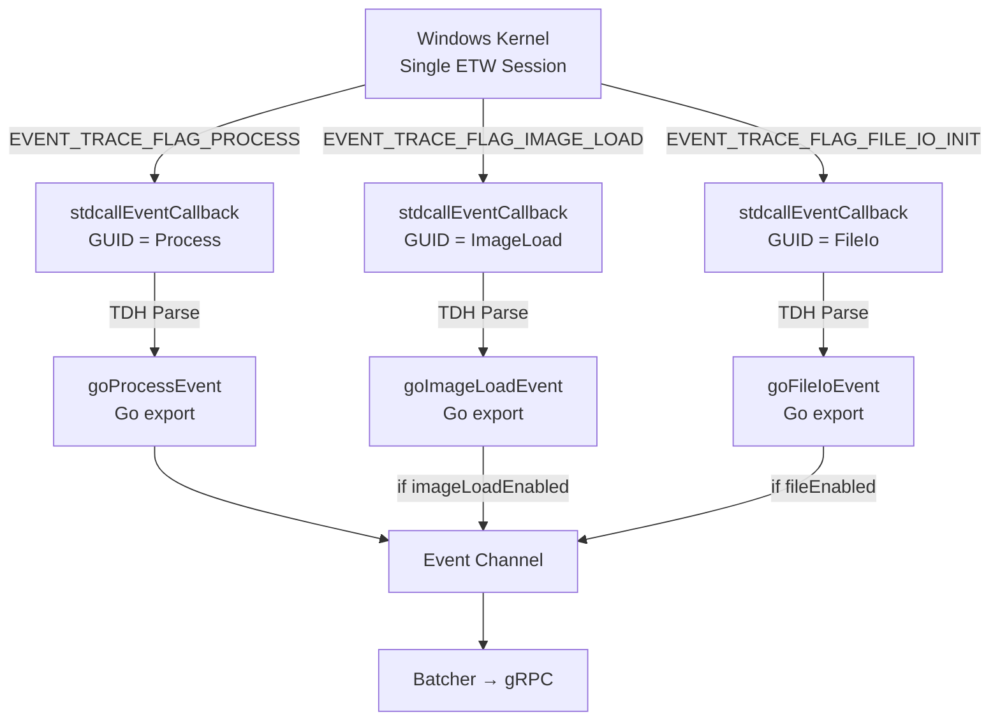

# Phase 2 (Revised): ETW Kernel Trace Refactoring — Walkthrough

## Architectural Change

Replaced the flawed polling-based File (ReadDirectoryChangesW) and DLL (Toolhelp32) collectors with **real-time kernel ETW tracing** — the same mechanism used for process events. All three event types now share a **single kernel session** with combined flags.

### Before vs After

| Aspect | Before (Flawed) | After (Correct) |
|--------|------------------|------------------|
| **File I/O** | `ReadDirectoryChangesW` — no PID | ETW `FILE_IO_INIT` — kernel delivers PID |
| **DLL Loads** | Toolhelp32 polling (5s) | ETW `IMAGE_LOAD` — instant, zero latency |
| **Detection window** | 5s polling gap (DLL unload escapes) | Real-time kernel callback (zero gap) |
| **PID attribution** | None (file) / Indirect (DLL) | Exact PID from `EventHeader.ProcessId` |
| **CPU overhead** | High (module walk of every process) | Near-zero (kernel pushes events) |
| **Architecture** | 3 separate collectors | 1 ETW session, 3 event types |

## Files Modified

### C Layer (Kernel ETW)

| File | Change |
|------|--------|
| [etw_cgo.h](file:///d:/EDR_Platform/win_edrAgent/internal/collectors/etw_cgo.h) | Added `ParsedImageLoadEvent` + `ParsedFileIoEvent` structs and flag defines |
| [etw_cgo.c](file:///d:/EDR_Platform/win_edrAgent/internal/collectors/etw_cgo.c) | Added 3 provider GUIDs, GUID-based callback routing, [parseImageLoadEvent](file:///d:/EDR_Platform/win_edrAgent/internal/collectors/etw_cgo.c#118-155)/[parseFileIoEvent](file:///d:/EDR_Platform/win_edrAgent/internal/collectors/etw_cgo.c#163-170) with TDH + manual fallback, combined `EnableFlags` |

### Go Layer

| File | Change |
|------|--------|
| [etw.go](file:///d:/EDR_Platform/win_edrAgent/internal/collectors/etw.go) | Added `fileEnabled`/`imageLoadEnabled` config, [goImageLoadEvent](file:///d:/EDR_Platform/win_edrAgent/internal/collectors/etw.go#208-230)/[goFileIoEvent](file:///d:/EDR_Platform/win_edrAgent/internal/collectors/etw.go#231-248) exports, per-type metrics |
| [file.go](file:///d:/EDR_Platform/win_edrAgent/internal/collectors/file.go) | **Rewrote**: ETW [handleFileIo](file:///d:/EDR_Platform/win_edrAgent/internal/collectors/file.go#30-91) handler with PID enrichment + noise filter (removed ReadDirectoryChangesW) |
| [imageload.go](file:///d:/EDR_Platform/win_edrAgent/internal/collectors/imageload.go) | **Rewrote**: ETW [handleImageLoad](file:///d:/EDR_Platform/win_edrAgent/internal/collectors/imageload.go#27-72) handler with PID, SHA256, Authenticode (removed Toolhelp32) |
| [wmi.go](file:///d:/EDR_Platform/win_edrAgent/internal/collectors/wmi.go) | Fixed: `encoding/json.Unmarshal` replaces naive `strings.Split` |

### Integration

| File | Change |
|------|--------|
| [agent_windows.go](file:///d:/EDR_Platform/win_edrAgent/internal/agent/agent_windows.go) | Single ETW collector with `fileEnabled`/`imageLoadEnabled`, removed standalone File/ImageLoad blocks |
| [config.go](file:///d:/EDR_Platform/win_edrAgent/internal/config/config.go) | Added `ImageLoadEnabled` field |
| [default.yaml](file:///d:/EDR_Platform/win_edrAgent/config/default.yaml) | Added `imageload_enabled: true` |

## How It Works

## Verification

- ✅ `go build` — exit code 0
- ✅ Unit tests — all PASS
