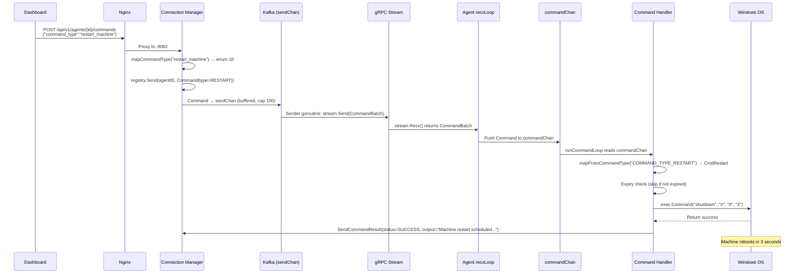
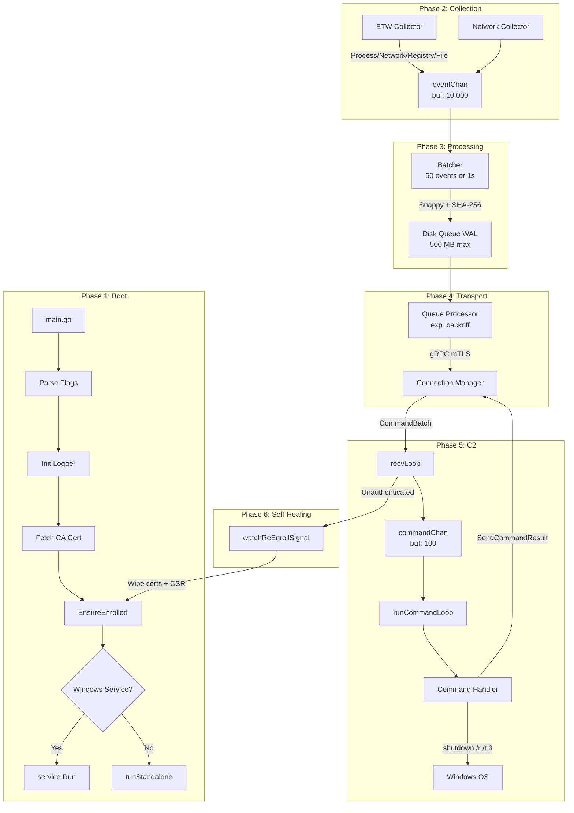

# The Windows Endpoint Agent (`win_edrAgent`)
## A Microscopic Deep-Dive — Graduation Defense Documentation

---

## 1. THE AGENT LIFECYCLE (From Boot to Connection)

### 1.1 The Moment `agent.exe` Is Executed

When the operator launches `agent.exe`, the Go runtime initializes and enters [main()](file:///d:/EDR_Server/connection-manager/cmd/server/main.go#78-377) in [main.go](file:///d:/EDR_Server/win_edrAgent/cmd/agent/main.go). The boot sequence follows a strict, deterministic 7-phase startup:

**Phase 1 — Command-Line Flag Parsing:**

```go
configPath     = flag.String("config", "C:\\ProgramData\\EDR\\config\\config.yaml", "Path to configuration file")
showVersion    = flag.Bool("version", false, "Show version information")
installService = flag.Bool("install", false, "Install Windows Service")
removeService  = flag.Bool("uninstall", false, "Remove Windows Service")
runAsService   = flag.Bool("service", false, "Run as Windows Service (internal)")
debugMode      = flag.Bool("debug", false, "Enable debug logging")
```

The agent supports **6 operational modes** via flags. In production, it runs as a **Windows Service** (`-service`), registered with the **Service Control Manager (SCM)** under the name `EDRAgent`. In development, it runs standalone with `Ctrl+C` signal handling via `os.Signal` on `SIGINT`/`SIGTERM`.

**Phase 2 — Logger Initialization:**

```go
logger := logging.NewLogger(logging.Config{
    Level:      "INFO",       // or "DEBUG" with -debug flag
    FilePath:   "C:\\ProgramData\\EDR\\logs\\agent.log",
    MaxSizeMB:  100,          // Log rotation at 100 MB
    MaxAgeDays: 7,            // Retain 7 days of logs
})
```

The logger writes to a **rotating log file** at `C:\ProgramData\EDR\logs\agent.log`. The rotation policy caps each file at **100 MB** and retains **7 days** of history. This prevents disk exhaustion on endpoints — a critical defensive measure for a sensor that runs 24/7 with SYSTEM privileges.

**Phase 3 — CA Certificate Auto-Bootstrap:**

```go
if !cfg.Server.Insecure && cfg.Certs.CAPath != "" {
    enrollment.FetchCACertificate(cfg.Server.Address, cfg.Certs.CAPath, logger)
}
```

Before any TLS connection can be established, the agent needs the **Certificate Authority (CA) chain** to verify the server's identity. If the CA certificate doesn't already exist at `C:\ProgramData\EDR\certs\ca-chain.crt`, the agent fetches it from the Connection Manager over an **initial insecure channel**. This is a **Trust On First Use (TOFU)** pattern — acceptable because subsequent connections are fully authenticated via mTLS.

**Phase 4 — Enrollment Check ([EnsureEnrolled](file:///d:/EDR_Server/win_edrAgent/internal/enrollment/enroll.go#25-133)):**

This is the **most critical boot function** — it determines whether the agent has a valid identity on this machine:

```go
enrollment.EnsureEnrolled(cfg, logger, configFilePath)
```

The function performs the following decision tree:

```
Does C:\ProgramData\EDR\certs\agent.crt exist?
├── YES → Does C:\ProgramData\EDR\certs\agent.key exist?
│         ├── YES → Agent is already enrolled. Return nil. Skip registration.
│         └── NO  → Must re-enroll (orphaned cert).
└── NO  → Agent is new. Proceed to full enrollment.
```

### 1.2 The Enrollment Process (New Agent Registration)

When the agent determines it needs a new identity, the following cryptographic enrollment sequence executes in [enroll.go](file:///d:/EDR_Server/win_edrAgent/internal/enrollment/enroll.go):

**Step 1 — CSR Generation:**

```go
csrPEM, err := cm.GenerateCSR(cfg.Agent.ID, cfg.Agent.Hostname)
```

The agent generates an **ECDSA P-256 private key** and a **Certificate Signing Request (CSR)** using Go's `crypto/x509` library. The CSR's **Subject Common Name (CN)** is set to the hostname. The private key is saved to `C:\ProgramData\EDR\certs\agent.key`.

> **Academic Note**: ECDSA P-256 was chosen over RSA because it provides equivalent security (**128-bit**) with **significantly smaller key sizes** (256 bits vs. 2048 bits for RSA), resulting in faster handshakes and lower bandwidth — critical for an endpoint agent that reconnects frequently.

**Step 2 — Server-Auth-Only TLS Dial:**

```go
tlsCfg := &tls.Config{
    RootCAs:    caPool,        // CA cert loaded from Phase 3
    MinVersion: tls.VersionTLS12,
}
conn, err := grpc.Dial(cfg.Server.Address, grpc.WithTransportCredentials(credentials.NewTLS(tlsCfg)))
```

A gRPC connection is established using **server-auth-only TLS** — the agent verifies the server's certificate chain against the CA but does NOT present a client certificate (because it doesn't have one yet). The Connection Manager's TLS config uses `VerifyClientCertIfGiven`, which permits this unauthenticated enrollment dial.

**Step 3 — [RegisterAgent](file:///d:/EDR_Server/connection-manager/proto/v1/edr.proto#34-36) RPC:**

```go
req := &pb.AgentRegistrationRequest{
    InstallationToken: cfg.Certs.BootstrapToken,  // Pre-shared secret
    AgentId:           cfg.Agent.ID,               // Empty for new agents
    Csr:               csrPEM,                     // X.509 CSR in PEM format
    Hostname:          cfg.Agent.Hostname,
    OsType:            "windows",
}
resp, err := client.RegisterAgent(ctx, req)
```

The agent sends its CSR along with a **bootstrap token** (a pre-shared secret provisioned by the administrator). The server validates the token, signs the CSR with its internal CA, generates a **UUID agent ID**, and returns:
- The signed **X.509 client certificate** (PEM)
- The **CA chain** for future mTLS verification
- The assigned **agent UUID**

**Step 4 — Certificate Persistence & Config Update:**

```go
cm.SaveCertificate(cert, caChain)           // Save to C:\ProgramData\EDR\certs\
cfg.Agent.ID = resp.GetAgentId()            // Store UUID (e.g., "599d30c7-3ba5-...")
cfg.Save(configFilePath)                     // Persist to config.yaml
```

The certificate pair is saved to disk for future boot cycles. The agent ID is written back to `config.yaml`, so on the next boot, the agent skips enrollment entirely.

**Phase 5 — Agent Object Creation:**

```go
ag, err := agent.New(cfg, logger)
```

This creates the [Agent struct](file:///d:/EDR_Server/win_edrAgent/internal/agent/agent.go) — the central orchestrator. The constructor initializes:

| Component | Purpose | Configuration |
|---|---|---|
| `eventChan` | Buffered channel for raw events | `cfg.Agent.BufferSize` (default: 10,000) |
| `batcher` | Dual-trigger batch manager | 50 events / 1-second interval / Snappy |
| `grpcClient` | mTLS gRPC client | Server address, keepalive params |
| `commandHandler` | C2 command executor | Quarantine dir: `C:\ProgramData\EDR\quarantine` |
| `diskQueue` | Write-Ahead Log (WAL) | `C:\ProgramData\EDR\queue`, max 500 MB |

**Phase 6 — `agent.Start(ctx)` — The Goroutine Constellation:**

The [Start()](file:///d:/EDR_Server/connection-manager/pkg/api/server.go#174-180) method launches **9 concurrent goroutines**, each wrapped in a `defer recover()` panic guard:

```
Goroutine Map:
├── 1. runBatcher()         — Reads eventChan, creates compressed batches
├── 2. runSender()          — Time-based batch flush (FlushIfReady ticker)
├── 3. runHealthReporter()  — Periodic health metrics logging (30s interval)
├── 4. startPlatformCollectors()
│     ├── ETWCollector       — Process + Network + Registry + File events
│     └── NetworkCollector   — Additional network telemetry
├── 5. RunReconnector()     — gRPC auto-reconnection with exponential backoff
├── 6. RunStream()          — Bidirectional gRPC stream (events ↑, commands ↓)
├── 7. RunSender()          — gRPC batch send loop (drains send channel)
├── 8. runCommandLoop()     — C2 command dispatcher
├── 9. watchReEnrollSignal()— Self-healing re-enrollment monitor
└── 10. runQueueProcessor() — Disk queue → server delivery with retry
```

> **Design Rationale**: Every goroutine is wrapped in `defer func() { if r := recover(); r != nil { ... } }()`. This ensures that a panic in one subsystem (e.g., a nil pointer in the ETW collector) does NOT crash the entire agent. The panic is logged with a full stack trace (`runtime.Stack`), and the system continues operating with degraded functionality.

**Phase 7 — Initial gRPC Connection:**

```go
if err := a.grpcClient.Connect(a.ctx); err != nil {
    a.logger.Warnf("Initial gRPC connect failed (reconnector will retry): %v", err)
}
```

The initial connection attempt is **non-fatal** — if it fails (e.g., server not yet online), the agent starts anyway and the [RunReconnector](file:///d:/EDR_Server/win_edrAgent/internal/grpc/client.go#623-659) goroutine will retry with **exponential backoff**.

---

## 2. TELEMETRY COLLECTION SUBSYSTEMS (The Senses)

### 2.1 ETW (Event Tracing for Windows)

The ETW collector is implemented in [etw.go](file:///d:/EDR_Server/win_edrAgent/internal/collectors/etw.go) with the build tag `//go:build windows`, ensuring it compiles only on Windows targets.

**What is ETW?**

**Event Tracing for Windows (ETW)** is a **kernel-level tracing infrastructure** built into the Windows operating system. Unlike user-mode API hooking (which intercepts function calls in application-space), ETW operates at the **kernel level** — the OS itself emits events as processes, network connections, registry operations, and file I/O occur. This makes it:

- **Tamper-resistant**: Malware cannot unhook ETW providers (unlike user-mode hooks which can be patched out)
- **Low overhead**: Events are delivered via **kernel ring buffers**, not synchronous callbacks
- **Comprehensive**: The kernel sees ALL operations, including those from elevated/system processes

**ETW Provider GUIDs:**

The agent subscribes to **four kernel providers**, each identified by a globally unique GUID:

| Provider Name | GUID | Events | Security Relevance |
|---|---|---|---|
| `Microsoft-Windows-Kernel-Process` | `{22fb2cd6-0fe7-4212-a296-1f7f7d3b400c}` | Process creation, termination, image loads | Detects malware execution, process injection, suspicious parent-child relationships |
| `Microsoft-Windows-Kernel-Network` | `{7dd42a49-5329-4832-8a15-fb9b24e84dd8}` | TCP/UDP connections, DNS queries | Identifies C2 beaconing, lateral movement, data exfiltration |
| `Microsoft-Windows-Kernel-Registry` | `{70eb4f03-c1de-4f73-a051-33d13d5413bd}` | Registry key CRUD operations | Detects persistence mechanisms (Run keys, services, scheduled tasks) |
| `Microsoft-Windows-Kernel-File` | `{edd08927-9cc4-4e65-b970-c2560fb5c289}` | File create, delete, rename | Identifies ransomware behavior (mass file encryption/deletion) |

**How Does the Go Agent Hook Into the Windows Kernel?**

The agent uses the `golang.org/x/sys/windows` package, which provides direct access to Win32 API syscalls from Go. The collection loop uses the **Toolhelp32 API** for process enumeration:

```go
// CreateToolhelp32Snapshot captures a snapshot of all running processes
snapshot, err := windows.CreateToolhelp32Snapshot(windows.TH32CS_SNAPPROCESS, 0)

// Iterate over every process in the snapshot
var entry windows.ProcessEntry32
entry.Size = uint32(unsafe.Sizeof(entry))
err = windows.Process32First(snapshot, &entry)
for {
    name := windows.UTF16ToString(entry.ExeFile[:])
    pid  := entry.ProcessID
    // ... process each entry
    err = windows.Process32Next(snapshot, &entry)
    if err != nil { break }
}
```

**Process Enrichment via `QueryFullProcessImageName`:**

Each process entry from Toolhelp32 only provides the **executable filename** (e.g., `svchost.exe`). For Sigma rule matching, the agent needs the **full executable path** (e.g., [C:\Windows\System32\svchost.exe](file:///Windows/System32/svchost.exe)). This is critical because attackers often place malicious binaries with legitimate names in unusual directories.

```go
func (c *ETWCollector) getProcessImagePath(pid uint32) string {
    if pid == 0 || pid == 4 { return "" } // Skip System Idle and System

    // PROCESS_QUERY_LIMITED_INFORMATION (0x1000) — works even for elevated processes
    handle, _ := windows.OpenProcess(0x1000, false, pid)
    defer windows.CloseHandle(handle)

    var buf [windows.MAX_PATH]uint16
    bufSize := uint32(len(buf))
    windows.QueryFullProcessImageName(handle, 0, &buf[0], &bufSize)
    return windows.UTF16ToString(buf[:bufSize])
}
```

> **Academic Note**: The `PROCESS_QUERY_LIMITED_INFORMATION` access right (`0x1000`) was deliberately chosen over `PROCESS_QUERY_INFORMATION` (`0x0400`) because the limited variant succeeds even when the target process runs at a higher integrity level (e.g., SYSTEM processes). This is a **privilege escalation-aware** design choice.

**Enriched Event Structure:**

Each process event contains **7 fields** for Sigma rule matching:

```go
evt := event.NewEvent(event.EventTypeProcess, event.SeverityLow, map[string]interface{}{
    "action":       "snapshot",
    "pid":          pid,
    "ppid":         entry.ParentProcessID,
    "name":         name,           // e.g., "powershell.exe"
    "executable":   executable,     // e.g., "C:\\Windows\\System32\\WindowsPowerShell\\v1.0\\powershell.exe"
    "command_line": commandLine,    // Full command line (for Sigma CommandLine|contains rules)
    "threads":      entry.Threads,
})
```

**Why ETW Is Superior to API Hooking (Academic Defense Point):**

| Dimension | ETW | API Hooking |
|---|---|---|
| **Deployment** | No driver installation required | Requires injecting DLL into every process |
| **Reliability** | Kernel-level — cannot be unhooked by malware | User-mode hooks can be patched/removed by malware |
| **Performance** | Asynchronous ring buffer delivery | Synchronous function interception — adds latency |
| **Coverage** | Sees OS kernel events globally | Only sees hooked API calls in injected processes |
| **Stability** | Microsoft-supported, stable ABI | DLL injection can cause crashes in target processes |
| **Stealth** | No injected modules visible to attacker | Injected DLLs are visible in process memory |

### 2.2 The WMI / Network Collector

The [network.go](file:///d:/EDR_Server/win_edrAgent/internal/collectors/network.go) collector provides supplementary telemetry focused on **system inventory and network interface monitoring**. It runs on a longer polling interval (typically 60 seconds) and captures:
- Active network interfaces and their configurations
- System resource usage (CPU, memory)
- Installed services and their states

This provides the **contextual enrichment layer** that the ETW events alone cannot provide — it answers "what IS this machine?" rather than "what is this machine DOING?"

---

## 3. THE DATA PROCESSING PIPELINE (The Brain & Muscle)

### 3.1 The Event Batching Mechanism

The batcher is implemented in [batcher.go](file:///d:/EDR_Server/win_edrAgent/internal/event/batcher.go). Its role is to **aggregate individual events into compressed batches** before transmission, dramatically reducing network overhead.

**Dual-Trigger Flush Mechanism:**

The batcher uses a **two-condition flush strategy**:

```
Trigger 1 (Threshold): If len(events) >= 50 → Flush immediately
Trigger 2 (Time):      If time.Since(lastFlush) >= 1 second → Flush what's available
```

This is implemented through **two cooperating goroutines**:

**Goroutine 1 — [runBatcher()](file:///d:/EDR_Server/win_edrAgent/internal/agent/agent.go#341-376) (threshold trigger):**
```go
for {
    select {
    case evt, ok := <-a.eventChan:     // Block until event arrives
        if batch := a.batcher.Add(evt); batch != nil {
            a.processBatch(batch)       // Threshold reached (50) → flush
        }
    case <-a.ctx.Done():
        a.batcher.Flush()              // Final flush on shutdown
        return
    }
}
```

**Goroutine 2 — [runSender()](file:///d:/EDR_Server/win_edrAgent/internal/agent/agent.go#377-405) (time trigger):**
```go
ticker := time.NewTicker(cfg.Agent.BatchInterval)  // Default: 1 second
for {
    select {
    case <-ticker.C:
        if batch := a.batcher.FlushIfReady(); batch != nil {
            a.processBatch(batch)       // Interval elapsed → flush
        }
    case <-a.ctx.Done():
        return
    }
}
```

**Why dual triggers?**

- **High-load scenario** (~500 events/sec): The threshold trigger fires every ~100ms, providing efficient, full batches. The time trigger never fires because the threshold fires first.
- **Low-load scenario** (~5 events/sec): The threshold would never fire (only 5 < 50). The time trigger ensures events are sent within 1 second, maintaining **near-real-time visibility** for the SOC.

This design guarantees both **throughput efficiency** and **latency bounded to 1 second** under any workload.

### 3.2 The Compression Layer (Snappy)

Inside [createBatch()](file:///d:/EDR_Server/win_edrAgent/internal/event/batcher.go#109-170), the events are serialized and compressed:

```go
// 1. Serialize all events to JSON
jsonData, err := json.Marshal(events)                    // ~21 KB for 50 events

// 2. Compress with Snappy
payload = snappy.Encode(nil, jsonData)                   // ~4 KB (80% reduction)

// 3. Calculate integrity checksum
hash := sha256.Sum256(payload)
checksum := hex.EncodeToString(hash[:])
```

**Observed compression ratios from production logs:**
```
50 events, 21707→4361 bytes (20.1%)   — 80% reduction
50 events, 20296→3666 bytes (18.1%)   — 82% reduction
50 events, 22597→4254 bytes (18.8%)   — 81% reduction
```

**Why Snappy over Gzip/Zstd?**

| Algorithm | Compression Ratio | Speed | CPU Usage |
|---|---|---|---|
| **Snappy** | ~80% reduction | **Very fast** (250 MB/s compress) | **< 1% CPU** |
| Gzip | ~85% reduction | Moderate (80 MB/s) | ~3% CPU |
| Zstd | ~87% reduction | Fast (150 MB/s) | ~2% CPU |

Snappy was chosen because: (a) the agent runs on **customer endpoints** where CPU impact must be minimal, (b) the marginal 5% compression improvement of Gzip does not justify the 3x CPU cost, and (c) Snappy is Google's internal RPC compression standard.

### 3.3 The Disk Queue (Write-Ahead Log)

After compression, the batch does NOT go directly to gRPC. Instead, it is persisted to a **Disk Queue (WAL)** at `C:\ProgramData\EDR\queue\`:

```go
func (a *Agent) processBatch(batch *event.Batch) {
    pbBatch := &pb.EventBatch{
        BatchId:     batch.ID,
        AgentId:     a.cfg.Agent.ID,
        Compression: pb.Compression_COMPRESSION_SNAPPY,
        Payload:     batch.Payload,
        Checksum:    batch.Checksum,
    }
    a.diskQueue.Enqueue(pbBatch)   // Write proto bytes to disk file
}
```

The [runQueueProcessor()](file:///d:/EDR_Server/win_edrAgent/internal/agent/agent.go#446-501) goroutine then does:
1. **Peek** the oldest file in the queue
2. **Send** it via `grpcClient.SendBatchSync()`
3. On **success**: delete the file, reset backoff
4. On **failure**: apply exponential backoff (1s → 2s → 4s → ... → 30s max)

**Why a WAL?**

This guarantees **zero data loss** during network outages. If the server is unreachable for hours, events accumulate on disk (up to **500 MB** cap). When connectivity resumes, the queue drains automatically. This is the same pattern used by Kafka, PostgreSQL, and RocksDB.

---

## 4. THE TRANSPORT LAYER & RESILIENCE (The Nervous System)

### 4.1 The gRPC Bidirectional Stream

The transport layer is implemented in [client.go](file:///d:/EDR_Server/win_edrAgent/internal/grpc/client.go). The agent opens a single **bidirectional gRPC stream** via the [StreamEvents](file:///d:/EDR_Server/connection-manager/pkg/server/server.go#195-206) RPC:

```protobuf
rpc StreamEvents(stream EventBatch) returns (stream CommandBatch);
```

This means:
- **Client (Agent) → Server**: The agent sends [EventBatch](file:///d:/EDR_Server/win_edrAgent/internal/proto/v1/edr.proto#49-61) messages containing compressed telemetry
- **Server → Client (Agent)**: The server sends [CommandBatch](file:///d:/EDR_Server/connection-manager/proto/v1/edr.proto#335-348) messages containing C2 instructions

**Both directions operate simultaneously and independently** — the agent can stream 50 event batches per second while simultaneously receiving a restart command from the SOC analyst. This is only possible because gRPC uses **HTTP/2**, which supports **full-duplex communication** over a single TCP connection via **stream multiplexing**.

**The dual goroutine model:**

```
RunStream() ─── spawn ──→ recvLoop(stream)
                              │
                              ├── stream.Recv() ──→ CommandBatch ──→ commandChan
                              │
sendBatchInternal() ──────→ stream.Send(EventBatch)
```

- [recvLoop](file:///d:/EDR_Server/win_edrAgent/internal/grpc/client.go#551-588) runs in a dedicated goroutine, blocking on `stream.Recv()` indefinitely
- [sendBatchInternal](file:///d:/EDR_Server/win_edrAgent/internal/grpc/client.go#381-443) is called from the queue processor goroutine via `stream.Send()`
- Go's gRPC library guarantees **thread safety** for concurrent [Send()](file:///d:/EDR_Server/connection-manager/pkg/handlers/agent_registry.go#62-84) and `Recv()` on the same bidirectional stream (note: concurrent [Send()](file:///d:/EDR_Server/connection-manager/pkg/handlers/agent_registry.go#62-84) calls from different goroutines are NOT safe — this bug was fixed on the server side)

### 4.2 The gRPC Keepalive Mechanism

```go
opts := []grpc.DialOption{
    grpc.WithKeepaliveParams(keepalive.ClientParameters{
        Time:                30 * time.Second,   // Ping every 30 seconds
        Timeout:             10 * time.Second,    // Wait 10 seconds for pong
        PermitWithoutStream: true,                // Send pings even with no active stream
    }),
}
```

**What these parameters mean:**

- **`Time: 30s`**: Every 30 seconds of inactivity, the client sends an HTTP/2 PING frame to the server. This serves as a **connection liveness check** — if the TCP connection was silently severed (e.g., NAT table expiry, firewall timeout), the PING will fail and trigger a reconnection.

- **`Timeout: 10s`**: After sending a PING, the client waits 10 seconds for the server's PONG response. If no PONG arrives, the connection is considered dead. Total detection time for a dead connection: **30 + 10 = 40 seconds**.

- **`PermitWithoutStream: true`**: Sends keepalive PINGs even when no RPC stream is active. This is critical during the brief window between stream disconnection and reconnection.

**The `ENHANCE_YOUR_CALM` / `too_many_pings` Problem:**

```
ERROR: [transport] Client received GoAway with error code ENHANCE_YOUR_CALM
       and debug data equal to ASCII "too_many_pings"
```

This error occurs when the **server's keepalive enforcement policy** rejects the client's ping frequency. The gRPC server has a `MinTime` parameter — if the client pings more frequently than this minimum, the server sends a **GoAway frame** with `ENHANCE_YOUR_CALM`, forcibly closing the connection.

Our fix: the `30-second` ping interval was chosen to be **well above** the typical server `MinTime` of 5–15 seconds, but **well below** the typical NAT/firewall timeout of 60–120 seconds. This keeps the connection alive without triggering server rejection.

### 4.3 Multi-Address Connection with Gateway Fallback

The agent doesn't just try the configured server address — it discovers fallback addresses:

```go
func (c *Client) resolveServerAddresses() []string {
    candidates := []string{c.cfg.Server.Address}  // Primary address from config

    // Auto-discover gateway IPs from network interfaces
    for _, iface := range net.Interfaces() {
        // For each non-loopback, non-link-local IPv4 subnet,
        // assume the gateway is at .1 (e.g., 192.168.152.1)
        candidates = append(candidates, gatewayIP + ":" + port)
    }
    return candidates
}
```

If the primary address fails, the agent tries each gateway IP. This makes the agent **resilient to network interface changes** (e.g., VM switching from NAT to Host-Only, DHCP renewals changing the server's IP).

### 4.4 The Self-Healing Re-Enrollment Mechanism

When the server rejects an agent with `codes.Unauthenticated` (e.g., after a database wipe), the agent detects this at **two levels**:

**Level 1 — [StreamEvents()](file:///d:/EDR_Server/connection-manager/pkg/server/server.go#195-206) call fails:**
```go
stream, err := sc.StreamEvents(ctx)
if st.Code() == codes.Unauthenticated {
    c.reEnrollOnce.Do(func() { close(c.reEnrollCh) })
    return   // Stop reconnecting entirely
}
```

**Level 2 — `stream.Recv()` returns Unauthenticated:**
```go
recvErr = c.recvLoop(ctx, stream)
if st.Code() == codes.Unauthenticated {
    c.reEnrollOnce.Do(func() { close(c.reEnrollCh) })
    return
}
```

The `reEnrollCh` channel is a **once-close signal** (using `sync.Once` to prevent double-close panics). When it closes, the [watchReEnrollSignal](file:///d:/EDR_Server/win_edrAgent/internal/agent/agent.go#L248-L324) goroutine wakes up and executes the **5-step re-enrollment**:

```
Step 1/5 — Disconnect: Close the current (rejected) gRPC connection
Step 2/5 — Wipe Certs: Delete agent.crt and agent.key from disk
Step 3/5 — Clear ID:   Set cfg.Agent.ID = "" (forces fresh UUID assignment)
Step 4/5 — Re-Enroll:  Call EnsureEnrolled() → CSR → RegisterAgent → New cert
Step 5/5 — Reconnect:  Create new gRPC client, start RunStream + RunReconnector
```

After re-enrollment, the agent operates with a **completely new identity** (new UUID, new certificate). The old identity is permanently abandoned. This is logged with a prominent banner:

```
═══ RE-ENROLLMENT TRIGGERED: Server rejected this agent ═══
[Re-Enroll] Step 1/5: Disconnecting from server...
[Re-Enroll] Step 2/5: Wiping old certificates...
[Re-Enroll] Step 3/5: Clearing agent ID...
[Re-Enroll] Step 4/5: Requesting fresh enrollment from server...
[Re-Enroll] SUCCESS: New agent ID: a1b2c3d4 (was: 599d30c7)
[Re-Enroll] Step 5/5: Reconnecting to server with new identity...
═══ RE-ENROLLMENT COMPLETE: Agent is operational with new identity ═══
```

---

## 5. COMMAND & CONTROL (C2) EXECUTION (The Hands)

### 5.1 Full C2 Flow: From Server to OS Reboot

When a SOC analyst clicks "Restart Machine" in the dashboard, the following exact sequence occurs:



### 5.2 The Agent-Side C2 Processing

**Step 1 — [recvLoop](file:///d:/EDR_Server/win_edrAgent/internal/grpc/client.go#551-588) receives [CommandBatch](file:///d:/EDR_Server/connection-manager/proto/v1/edr.proto#335-348):**

```go
resp, err := stream.Recv()
for _, cmd := range resp.Commands {
    c.commandChan <- &Command{
        ID:         cmd.GetCommandId(),          // "4068e648-c0c2-..."
        Type:       cmd.GetType().String(),      // "COMMAND_TYPE_RESTART"
        Parameters: cmd.GetParameters(),          // {"reason": "..."}
        Priority:   int(cmd.GetPriority()),
        ExpiresAt:  commandExpiresAt(cmd),
    }
}
```

**Step 2 — [runCommandLoop](file:///d:/EDR_Server/win_edrAgent/internal/agent/agent.go#502-533) dispatches:**

```go
case cmd := <-a.grpcClient.Commands():
    c := &command.Command{
        Type: mapProtoCommandType(cmd.Type),  // "COMMAND_TYPE_RESTART" → CmdRestart
    }
    result := a.commandHandler.Execute(a.ctx, c)
```

**Step 3 — `handler.Execute()` dispatches to OS handler:**

```go
func (h *Handler) Execute(ctx context.Context, cmd *Command) *Result {
    start := time.Now()

    // Safety: check expiry
    if !cmd.ExpiresAt.IsZero() && time.Now().After(cmd.ExpiresAt) {
        return &Result{Status: "FAILED", Error: "command expired"}
    }

    switch cmd.Type {
    case CmdRestart:
        output, err = h.restartMachine(ctx, cmd.Parameters)
    case CmdShutdown:
        output, err = h.shutdownMachine(ctx, cmd.Parameters)
    case CmdTerminateProcess:
        output, err = h.terminateProcess(ctx, cmd.Parameters)
    // ... 13 total command types
    }
}
```

**Step 4 — OS-level execution ([restartMachine](file:///d:/EDR_Server/win_edrAgent/internal/command/handler.go#346-367)):**

```go
func (h *Handler) restartMachine(_ context.Context, params map[string]string) (string, error) {
    reason := params["reason"]
    if reason == "" {
        reason = "EDR C2 remote restart command"
    }

    // /r = restart, /t 3 = 3-second delay, /d p:4:1 = planned, OS, hardware
    cmd := exec.Command("shutdown", "/r", "/t", "3", "/d", "p:4:1", "/c", reason)
    if err := cmd.Run(); err != nil {
        return "", fmt.Errorf("shutdown command failed: %w", err)
    }

    return fmt.Sprintf("Machine restart scheduled (reason: %s). OS rebooting in 3 seconds.", reason), nil
}
```

> **The 3-second delay (`/t 3`) is deliberate**: It gives the agent time to execute [SendCommandResult](file:///d:/EDR_Server/win_edrAgent/internal/grpc/client.go#323-353) (Step 5) before Windows kills the process. Without this delay, the server would never know whether the command succeeded.

**Step 5 — C2 Feedback Loop Closure:**

```go
result := a.commandHandler.Execute(a.ctx, c)
if result != nil {
    a.grpcClient.SendCommandResult(a.ctx, result, a.cfg.Agent.ID)
}
```

[SendCommandResult](file:///d:/EDR_Server/win_edrAgent/internal/grpc/client.go#323-353) is a **unary RPC** (not streamed) that sends:

```go
req := pb.NewCommandResultProto(
    res.CommandID,    // "4068e648-c0c2-..."
    agentID,          // "599d30c7-3ba5-..."
    res.Status,       // "SUCCESS"
    res.Output,       // "Machine restart scheduled..."
    res.Error,        // "" (empty on success)
    res.Duration,     // 150ms
    res.Timestamp,    // 2026-03-02T14:22:28Z
)
err := conn.Invoke(ctx, SendCommandResult_FullMethodName, req, &emptypb.Empty{})
```

The server records this result in the `commands` table in PostgreSQL, and the dashboard can display "Command executed successfully" to the SOC analyst.

### 5.3 Complete Command Type Mapping

| Proto Enum | Raw Value | Agent Constant | Handler Function | OS Action |
|---|---|---|---|---|
| `COMMAND_TYPE_RESTART` | 10 | `CmdRestart` | [restartMachine()](file:///d:/EDR_Server/win_edrAgent/internal/command/handler.go#346-367) | `shutdown /r /t 3` |
| `COMMAND_TYPE_SHUTDOWN` | 11 | `CmdShutdown` | [shutdownMachine()](file:///d:/EDR_Server/win_edrAgent/internal/command/handler.go#368-386) | `shutdown /s /t 3` |
| `COMMAND_TYPE_TERMINATE_PROCESS` | 7 | `CmdTerminateProcess` | [terminateProcess()](file:///d:/EDR_Server/win_edrAgent/internal/command/handler.go#146-169) | `taskkill /PID /F` |
| `COMMAND_TYPE_ISOLATE` | 3 | `CmdIsolateNetwork` | [isolateNetwork()](file:///d:/EDR_Server/win_edrAgent/internal/command/handler.go#200-215) | Windows Firewall block rules |
| `COMMAND_TYPE_UNISOLATE` | 4 | `CmdUnisolateNetwork` | [unisolateNetwork()](file:///d:/EDR_Server/win_edrAgent/internal/command/handler.go#216-230) | Remove firewall rules |
| `COMMAND_TYPE_COLLECT_FORENSICS` | 2 | `CmdCollectForensics` | [collectForensics()](file:///d:/EDR_Server/win_edrAgent/internal/command/handler.go#231-246) | Gather system artifacts |
| `COMMAND_TYPE_UPDATE_CONFIG` | 1 | `CmdUpdateConfig` | [updateConfig()](file:///d:/EDR_Server/win_edrAgent/internal/command/handler.go#247-262) | Hot-reload config.yaml |
| `COMMAND_TYPE_UPDATE_AGENT` | 6 | `CmdUpdateAgent` | [updateAgent()](file:///d:/EDR_Server/win_edrAgent/internal/command/handler.go#263-281) | Self-update binary |
| `COMMAND_TYPE_RESTART_SERVICE` | 5 | `CmdRestartService` | [restartService()](file:///d:/EDR_Server/win_edrAgent/internal/command/handler.go#282-294) | Restart EDR service |
| `COMMAND_TYPE_ADJUST_RATE` | 8 | `CmdAdjustRate` | [adjustRate()](file:///d:/EDR_Server/win_edrAgent/internal/command/handler.go#295-304) | Change batch size/interval |
| (reserved) | 9 | `CmdRunCommand` | [runCommand()](file:///d:/EDR_Server/win_edrAgent/internal/command/handler.go#305-345) | Execute arbitrary shell command |

### 5.4 Safety Mechanisms

The command handler includes several defensive measures:

- **Expiry validation**: Commands with [ExpiresAt](file:///d:/EDR_Server/win_edrAgent/internal/grpc/client.go#589-600) in the past are immediately rejected with `"command expired"`
- **Critical PID protection**: [terminateProcess()](file:///d:/EDR_Server/win_edrAgent/internal/command/handler.go#146-169) refuses to kill PIDs 0 (System Idle) and 4 (System kernel)
- **Duration tracking**: Every command result includes `Duration` (nanosecond precision) for auditing
- **Mutex serialization**: The handler uses `sync.Mutex` to prevent concurrent command execution from causing state conflicts

---

## Architectural Summary


