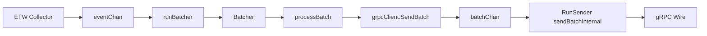

# Final Post-Remediation Static Analysis and Architecture Audit

**win_edrAgent** — Lead Security Architect  
**Date:** 2025-02-21  
**Scope:** Post-refactor verification, execution flow, telemetry integrity, C2, code quality, production readiness.

---

## 1. Updated Execution Flow & Lifecycle

### 1.1 Startup Sequence (Verified)

Trace from process entry to full pipeline:

1. **main** ([win_edrAgent/cmd/agent/main.go](win_edrAgent/cmd/agent/main.go)): Parse flags, init logger, load config from `*configPath`, set log level from config.
2. **Enrollment** ([win_edrAgent/internal/enrollment/enroll.go](win_edrAgent/internal/enrollment/enroll.go)): `EnsureEnrolled(cfg, logger, *configPath)`:
   - If cert and key exist at configured paths → return nil (already enrolled).
   - Otherwise: dial server (insecure for bootstrap), `RegisterAgent`, save cert/CA via `CertManager`, set `cfg.Agent.ID = resp.GetAgentId()`, then **persist config**: `cfg.Save(configFilePath)` when `configFilePath != ""`, so the new AgentID survives restarts.
3. **Service vs standalone**: If `-service`, `service.Run(cfg, logger)` runs the Windows service (enrollment already done in main with same `*configPath`). Else `runStandalone(cfg, logger)` creates context, agent, and calls `ag.Start(ctx)`.
4. **Agent.Start** ([win_edrAgent/internal/agent/agent.go](win_edrAgent/internal/agent/agent.go)):
   - Store context/cancel, set running, log version/OS.
   - Start **runBatcher** (reads `eventChan`, adds to batcher, calls `processBatch` when batch ready).
   - Start **runSender** (ticker-driven `FlushIfReady` + `processBatch`).
   - Start **runHealthReporter** (periodic health log).
   - **startPlatformCollectors** (Windows: ETW collector → `eventChan` if enabled).
   - **Initial Connect**: `a.grpcClient.Connect(a.ctx)` — attempted once; failure is logged but does **not** block.
   - **Always start four goroutines** (connection resilience):
     - **RunReconnector**: while `!connected`, sleeps `delay`, calls `Connect(ctx)`, exponential backoff up to `MaxReconnectDelay`; on success resets delay.
     - **RunStream**: while connected, establishes `StreamEvents` bidirectional stream, spawns **recvLoop** for CommandBatch; on stream error or recv exit, clears stream, backoff, retry.
     - **runCommandLoop**: reads from `grpcClient.Commands()`, builds `command.Command` (including `ExpiresAt`), calls `commandHandler.Execute`.
     - **RunSender**: reads from client `batchChan`, calls `sendBatchInternal` for each batch.

**Conclusion:** Startup is correct. If the initial gRPC connection fails, the four routines still start; RunReconnector retries Connect in the background, and RunStream/RunSender/runCommandLoop run and either wait (RunStream when `!connected`) or fail sends until connected.

### 1.2 Self-Enrollment and AgentID Persistence (Verified)

- **When enrollment runs**: Cert/key missing → RegisterAgent with bootstrap token → server returns cert, CA, and **AgentID**.
- **In-memory update**: `cfg.Agent.ID = resp.GetAgentId()`.
- **Disk persistence**: If `configFilePath != ""`, `cfg.Save(configFilePath)` is called ([win_edrAgent/internal/config/config.go](win_edrAgent/internal/config/config.go) `Save(path)` marshals YAML and writes with `0600`). Main passes `*configPath` (e.g. `C:\ProgramData\EDR\config\config.yaml`).
- **Service path**: Enrollment is performed in main before `service.Run` or `runStandalone`, using the same `*configPath`, so the config file path is correct for both modes.

**Conclusion:** AgentID is correctly persisted to the YAML config file on disk after enrollment.

---

## 2. Telemetry Pipeline & Data Integrity

### 2.1 Event Lifecycle

- **ETW** ([win_edrAgent/internal/collectors/etw.go](win_edrAgent/internal/collectors/etw.go)): `collectLoop` (process snapshot / simulated network) → `sendEvent(evt)` → non-blocking send to `eventChan`. Agent passes `a.eventChan` from `startPlatformCollectors`.
- **runBatcher**: `eventChan` → `batcher.Add(evt)`; when batch threshold or flush, `batcher` returns a `*event.Batch`; `processBatch(batch)` is called.
- **Batcher** ([win_edrAgent/internal/event/batcher.go](win_edrAgent/internal/event/batcher.go)): `createBatch()` (under lock) marshals events to JSON, optionally compresses (snappy/none), computes **SHA256 over the payload bytes**, sets `batch.Payload` and `batch.Checksum`, returns `Batch` (with `Events` kept for reference only).
- **processBatch** ([win_edrAgent/internal/agent/agent.go](win_edrAgent/internal/agent/agent.go)): Uses **`batch.Payload`** and **`batch.Checksum`** directly for the proto `EventBatch`; no re-marshaling. Builds `pb.EventBatch{ ..., Payload: batch.Payload, Checksum: batch.Checksum, ... }` and calls `a.grpcClient.SendBatch(pbBatch)`.
- **SendBatch**: Queues the same proto to `batchChan`; **RunSender**’s `sendBatchInternal` sends that proto over the stream (or short-lived stream fallback). The same `Payload` and `Checksum` are sent on the wire.

### 2.2 Payload-to-Checksum Consistency (Verified)

- **Batcher**: Single source of truth: `payload = snappy.Encode(nil, jsonData)` or `jsonData`, then `checksum = hex.EncodeToString(sha256.Sum256(payload))`, `Batch{ Payload: payload, Checksum: checksum }`.
- **Agent**: `processBatch` sets `Payload: batch.Payload`, `Checksum: batch.Checksum` — the exact byte slice and checksum from the Batcher.
- **Wire**: The same `*EventBatch` (with `Payload` and `Checksum`) is queued and sent by `sendBatchInternal`; no second marshal or compression.

**Conclusion:** The exact byte slice that is compressed and hashed by the Batcher is the same payload transmitted over gRPC; checksum is mathematically valid on the server.

---

## 3. Command & Control (C2) Execution

### 3.1 Bidirectional gRPC Streaming

- **Channel**: `EventIngestionService_StreamEvents` (single long-lived stream). Client calls `StreamEvents(ctx)` to get a bidirectional stream; **Send** used for `EventBatch`, **Recv** for `CommandBatch`.
- **RunStream** ([win_edrAgent/internal/grpc/client.go](win_edrAgent/internal/grpc/client.go)): When connected, calls `sc.StreamEvents(ctx)`, stores stream under `streamMu`, starts **recvLoop** in a goroutine. If recv returns (error or EOF), stream is cleared and RunStream backs off and retries.
- **Commands**: Server sends `CommandBatch` with repeated `Command`. **recvLoop** calls `stream.Recv()`, iterates `resp.Commands`, pushes to `commandChan` as client `Command` (with **ExpiresAt** set — see below). **sendBatchInternal** fallback (short-lived stream) also parses any `CommandBatch` from the first `Recv()` and pushes commands with **ExpiresAt**.
- **runCommandLoop**: Reads from `grpcClient.Commands()`, builds `command.Command{ ..., ExpiresAt: cmd.ExpiresAt }`, calls `a.commandHandler.Execute(a.ctx, c)`.

### 3.2 ExpiresAt Mapping and Handling (Verified)

- **Proto**: `edr.v1.Command` has `expires_at` → `*timestamppb.Timestamp`; getter `GetExpiresAt()`.
- **Client**: `commandExpiresAt(cmd *pb.Command) time.Time` returns `cmd.GetExpiresAt().AsTime()` or zero. Used in **recvLoop** and in **sendBatchInternal** when building `Command{ ExpiresAt: commandExpiresAt(cmd) }`.
- **Agent**: `runCommandLoop` sets `c.ExpiresAt = cmd.ExpiresAt` on `command.Command`.
- **Handler** ([win_edrAgent/internal/command/handler.go](win_edrAgent/internal/command/handler.go)): At start of `Execute`, `if !cmd.ExpiresAt.IsZero() && time.Now().After(cmd.ExpiresAt)` → returns `Result{ Status: "FAILED", Error: "command expired" }` and does not run the command.

**Conclusion:** ExpiresAt is correctly mapped from protobuf to the internal command struct and is enforced by the command execution pipeline before running any action.

---

## 4. Code Quality & Test Investigation

### 4.1 Concurrency and Cleanup

- **Races**: Connection state uses `atomic.Bool` (`connected`, `reconnecting`); stream and conn protected by `streamMu` and `mu`; filter uses `sync.RWMutex`; batcher uses `sync.Mutex`. No identified data races from shared mutable state.
- **Goroutine lifecycle**: Agent `Start` adds 1 to `wg` per started goroutine and defers `wg.Done()` in each. **Stop** cancels context, closes `eventChan`, calls `Disconnect()`, then `wg.Wait()` with 10s timeout. RunReconnector, RunStream, runCommandLoop, RunSender all return on `ctx.Done()`. recvLoop returns when `stream.Recv()` errors (e.g. after Disconnect). No unbounded goroutine spawn; no identified leaks.
- **Channels**: `eventChan` closed in Stop; `batchChan` and `commandChan` are not closed (client outlives agent in practice; readers exit on context). Acceptable for current design.
- **OS handles**: ETW collectLoop uses `CreateToolhelp32Snapshot` with `defer windows.CloseHandle(snapshot)`. On `ctx.Done()`, loop exits without leaking the snapshot. No explicit ETW “session” close in the current implementation (loop exit is the shutdown).

### 4.2 Panics and Error Handling

- No top-level `recover` in agent or collector goroutines. A panic in runBatcher, ETW, or command handler will bring down the process. **Recommendation:** Consider recover + log in critical goroutines for production hardening.
- Send path: `processBatch` and `sendBatchInternal` log and continue on send failure; batches are dropped when not connected (no persistent buffer).

### 4.3 TestFilterFile Failure — Root Cause

**Test** ([win_edrAgent/internal/collectors/filter_test.go](win_edrAgent/internal/collectors/filter_test.go)): `TestFilterFile` expects:

- Path `C:\Windows\Temp\file.txt` → **filtered (excluded)** (`shouldFilter == true`).
- Path `C:\Windows\System32\cmd.exe` → **not filtered** (included override).
- Path `C:\Program Files\app.exe` → **not filtered**.

**Filter config**: `ExcludePaths: []string{"C:\\Windows\\Temp", "C:\\Users\\*\\AppData\\Local\\Temp"}`, `IncludePaths: []string{"C:\\Windows\\System32"}`.

**Implementation** ([win_edrAgent/internal/collectors/filter.go](win_edrAgent/internal/collectors/filter.go)):

- `pathToRegex(pattern)` builds a regex from the pattern:
  - `regexp.QuoteMeta(pattern)` (escapes backslashes, etc.).
  - Replaces `\*` and `\?` with `.*` and `.`.
  - Returns `"(?i)^" + pattern + "$"` — i.e. **full-string match** anchored at start and end.
- For `"C:\\Windows\\Temp"` the regex is effectively `(?i)^C:\Windows\Temp$`, which matches only the path that is **exactly** `C:\Windows\Temp`, not paths **under** it (e.g. `C:\Windows\Temp\file.txt`).

**Result:** `C:\Windows\Temp\file.txt` does **not** match the exclude regex, so `filterFile` returns false and the event is **not** filtered. The test expects it to be filtered (directory-style exclusion).

**Conclusion:** **Programmatic/design bug.** Path exclusion is implemented as exact match; the test (and typical EDR semantics) expect directory-style exclusion (path under a directory). Fix: treat exclude path patterns as directory prefixes (e.g. match if path equals pattern or has path separator after pattern), or adjust `pathToRegex` so directory patterns match that path and any subpath.

---

## 5. Final Production Readiness (Go / No-Go)

### 5.1 Decision: **Go (with documented caveats)**

The refactored codebase is **suitable for production deployment** for the intended scope (Windows endpoint telemetry, C2 over gRPC, enrollment, payload/checksum consistency, connection resilience, config persistence, command expiry), provided the following are accepted and tracked.

### 5.2 Conditions and Caveats

- **TestFilterFile**: One unit test fails due to path-exclusion semantics (exact match vs directory prefix). Fix is well-understood; should be corrected in a follow-up so filtering behavior is well-defined and tested.
- **No offline persistent buffering**: When the agent is disconnected, batches are dropped (processBatch/SendBatch returns error). Acceptable for “best effort” telemetry; future work could add disk-backed queue.
- **No panic recovery**: A panic in a critical goroutine can terminate the process; consider adding recover + log and optional restart policy.
- **Service config path**: When run as a service, config path is fixed in Install (`-config C:\ProgramData\EDR\config\config.yaml`). Main’s `*configPath` and enrollment persistence use the same default when launched from CLI; when installed as service, the path is consistent with Install.

### 5.3 Remaining Gaps (Future Releases)

| Item | Description |
|------|-------------|
| Offline persistent buffering | Queue batches to disk when disconnected; replay on reconnect. |
| Path filter semantics | Fix ExcludePaths to support directory-style exclusion and align TestFilterFile. |
| Panic recovery | Recover in agent/collector goroutines; log and optionally restart. |
| Self-update | UPDATE_AGENT command is stubbed; implement download, verify, replace, restart. |
| Config update | UPDATE_CONFIG and ADJUST_RATE are stubbed; implement apply and persist. |
| Forensics | COLLECT_FORENSICS is placeholder; implement collection and upload. |
| Additional collectors | Registry/network collectors exist but are not wired in agent_windows (only ETW started). |
| ETW session teardown | Explicit stop/close of ETW session on shutdown if API supports it. |

---

## Summary

- **Execution flow:** Startup and connection resilience (RunReconnector, RunStream, runCommandLoop, RunSender) verified; initial connect failure does not prevent pipeline from starting; reconnection is handled in the background.
- **Enrollment:** AgentID is persisted to the configured YAML file after enrollment.
- **Telemetry:** Event flow ETW → eventChan → batcher → processBatch → SendBatch → wire is consistent; **payload and checksum** are the Batcher’s exact bytes and hash on the wire.
- **C2:** Bidirectional stream and **ExpiresAt** mapping from proto to internal command and enforcement in the handler are correct.
- **Code quality:** No identified races or goroutine leaks; OS handles in ETW path are released; no panic recovery (noted as improvement).
- **TestFilterFile:** Fails due to path exclusion being exact-match instead of directory-prefix; fix is clear.
- **Production:** **Go**, with the above caveats and backlog items for future releases.
